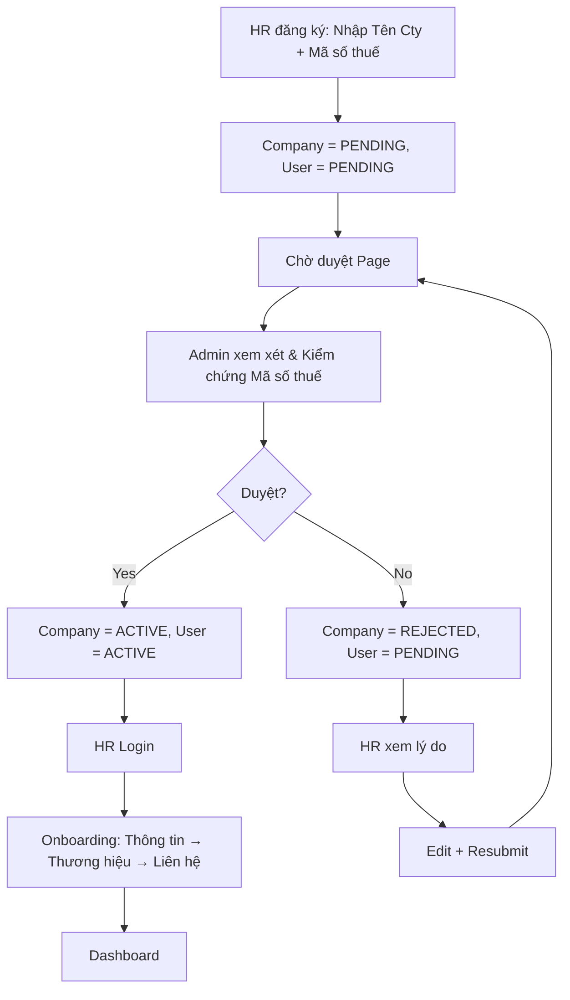

# EPIC 01 — Authentication & Onboarding

## 1. Tóm tắt
- **Nghiệp vụ:** Đăng ký, duyệt doanh nghiệp, login, onboarding và khởi tạo hồ sơ công ty cho HR.
- **Luồng MVP chuẩn:**
  Đăng ký
  → Company = PENDING
  → User = PENDING
  → Chờ duyệt Approval
  → Admin xem xét
  → Duyệt: Company = ACTIVE, User = ACTIVE
  → Từ chối: Company = REJECTED, User = PENDING (restricted)
  → HR Login
  → Onboarding (3 steps)
  → Dashboard
- **Google OAuth:** `Future Enhancement` hoặc phương thức auth bổ sung; không thay thế flow phê duyệt hiện tại.

## 2. Giá trị nghiệp vụ và chỉ số
- **Giá trị nghiệp vụ:** Đảm bảo doanh nghiệp chỉ được sử dụng hệ thống sau khi được admin kiểm duyệt; giảm spam và tài khoản giả mạo.
- **Chỉ số:**
  - Tỷ lệ đăng ký thành công > 95%
  - Tỷ lệ company được duyệt trong SLA nội bộ đạt > 90%
  - Tỷ lệ HR hoàn thành onboarding trong 7 ngày >= 80%

## 3. Quy trình nghiệp vụ

## 4. Phạm vi và Backlog
| ID | Tên Story | Ưu tiên | Trạng thái |
|---|---|---|---|
| US-01 | HR đăng nhập | Must Have | To-do |
| US-02 | HR đăng ký | Must Have | To-do |
| US-03 | HR onboarding | Must Have | To-do |
| US-04 | Admin đăng nhập | Must Have | To-do |
| US-05 | HR quản lý mật khẩu | Must Have | To-do |

## 5. Business Rules

### Authentication vs Authorization
- **Authentication:** Credentials của HR hợp lệ → login thành công. Credentials sai → trả lỗi đăng nhập.
- **Authorization:** 
  - Company = ACTIVE, User = ACTIVE → workspace unrestricted → dashboard
  - Company = PENDING → xác thực thành công, nhưng bị chặn truy cập workspace → trang `/pending`
  - Company = REJECTED → xác thực thành công, nhưng bị chặn truy cập workspace → trang `/registration/rejected`
  - User = INACTIVE/BLOCKED → access denied, login rejected

### Registration & Approval Flow
- Khi đăng ký, HR BẮT BUỘC phải cung cấp Tên công ty, Email domain và Mã số thuế chính xác để Admin có cơ sở kiểm chứng.
- HR không được truy cập workspace nếu `company.status = PENDING`, `company.status = REJECTED` hoặc `user.status = INACTIVE/BLOCKED`.
- Người dùng chưa được duyệt sẽ vào Chờ duyệt Page / Rejected Page thay vì Dashboard.
- Company REJECTED không phải ngõ cụt: HR có quyền đăng nhập, xem lý do, chỉnh sửa thông tin/Mã số thuế và gửi lại.
- Khi HR gửi lại hồ sơ: Company Status = PENDING, User Status = PENDING và luồng duyệt được lặp lại.

### Onboarding
- Onboarding không được bắt user nhập lại dữ liệu đã biết từ bước đăng ký.
- Nếu HR bỏ qua onboarding, hệ thống lưu `onboardingCompleted = true` nhưng vẫn hiển thị nhắc nhở và progress indicator.
- Google OAuth chỉ là phương thức đăng nhập bổ sung, không thay đổi luồng duyệt của Admin.

## 6. Ngoài phạm vi và cải tiến trong tương lai
- Google OAuth chính thức trong MVP: cải tiến trong tương lai nếu chưa được phê duyệt riêng.
- Manual verification external tax code system.
- Email verification OTP không phải yêu cầu bắt buộc trong MVP.

