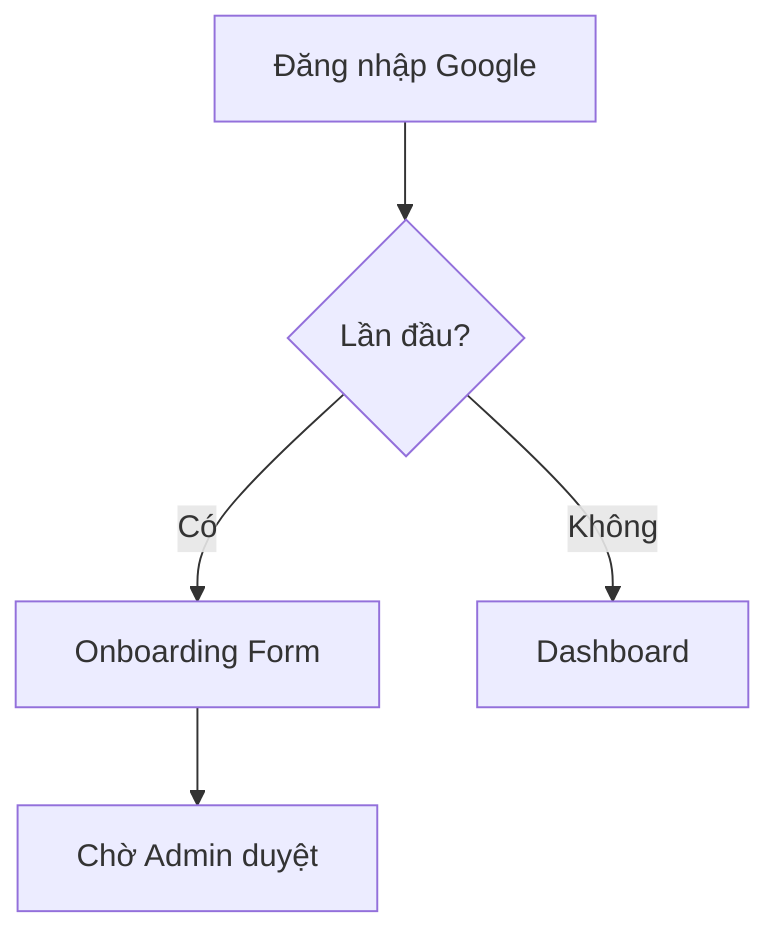

# HƯỚNG DẪN VIẾT TÀI LIỆU EPIC BRIEF (epic-01/brief.md)

## 1. TÓM TẮT YÊU CẦU (Executive Summary)
- **Nghiệp vụ:** Nghiệp vụ Đăng nhập, Đăng ký và Thiết lập hồ sơ ban đầu cho doanh nghiệp.
- **Prerequisites:** Hệ thống Database đã sẵn sàng, tích hợp Google OAuth.

## 2. GIÁ TRỊ DOANH NGHIỆP & CHỈ SỐ ĐO LƯỜNG (Business Value & Metrics)
- **Business Value:** Giúp doanh nghiệp dễ dàng tiếp cận hệ thống một cách an toàn.
- **Metrics:** Tỷ lệ đăng ký thành công > 95%.

## 3. QUY TRÌNH NGHIỆP VỤ (Business Process)

## 4. PHÂN CHIA USER STORY (Scope & Backlog)
| ID | Tên Story | Loại | Priority (MoSCoW) | Trạng thái |
|---|---|---|---|---|
| US-01 | HR Dang nhap | Feature | Must Have | To-do |
| US-02 | HR Dang ky | Feature | Must Have | To-do |
| US-03 | HR Onboarding | Feature | Must Have | To-do |
| US-04 | Admin Dang nhap | Feature | Must Have | To-do |

