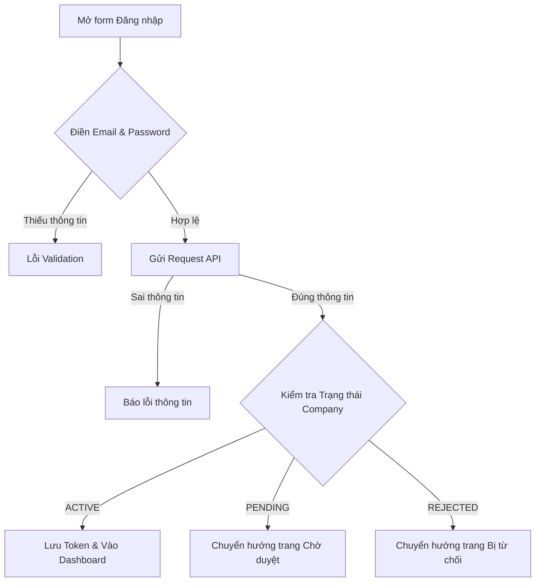

# 📋 User Story 01: HR Đăng Nhập (Login with Email & Password)

## 1. MÔ TẢ USER STORY
- **Là** Nhà tuyển dụng (HR),
- **Tôi muốn** đăng nhập vào hệ thống bằng email và mật khẩu,
- **Để** tôi có thể truy cập đúng workspace tương ứng với trạng thái doanh nghiệp của mình.
- **Story Points:** 3

## SƠ ĐỒ LUỒNG NGHIỆP VỤ (Business Flow)

## 2. TIÊU CHÍ NGHIỆM THU (Acceptance Criteria)

- **Kịch bản 1: Đăng nhập thành công với company ACTIVE**
  - **VỚI ĐIỀU KIỆN** người dùng đã có tài khoản HR hợp lệ và doanh nghiệp đang ở trạng thái `ACTIVE`.
  - **KHI** người dùng nhập đúng email và mật khẩu, nhấn "Đăng nhập".
  - **THÌ** hệ thống xác thực credentials, tạo `access_token` và `refresh_token`, lưu vào HTTP-only cookie.
  - Người dùng được chuyển hướng đến `/onboarding` nếu onboarding chưa hoàn tất, hoặc `/dashboard` nếu onboarding đã hoàn tất.

- **Kịch bản 2: Sai email hoặc mật khẩu**
  - **VỚI ĐIỀU KIỆN** người dùng nhập thông tin đăng nhập không đúng.
  - **KHI** email không tồn tại hoặc mật khẩu không khớp.
  - **THÌ** hệ thống trả về lỗi chung: _"Email hoặc mật khẩu không chính xác."_
  - Không coi đây là trường hợp `PENDING` hoặc `REJECTED`.

- **Kịch bản 3: Company đang chờ duyệt**
  - **VỚI ĐIỀU KIỆN** người dùng có credentials hợp lệ nhưng company đang ở trạng thái `PENDING`.
  - **KHI** họ đăng nhập.
  - **THÌ** hệ thống xác thực thành công nhưng redirect về `/pending`.
  - User không được vào HR workspace.

- **Kịch bản 4: Company bị từ chối**
  - **VỚI ĐIỀU KIỆN** người dùng có credentials hợp lệ nhưng company đang ở trạng thái `REJECTED`.
  - **KHI** họ đăng nhập.
  - **THÌ** hệ thống xác thực thành công nhưng redirect về `/registration/rejected`.
  - User không được vào HR workspace, nhưng được xem lý do từ chối và edit/resubmit.

- **Kịch bản 5: User bị vô hiệu hóa / blocked**
  - **VỚI ĐIỀU KIỆN** tài khoản User đang ở trạng thái `INACTIVE` hoặc `BLOCKED`.
  - **KHI** người dùng cố đăng nhập.
  - **THÌ** hệ thống từ chối quyền truy cập HR workspace với thông báo phù hợp: _"Tài khoản đã bị vô hiệu hóa. Vui lòng liên hệ quản trị viên."_

- **Kịch bản 6: Người dùng đã đăng nhập truy cập lại trang Login**
  - **VỚI ĐIỀU KIỆN** người dùng đã có `access_token` hợp lệ trong cookie.
  - **KHI** người dùng truy cập `/login`.
  - **THÌ** hệ thống tự động redirect đến đúng workspace phù hợp mà không hiển thị form đăng nhập.

## 3. BUSINESS RULES
- **Company Status** (PENDING / ACTIVE / REJECTED) phụ thuộc vào quyết định duyệt của Admin, không phải kết quả xác thực.
- **User Status** (PENDING / ACTIVE / INACTIVE / BLOCKED) là state của account cá nhân, độc lập với Company.
- Auth success ≠ workspace access: HR có thể login nhưng workspace access phụ thuộc vào Company + User status.
- Company PENDING → xác thực thành công, workspace bị hạn chế → `/pending`
- Company REJECTED → xác thực thành công, workspace bị hạn chế → `/registration/rejected`
- INACTIVE/BLOCKED user → access denied, login rejected
- Không dùng PENDING/REJECTED như authentication fail; đó là authorization rule.

## 4. NGOÀI PHẠM VI
- **KHÔNG** hỗ trợ đăng nhập 2 yếu tố (2FA) trong phiên bản này.
- **KHÔNG** giới hạn số lần đăng nhập thất bại (no account lockout) trong phiên bản này.
- Chức năng "Quên mật khẩu" là một tính năng riêng biệt, không thuộc User Story này.
