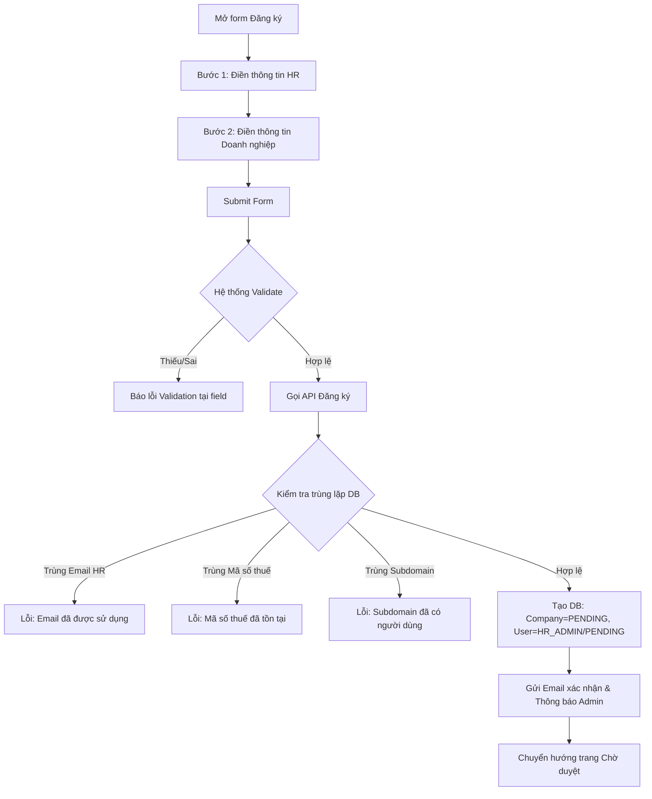

# 📋 User Story 02: HR Đăng Ký (Company Registration)

## 1. MÔ TẢ USER STORY
- **Là** Nhà tuyển dụng (HR) chưa có tài khoản,
- **Tôi muốn** đăng ký công ty và tài khoản HR của mình,
- **Để** tôi có thể bắt đầu sử dụng hệ thống sau khi được Admin phê duyệt và không cần hiểu các khái niệm kỹ thuật.
- **Story Points:** 3

## SƠ ĐỒ LUỒNG NGHIỆP VỤ (Business Flow)

## 2. TIÊU CHÍ NGHIỆM THU (Acceptance Criteria)

- **Kịch bản 1: Đăng ký thành công với thông tin hợp lệ (Form 2 bước)**
  - **VỚI ĐIỀU KIỆN** người dùng chưa có tài khoản trên hệ thống.
  - **KHI** người dùng điền đầy đủ form:
    - **Bước 1 (Tài khoản HR):** Họ tên, Email đăng nhập, Mật khẩu (≥ 8 ký tự, có chữ hoa + số).
    - **Bước 2 (Doanh nghiệp):** Tên công ty, Mã số thuế, Số điện thoại, Địa chỉ, Subdomain mong muốn, Ngành nghề (Industry), Quy mô (Company Size), Mô tả công ty, và Upload Logo (tùy chọn).
  - **VÀ** nhấn "Đăng ký".
  - **THÌ** hệ thống tạo bản ghi trong bảng `companies` với `status = PENDING` và `users` với `role = HR`, `status = PENDING` (liên kết qua `company_id`).
  - Hệ thống gửi email xác nhận đến HR và gửi yêu cầu phê duyệt đến Admin.
  - HR được chuyển đến trang Chờ duyệt.

- **Kịch bản 2: Trang chờ duyệt**
  - **VỚI ĐIỀU KIỆN** đăng ký đã được tạo thành công.
  - **KHI** HR xem màn hình Chờ duyệt.
  - **THÌ** màn hình hiển thị: đơn đăng ký đã được tiếp nhận, doanh nghiệp đang chờ review, trạng thái hiện tại, email nhận thông báo, CTA kiểm tra lại trạng thái, và nút đăng xuất.
  - Không hiển thị màn hình rỗng chỉ có câu "Đang chờ phê duyệt" mà không có thông tin rõ ràng.

- **Kịch bản 3: Validation lỗi trực tiếp (Inline Validation)**
  - **VỚI ĐIỀU KIỆN** người dùng bỏ trống trường bắt buộc hoặc nhập sai định dạng (vd: mật khẩu yếu, email sai định dạng, số điện thoại không hợp lệ).
  - **KHI** người dùng chuyển bước (Next) hoặc nhấn "Đăng ký".
  - **THÌ** form hiển thị lỗi màu đỏ tại từng trường bị sai và chặn không cho sang bước tiếp theo hoặc không cho submit.

- **Kịch bản 4: Xử lý lỗi dữ liệu trùng lặp (Email / MST / Subdomain)**
  - **VỚI ĐIỀU KIỆN** Email HR, Mã số thuế, hoặc Subdomain đã tồn tại trên hệ thống.
  - **KHI** người dùng nhấn "Đăng ký".
  - **THÌ** hệ thống hiển thị thông báo lỗi rõ ràng tương ứng:
    - _"Email này đã được sử dụng. Vui lòng đăng nhập hoặc dùng email khác."_
    - _"Mã số thuế này đã được đăng ký. Vui lòng liên hệ hỗ trợ nếu có nhầm lẫn."_
    - _"Subdomain này đã được sử dụng. Vui lòng chọn một subdomain khác."_

- **Kịch bản 5: Bị từ chối → chỉnh sửa + gửi lại**
  - **VỚI ĐIỀU KIỆN** Company đang ở trạng thái `REJECTED`. HR đang ở trang `/registration/rejected`.
  - **KHI** HR nhấn CTA "Chỉnh sửa & Gửi lại hồ sơ".
  - **THÌ** hệ thống mở form chỉnh sửa, **status KHÔNG thay đổi trong khi HR đang edit** (vẫn là `REJECTED`).
  - HR chỉnh sửa các trường (không được đổi Email đăng nhập, Mã số thuế chỉ đổi nếu thuộc lý do từ chối).
  - **KHI** HR nhấn nút "Xác nhận gửi lại" (confirmation action cuối), hệ thống hiển thị modal xác nhận: _"Bạn sắp gửi lại hồ sơ đăng ký. Hồ sơ sẽ vào hàng chờ xem xét của Admin."_
  - **Sau khi HR confirm:** Hệ thống gọi API → `Company.status = PENDING`, `User.status = PENDING`, hồ sơ xuất hiện lại trong danh sách Admin.
  - HR được redirect về trang Chờ duyệt (`/pending`).

## 3. BUSINESS RULES

### Company & User Creation
- Quá trình đăng ký phải tạo **Company** (`status = PENDING`) và **User** (`role = HR_ADMIN`, `status = PENDING`) trong cùng một Transaction (nếu lỗi thì rollback toàn bộ).
- Cả Company và User phải cùng được Admin duyệt trước khi activate.
- Khi Admin approve: Company = ACTIVE, User = ACTIVE.
- Khi Admin reject: Company = REJECTED, User = PENDING (restricted).

### Auto-fill & Gợi ý dữ liệu
- Subdomain có thể tự động tạo (auto-suggest) dựa trên Tên công ty khi người dùng nhập xong tên, HR vẫn có thể chỉnh sửa lại.
- Email liên hệ của công ty nếu để trống sẽ tự động lấy Email đăng nhập của HR.

### Approval & Resubmit Trigger Rule
- Đăng ký phải đi qua kênh duyệt; không được cho phép company vào Dashboard ngay sau khi đăng ký.
- Nếu `company.status = REJECTED`, HR không được dead-end. Phải có route để xem lý do, sửa, resubmit.
- Status CHỈ chuyển về `PENDING` sau khi HR nhấn nút "Xác nhận gửi lại" trong confirmation modal — không phải khi mở form edit.
- Trong thời gian HR đang edit form (chưa confirm), Company và User vẫn ở trạng thái `REJECTED`.
- Nếu HR đóng tab/thoát khỏi form mà chưa confirm, không có thay đổi status nào xảy ra.
- Khi gửi lại hồ sơ chính thức thành công: Company = PENDING, User = PENDING, luồng duyệt được lặp lại.

### Auth Method
- Google OAuth chỉ là phương thức auth bổ sung trong tương lai. Trọng tâm MVP là email/password.

## 4. NGOÀI PHẠM VI
- **KHÔNG** hỗ trợ đăng ký cho ứng viên (Candidate) – ứng viên không cần tài khoản.
- **KHÔNG** tự động kích hoạt tài khoản – phải qua bước Admin phê duyệt.
- Xác thực email qua OTP/link là cải tiến trong tương lai, không bắt buộc trong MVP.
