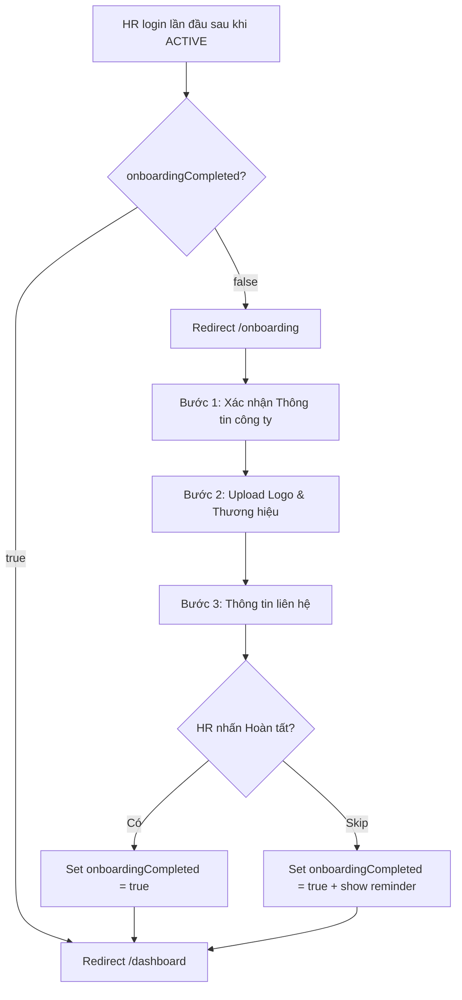

# 📋 User Story 03: HR Onboarding (Thiết lập Hồ Sơ Công Ty Sau Khi Được Duyệt)

## 1. MÔ TẢ USER STORY
- **Là** Nhà tuyển dụng (HR) vừa được Admin phê duyệt,
- **Tôi muốn** hoàn thành quy trình onboarding để thiết lập thông tin cơ bản cho công ty,
- **Để** hệ thống có đủ thông tin hiển thị trên Career Site và Dashboard, đồng thời tôi có thể bắt đầu tạo Job ngay sau đó.
- **Story Points:** 3

## SƠ ĐỒ LUỒNG NGHIỆP VỤ (Business Flow)

## 2. TIÊU CHÍ NGHIỆM THU (Acceptance Criteria)

- **Kịch bản 1: HR lần đầu đăng nhập sau khi được duyệt — bị redirect vào Onboarding**
  - **VỚI ĐIỀU KIỆN** Company.status = ACTIVE, User.status = ACTIVE và `onboardingCompleted = false`.
  - **KHI** HR đăng nhập thành công.
  - **THÌ** hệ thống tự động redirect về `/onboarding` thay vì `/dashboard`.

- **Kịch bản 2: Bước 1 — Xác nhận thông tin công ty**
  - **VỚI ĐIỀU KIỆN** HR đang ở Bước 1 Onboarding.
  - **THÌ** hệ thống pre-fill các trường từ dữ liệu đăng ký (Tên công ty, Email, Số điện thoại, Mã số thuế) — không được yêu cầu nhập lại.
  - HR có thể cập nhật thêm: Website, Ngành nghề, Quy mô công ty, Mô tả ngắn.
  - HR nhấn "Tiếp theo" để sang Bước 2.

- **Kịch bản 3: Bước 2 — Upload Logo & Thiết lập Thương hiệu**
  - **VỚI ĐIỀU KIỆN** HR đang ở Bước 2 Onboarding.
  - **THÌ** HR có thể upload Logo công ty (PNG/JPG, ≤ 2MB) — đây là logo dùng cho Career Site (public).
  - Nếu bỏ qua, hệ thống dùng placeholder mặc định.
  - HR nhấn "Tiếp theo" để sang Bước 3.

- **Kịch bản 4: Bước 3 — Thông tin liên hệ**
  - **VỚI ĐIỀU KIỆN** HR đang ở Bước 3 Onboarding (bước cuối).
  - **THÌ** HR điền Email liên hệ tuyển dụng (reply-to email cho ứng viên), Địa chỉ công ty (nếu chưa có).
  - Nhấn "Hoàn tất Onboarding" → set `onboardingCompleted = true` → redirect `/dashboard`.

- **Kịch bản 5: HR bỏ qua toàn bộ Onboarding (Skip)**
  - **VỚI ĐIỀU KIỆN** HR không muốn điền ngay.
  - **KHI** HR nhấn "Bỏ qua, thiết lập sau" (có thể ở bất kỳ bước nào).
  - **THÌ** hệ thống set `onboardingCompleted = true` và redirect về `/dashboard`.
  - Dashboard hiển thị banner nhắc nhở với progress indicator (X/3 bước đã hoàn thành) và CTA "Hoàn thiện hồ sơ công ty".

- **Kịch bản 6: HR đã hoàn thành Onboarding — không bị redirect lại**
  - **VỚI ĐIỀU KIỆN** `onboardingCompleted = true`.
  - **KHI** HR truy cập lại `/onboarding`.
  - **THÌ** hệ thống redirect về `/dashboard`. Onboarding không xuất hiện lại.

## 3. BUSINESS RULES

### onboardingCompleted Flag
- `onboardingCompleted = false`: HR bị redirect vào `/onboarding` sau mỗi lần login cho đến khi hoàn thành hoặc skip.
- `onboardingCompleted = true`: Set khi HR nhấn "Hoàn tất" (bước 3) **HOẶC** nhấn "Bỏ qua". Sau khi set `true`, không tự reset về `false`.
- **Lý do skip = true:** Dùng `onboardingCompleted = true` kể cả khi skip vì mục tiêu là không block HR vào Dashboard; reminder banner sẽ thay thế redirect. Không dùng trường riêng `onboardingSkipped` để tránh logic phức tạp.

### Dữ liệu pre-fill
- Onboarding KHÔNG được yêu cầu nhập lại dữ liệu từ bước đăng ký (Tên công ty, Email, MST).
- Dữ liệu từ bước đăng ký phải được pre-fill tự động qua API `GET /api/v1/companies/me`.

### Logo trong Onboarding
- Logo upload ở Bước 2 Onboarding → lưu vào `career_site_settings.logo_url` (public/Career Site logo).
- Logo nội bộ Dashboard (sidebar) có thể set riêng trong US-30 Company Settings.
- **Source of truth:** Career Site logo ← `career_site_settings.logo_url`; Dashboard logo ← `companies.logo_url` (nội bộ).

## 4. NGOÀI PHẠM VI
- **KHÔNG** bắt buộc HR hoàn thành tất cả bước — skip là hợp lệ.
- **KHÔNG** reset `onboardingCompleted` về `false` khi HR chỉnh sửa thông tin sau đó trong Settings.
- **KHÔNG** có bước "Video giới thiệu hệ thống" trong MVP.
