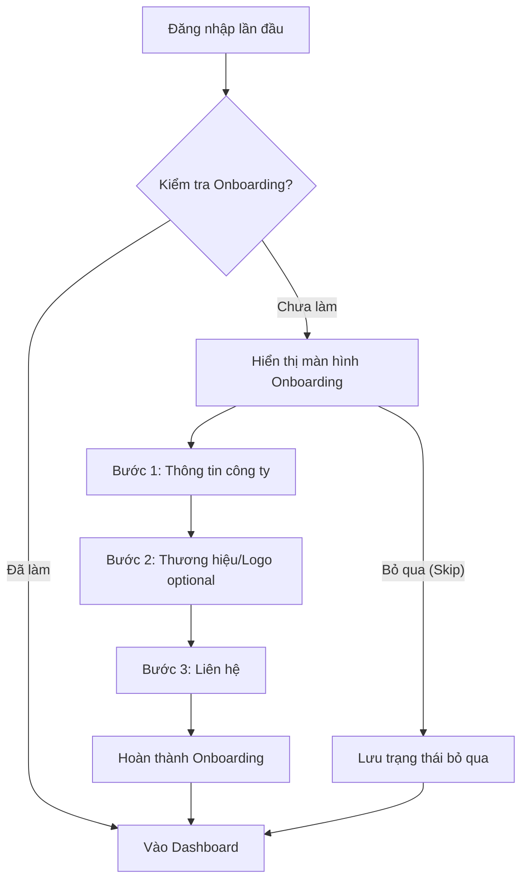

# 📋 User Story 03: HR Onboarding (Thiết Lập Hồ Sơ Công Ty)

## 1. MÔ TẢ USER STORY
- **Là** Nhà tuyển dụng (HR) vừa được Admin phê duyệt,
- **Tôi muốn** hoàn thành nhanh một bước onboarding ngắn gọn để thiết lập thông tin công ty,
- **Để** tôi có thể bắt đầu tuyển dụng mà không mất thời gian điền lại dữ liệu đã biết và không bị mất hướng dẫn khi chưa hoàn tất hồ sơ.
- **Story Points:** 3

## SƠ ĐỒ LUỒNG NGHIỆP VỤ (Business Flow)

## 2. TIÊU CHÍ NGHIỆM THU (Acceptance Criteria)

- **Kịch bản 1: HR đăng nhập lần đầu sau khi được approve**
  - **VỚI ĐIỀU KIỆN** Admin vừa phê duyệt tài khoản HR, `Company Status` chuyển từ `PENDING` → `ACTIVE` và `User Status` chuyển từ `PENDING` → `ACTIVE`.
  - **KHI** HR đăng nhập lần đầu.
  - **THÌ** hệ thống kiểm tra `company_profile.onboardingCompleted = false` và chuyển đến trang Onboarding `/onboarding` thay vì Dashboard.

- **Kịch bản 2: Onboarding 3 bước**
  - **VỚI ĐIỀU KIỆN** HR đang ở trang Onboarding.
  - **KHI** HR điền bước 1: Thông tin công ty (industry, company size, website, description); bước 2: Branding (logo, optional); bước 3: Liên hệ (phone, address).
  - **THÌ** hệ thống hiển thị progress indicator: 1 Thông tin → 2 Thương hiệu → 3 Liên hệ.
  - Sau mỗi step, hệ thống lưu dữ liệu. Khi HR nhấn "Hoàn thành" ở bước cuối, `onboardingCompleted = true` được cập nhật và user được chuyển đến Dashboard.

- **Kịch bản 3: Không hỏi lại dữ liệu đã biết**
  - **VỚI ĐIỀU KIỆN** Company Name, Email và Mã số thuế đã có từ đăng ký.
  - **KHI** HR ở trang Onboarding.
  - **THÌ** hệ thống không bắt nhập lại những dữ liệu này trừ khi cần xác nhận hoặc chỉnh sửa rõ ràng. Những trường này có thể được hiển thị dạng readonly hoặc không hiện thị nếu không cần.

- **Kịch bản 4: Bỏ qua onboarding**
  - **VỚI ĐIỀU KIỆN** HR không muốn điền ngay trong lần đầu.
  - **KHI** HR nhấn "Bỏ qua, tôi sẽ điền sau".
  - **THÌ** hệ thống lưu `onboardingCompleted = true` để không bắt lặp lại, nhưng vẫn hiển thị reminder trên Dashboard: "Hồ sơ doanh nghiệp của bạn chưa hoàn thiện." và CTA "Hoàn thiện hồ sơ".

- **Kịch bản 5: Lưu / khôi phục dữ liệu**
  - **VỚI ĐIỀU KIỆN** HR đã điền một bước nhưng chưa hoàn thành onboarding.
  - **KHI** HR reload trang hoặc quay lại sau thời gian.
  - **THÌ** dữ liệu đã nhập trong từng bước còn nguyên và có thể tiếp tục mà không cần nhập lại.

- **Kịch bản 6: HR cũ quay lại trang /onboarding**
  - **VỚI ĐIỀU KIỆN** HR đã có `onboardingCompleted = true`.
  - **KHI** HR truy cập direct URL `/onboarding`.
  - **THÌ** hệ thống redirect về `/dashboard`.

## 3. BUSINESS RULES
- Onboarding tối đa 3 bước và ưu tiên tối giản.
- Logo là optional.
- `Skip` không làm mất reminder; chỉ làm profile chưa hoàn thiện nhưng onboarding không lặp lại.
- Nếu chưa triển khai autosave, phải có save per step và restore khi reload.

## 4. NGOÀI PHẠM VI
- **KHÔNG** bắt buộc HR phải upload logo trong bước Onboarding.
- **KHÔNG** verify thông tin với dữ liệu quốc gia hoặc pháp lý trong MVP.
