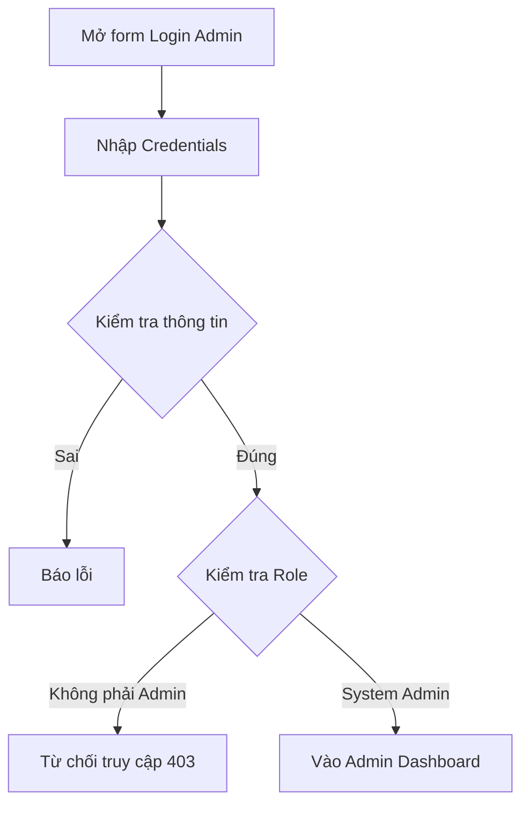

# 📋 User Story 04: Admin Đăng Nhập (System Admin đăng nhập)

## 1. MÔ TẢ USER STORY
- **Là** Quản trị viên Hệ thống (System Admin),
- **Tôi muốn** đăng nhập vào Admin Dashboard bằng tài khoản Admin riêng biệt,
- **Để** tôi có thể phê duyệt doanh nghiệp mới, quản lý người dùng và giám sát hoạt động toàn hệ thống.
- **Story Points:** 2

## SƠ ĐỒ LUỒNG NGHIỆP VỤ (Business Flow)

## 2. TIÊU CHÍ NGHIỆM THU (Acceptance Criteria)

- **Kịch bản 1: Admin đăng nhập thành công và được redirect đúng dashboard**
  - **VỚI ĐIỀU KIỆN** tài khoản Admin đã được tạo sẵn trong database với `role = ADMIN`.
  - **KHI** Admin nhập đúng email và mật khẩu tại trang `/login`.
  - **THÌ** hệ thống xác thực credentials và kiểm tra `role`.
  - Vì `role = ADMIN`: hệ thống redirect đến `/admin/dashboard` thay vì `/dashboard`.

- **Kịch bản 2: Admin không thể truy cập HR Dashboard và ngược lại**
  - **VỚI ĐIỀU KIỆN** Admin đã đăng nhập thành công.
  - **KHI** Admin cố truy cập `/dashboard` (HR Dashboard).
  - **THÌ** hệ thống chặn và redirect về `/admin/dashboard` với thông báo "Bạn không có quyền truy cập khu vực này."
  - Tương tự: HR không thể truy cập `/admin/*`.

- **Kịch bản 3: Tài khoản Admin không thể tự đăng ký**
  - **VỚI ĐIỀU KIỆN** trang đăng ký `/register` công khai.
  - **KHI** bất kỳ người dùng nào điền form đăng ký.
  - **THÌ** hệ thống chỉ tạo tài khoản với `role = HR_ADMIN` (không bao giờ tạo `role = ADMIN` qua form).
  - Tài khoản Admin chỉ được tạo thông qua database seed hoặc script nội bộ.

- **Kịch bản 4: Session Admin hết hạn**
  - **VỚI ĐIỀU KIỆN** Admin đang thao tác trên Admin Dashboard.
  - **KHI** `access_token` hết hạn (15 phút) và `refresh_token` cũng hết hạn (7 ngày).
  - **THÌ** hệ thống tự động logout Admin và redirect về `/login` với thông báo "Phiên làm việc đã hết hạn."

## 3. NGOÀI PHẠM VI
- **KHÔNG** hỗ trợ Admin đăng nhập bằng Google OAuth.
- **KHÔNG** cho phép Admin reset mật khẩu qua email (chỉ qua script nội bộ/database).
- Chức năng Audit Log ghi nhận đăng nhập Admin là tự động, không thuộc phạm vi tương tác UI của Story này.
