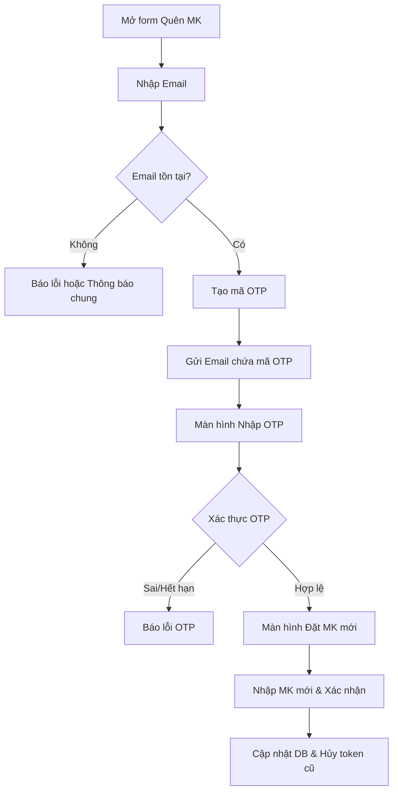
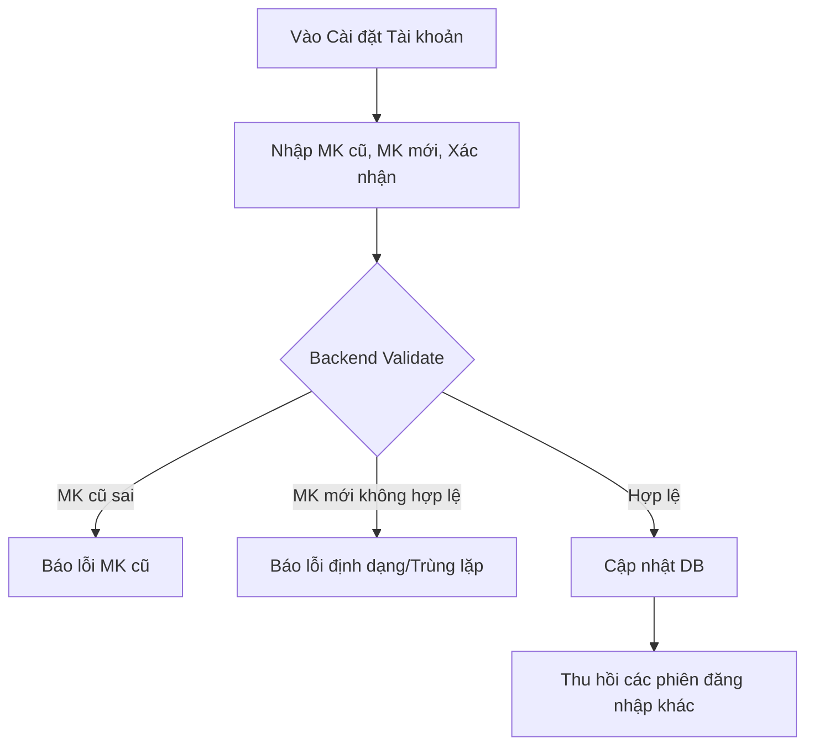

# 📋 User Story 06: HR Quản lý Mật khẩu (Password Management)

## 1. MÔ TẢ USER STORY
- **Là** Nhà tuyển dụng (HR),
- **Tôi muốn** có thể đặt lại mật khẩu khi quên (Forgot Password) hoặc chủ động đổi mật khẩu mới trong lúc đang đăng nhập (Change Password),
- **Để** bảo vệ quyền truy cập và an toàn cho tài khoản của mình.
- **Story Points:** 5

## SƠ ĐỒ LUỒNG NGHIỆP VỤ (Business Flow)

### Luồng 1: Quên mật khẩu (Forgot Password)

### Luồng 2: Chủ động đổi mật khẩu (Change Password)

## 2. TIÊU CHÍ NGHIỆM THU (Acceptance Criteria)

### A. Quên Mật Khẩu (Forgot Password)
- **Kịch bản 1: Yêu cầu lấy lại mật khẩu**
  - **KHI** HR nhập Email hợp lệ vào form Quên mật khẩu và nhấn "Gửi".
  - **THÌ** hệ thống gửi một email chứa mã OTP (6 số, hết hạn sau 5-10 phút) đến địa chỉ email đó.
- **Kịch bản 2: Xác thực OTP và Đặt lại mật khẩu**
  - **KHI** HR nhập đúng mã OTP và điền Mật khẩu mới hợp lệ (≥ 8 ký tự, có hoa, có số).
  - **THÌ** mật khẩu được cập nhật thành công, hệ thống thông báo thành công và chuyển hướng về trang Đăng nhập.

### B. Chủ động Đổi Mật Khẩu (Change Password)
- **Kịch bản 3: Đổi mật khẩu thành công**
  - **VỚI ĐIỀU KIỆN** HR đang đăng nhập.
  - **KHI** HR nhập đúng Mật khẩu cũ và Mật khẩu mới hợp lệ.
  - **THÌ** cập nhật mật khẩu, giữ nguyên phiên đăng nhập hiện tại nhưng tự động thu hồi (đăng xuất) các phiên đăng nhập trên thiết bị khác.
- **Kịch bản 4: Mật khẩu cũ sai**
  - **KHI** HR nhập sai mật khẩu cũ.
  - **THÌ** hệ thống cảnh báo "Mật khẩu hiện tại không chính xác".

### C. Validation chung
- **Kịch bản 5: Validation tính hợp lệ của mật khẩu mới**
  - **KHI** mật khẩu mới quá ngắn, thiếu ký tự hoa/số hoặc ô xác nhận mật khẩu không khớp.
  - **THÌ** form (FE) sẽ báo lỗi màu đỏ ngay lập tức và chặn Submit.
- **Kịch bản 6: Trùng mật khẩu cũ**
  - **KHI** mật khẩu mới giống hệt mật khẩu cũ.
  - **THÌ** hệ thống báo lỗi không cho phép sử dụng lại mật khẩu cũ.

## 3. BUSINESS RULES

- **Độ phức tạp mật khẩu:** Tối thiểu 8 ký tự, phải chứa ít nhất 1 chữ hoa, 1 chữ số.
- **Bảo mật Session:** Sau khi đổi hoặc reset mật khẩu thành công, toàn bộ refresh tokens / sessions cũ trong DB phải bị vô hiệu hóa để ngăn kẻ gian tiếp tục sử dụng tài khoản.
- **Bảo mật luồng OTP:** Mã OTP chỉ có hiệu lực trong khoảng thời gian ngắn (ví dụ 10 phút) và tự động hủy sau khi sử dụng thành công hoặc quá số lần nhập sai.

## 4. NGOÀI PHẠM VI
- Không hỗ trợ gửi OTP qua SMS trong MVP (chỉ qua Email).
