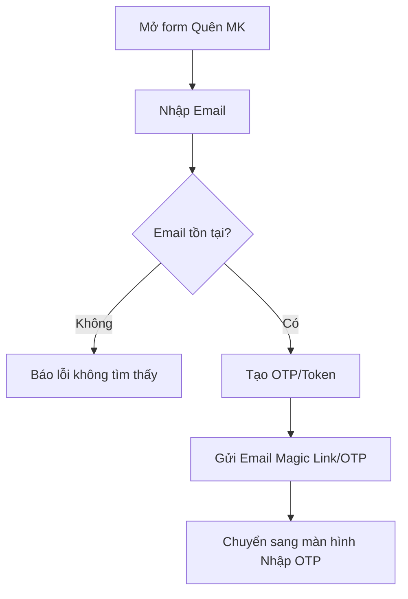

## SƠ ĐỒ LUỒNG NGHIỆP VỤ (Business Flow)

```mermaid
graph TD
    A[Mở form Quên MK] --> B[Nhập Email]
    B --> C{Email tồn tại?}
    C -- Không --> D[Báo lỗi không tìm thấy]
    C -- Có --> E[Tạo OTP/Token]
    E --> F[Gửi Email Magic Link/OTP]
    F --> G[Chuyển sang màn hình Nhập OTP]
```

