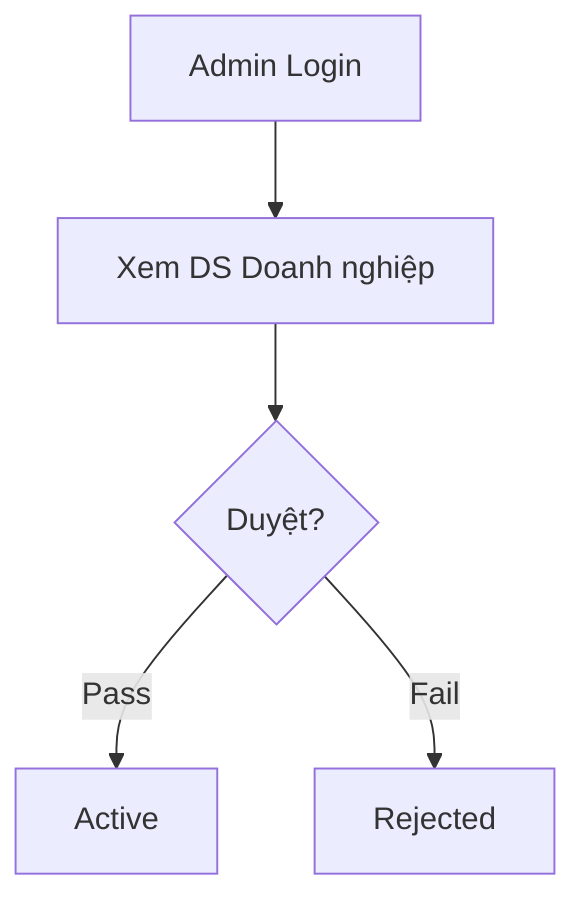

# HƯỚNG DẪN VIẾT TÀI LIỆU EPIC BRIEF (epic-02/brief.md)

## 1. TÓM TẮT YÊU CẦU (Executive Summary)
- **Nghiệp vụ:** Khu vực quản trị hệ thống dành cho Admin EasyTech để kiểm duyệt doanh nghiệp.
- **Prerequisites:** Đã có account role ADMIN.

## 2. GIÁ TRỊ DOANH NGHIỆP & CHỈ SỐ ĐO LƯỜNG (Business Value & Metrics)
- **Business Value:** Bảo vệ hệ thống khỏi rác và gian lận.
- **Metrics:** Thời gian duyệt trung bình < 4h.

## 3. QUY TRÌNH NGHIỆP VỤ (Business Process)

## 4. PHÂN CHIA USER STORY (Scope & Backlog)
| ID | Tên Story | Loại | Priority (MoSCoW) | Trạng thái |
|---|---|---|---|---|
| US-05 | Admin Duyet Doanh Nghiep | Feature | Must Have | To-do |

