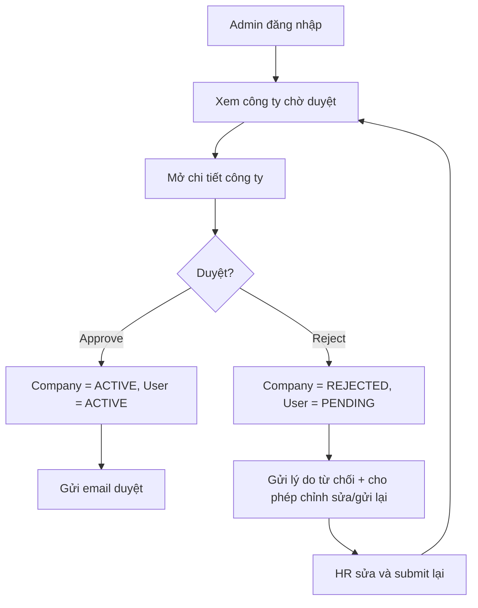

# EPIC 02 — Admin Area

## 1. Tóm tắt
- **Nghiệp vụ:** Admin EasyTech xem danh sách doanh nghiệp mới đăng ký, review và phê duyệt hoặc từ chối.
- **Điều kiện tiên quyết:** Account role = ADMIN.
- **Luồng MVP chuẩn:**
  Chờ duyệt
  → Xem hồ sơ công ty
  → Duyệt: Company = ACTIVE, User = ACTIVE
  → Từ chối: Company = REJECTED, User = PENDING (restricted)
  → HR nhận email và có thể chỉnh sửa / gửi lại nếu bị từ chối
  → Nếu gửi lại hồ sơ: Company = PENDING, User = PENDING, Admin xem xét lại

## 2. Giá trị nghiệp vụ và chỉ số
- **Giá trị nghiệp vụ:** Giảm spam, xác minh doanh nghiệp hợp lệ, bảo vệ chất lượng dữ liệu trong hệ thống.
- **Chỉ số:**
  - Thời gian review trung bình < 4 giờ (hoặc theo SLA xác nhận bởi Product Owner)
  - Tỷ lệ company bị approve sai < 1%

## 3. Quy trình nghiệp vụ

## 4. Phạm vi và Backlog
| ID | Tên Story | Ưu tiên | Trạng thái |
|---|---|---|---|
| US-06 | Admin duyệt doanh nghiệp | Must Have | Backend/UI contract regression implemented locally; E2E email and browser verification pending 2026-09-18 |
| US-07 | Admin quản lý job categories | P0 | Implementation locally; migration, delete protection, reorder and public category filter verified 2026-09-18 |
| US-08 | Admin xem audit logs | Should Have | API/UI implemented locally; E2E and structured before/after producers pending 2026-09-18 |
| US-09 | Admin quản lý users | Should Have | API/UI và audit/token invalidation implemented locally; E2E login lockout and browser verification pending 2026-09-18 |

## 5. Business Rules

### Admin Approval / Rejection
- Duyệt: Company = ACTIVE, all related Users = ACTIVE
- Từ chối: Company = REJECTED, related Users = PENDING (restricted)
- Reject phải đi kèm lý do cụ thể; không được để HR rơi vào dead-end.
- Rejected company phải cho phép Edit + Resubmit; không chỉ là trạng thái cuối.
- User không có `REJECTED`; user chỉ có `PENDING`, `ACTIVE`, `INACTIVE`, `BLOCKED`.
- Admin không được tự động đổi trạng thái nếu dữ liệu không hợp lệ; phải reject với lý do cụ thể.

### Audit & Governance
- Tất cả hành động duyệt/từ chối phải được ghi vào Audit Logs.
- Email approval/rejection reason phải được gửi tới HR đăng ký.
- HR có thể authentication thành công khi credentials hợp lệ, nhưng quyền vào workspace phụ thuộc Company Status và User Status.

### Admin Individual User Management (US-09)
- US-09 dùng `ACTIVE` và `INACTIVE` cho thao tác quản lý trạng thái tài khoản cá nhân; `BLOCKED` vẫn là trạng thái có trong enum/luồng cũ nhưng không được endpoint US-09 tự đặt.
- Admin có thể vô hiệu hóa hoặc kích hoạt lại một User cụ thể trong một Company mà **không ảnh hưởng đến Company Status**.
- Khi User bị `INACTIVE`: backend tăng `users.token_version`, khiến access token hiện tại bị từ chối ở request kế tiếp và refresh token không còn hợp lệ.
- Company vẫn ACTIVE → các HR khác trong cùng Company không bị ảnh hưởng.
- Admin phải ghi lý do khi chuyển sang `INACTIVE`; thao tác được ghi vào Audit Log.
- Không cho Admin tự vô hiệu hóa hoặc đổi trạng thái tài khoản `ADMIN` từ màn hình US-09 để tránh khóa toàn bộ đường quản trị.

## 6. Cải tiến trong tương lai và quyết định sản phẩm
- Luồng REQUEST_CHANGES là `Cải tiến trong tương lai` nếu Product muốn quy trình chi tiết hơn trạng thái REJECTED.
- Tự động kiểm tra trùng mã số thuế hoặc độ giống tên công ty là cải tiến trong tương lai, tùy mức chấp nhận rủi ro.

