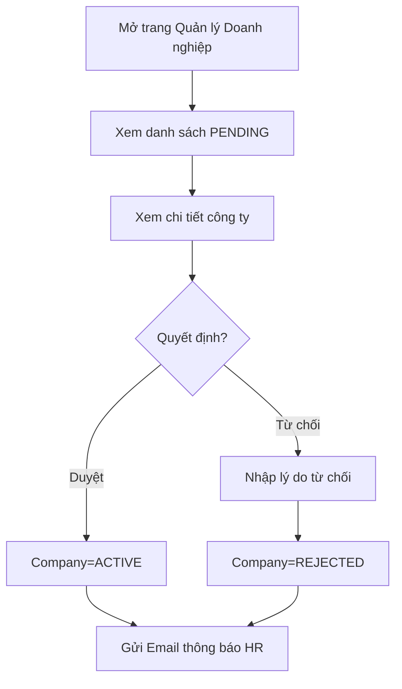

# 📋 User Story 06: Admin Duyệt Doanh Nghiệp (Approve Company Registrations)

## 1. MÔ TẢ USER STORY
- **Là** Quản trị viên Hệ thống (System Admin),
- **Tôi muốn** xem danh sách doanh nghiệp mới đăng ký và quyết định Approve hoặc Reject,
- **Để** chỉ những doanh nghiệp hợp lệ mới được cấp quyền sử dụng hệ thống và HR không bị rơi vào dead-end khi đơn bị từ chối.
- **Story Points:** 3

## SƠ ĐỒ LUỒNG NGHIỆP VỤ (Business Flow)

## 2. TIÊU CHÍ NGHIỆM THU (Acceptance Criteria)

- **Kịch bản 1: Admin xem danh sách công ty chờ phê duyệt**
  - **VỚI ĐIỀU KIỆN** Admin đang đăng nhập vào Admin Dashboard.
  - **KHI** Admin truy cập trang `/admin/companies/pending`.
  - **THÌ** hệ thống hiển thị danh sách các company có trạng thái `PENDING`. Thông tin gồm: Tên công ty, Email người đăng ký, Mã số thuế, Ngày đăng ký.

- **Kịch bản 2: Admin phê duyệt công ty thành công**
  - **VỚI ĐIỀU KIỆN** Admin đang xem chi tiết công ty chờ duyệt.
  - **KHI** Admin nhấn nút "Phê duyệt" (Approve).
  - **THÌ** hệ thống cập nhật `companies.status = ACTIVE` và `users.status = ACTIVE` cho tài khoản HR đăng ký.
  - Email thông báo được gửi đến HR: "Tài khoản của bạn đã được phê duyệt. Bạn có thể đăng nhập ngay.".

- **Kịch bản 3: Admin từ chối công ty**
  - **VỚI ĐIỀU KIỆN** Admin đang xem chi tiết công ty chờ duyệt.
  - **KHI** Admin nhấn nút "Từ chối" (Reject) và nhập lý do (bắt buộc).
  - **THÌ** hệ thống cập nhật `companies.status = REJECTED` và gửi email có lý do cụ thể cho HR.
  - Company bị ẩn khỏi danh sách pending và hiển thị trạng thái Rejected trong trang quản lý.

- **Kịch bản 4: Luồng bị từ chối không rơi vào ngõ cụt**
  - **VỚI ĐIỀU KIỆN** company đang ở trạng thái `REJECTED`.
  - **KHI** HR mở email hoặc xem trang Rejected.
  - **THÌ** HR thấy thông tin hiện tại, lý do từ chối, yêu cầu cần sửa, và CTA "Chỉnh sửa & gửi lại" cùng các tùy chọn hỗ trợ nếu cần.

- **Kịch bản 5: Kiểm tra trùng lặp thông tin**
  - **VỚI ĐIỀU KIỆN** một công ty chờ duyệt.
  - **KHI** Admin mở chi tiết.
  - **THÌ** hệ thống có thể cảnh báo nếu Mã số thuế hoặc Tên công ty tương đồng với company đang `ACTIVE`.

## 3. BUSINESS RULES

### Company & User Status Transitions
- **Duyệt:** Company = ACTIVE, User = ACTIVE (for all related HR accounts)
- **Từ chối:** Company = REJECTED, User = PENDING (restricted)
- HR thuộc company PENDING/REJECTED vẫn có thể đăng nhập, nhưng bị chặn truy cập workspace.
- Khi HR resubmit hồ sơ đăng ký đã bị reject: Company = PENDING, User = PENDING và hồ sơ quay lại danh sách Admin xem xét.

### Rejection Policy
- Reject phải đi kèm lý do cụ thế, không để HR hiểu nhầm.
- Company REJECTED phải cho phép chỉnh sửa + gửi lại; không phải trạng thái ngõ cụt.
- Email từ chối phải bao gồm: cụ thể điểm không đạt, hướng dẫn sửa, CTA gửi lại hồ sơ.

### Audit & Governance
- `REQUEST_CHANGES` là cải tiến trong tương lai, không bắt buộc trong MVP.
- Tất cả hành động duyệt/từ chối phải được ghi vào Audit Logs.

## 4. NGOÀI PHẠM VI
- **KHÔNG** tích hợp API quốc gia để tự động xác thực Mã số thuế.
- **KHÔNG** cho phép Admin chỉnh sửa thông tin công ty trước khi duyệt, trừ khi có quyết định sản phẩm riêng.
