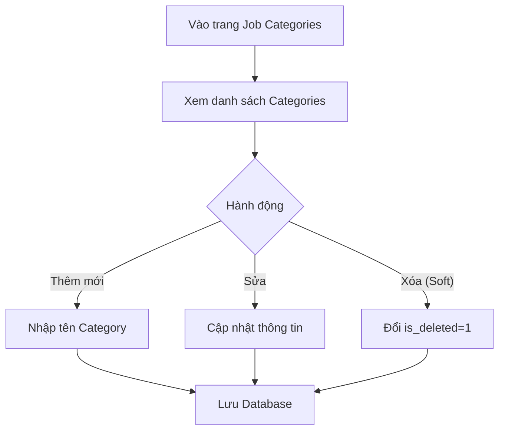

# 📋 User Story 07: Admin Quản Lý Job Categories (Danh Mục Ngành Nghề)

## 1. MÔ TẢ USER STORY
- **Là** Quản trị viên Hệ thống (System Admin),
- **Tôi muốn** quản lý (thêm, sửa, xóa, bật/tắt và sắp xếp) danh mục ngành nghề (Job Categories) được dùng làm từ khóa phân loại cho các tin tuyển dụng,
- **Để** HR của các công ty có thể chọn đúng ngành nghề khi tạo Job, và ứng viên có thể lọc Job theo lĩnh vực quan tâm trên Career Site.
- **Story Points:** 3

## SƠ ĐỒ LUỒNG NGHIỆP VỤ (Business Flow)

## 2. TIÊU CHÍ NGHIỆM THU (Acceptance Criteria)

### Quy ước lưu trữ trạng thái

- Trạng thái bật/tắt của danh mục được lưu ở cột `status` với hai giá trị `ACTIVE` và `INACTIVE`.
- Xóa danh mục là xóa mềm bằng cột `is_deleted = true`; không dùng `is_active`.
- Các API quản lý danh mục mặc định chỉ xử lý bản ghi có `is_deleted = false`, trừ khi task nêu rõ khác đi.
- `INACTIVE` không phải là xóa mềm: category vẫn tồn tại trong Admin, có thể được bật lại và
  vẫn giữ liên kết `jobs.category_id` của các Job cũ.
- HR chỉ được chọn category có `status = ACTIVE` và `is_deleted = false` khi tạo Job hoặc
  thay đổi `categoryId` của Job. Khi chỉnh sửa các field khác của một Job cũ, hệ thống không
  tự động xóa liên kết tới category đang `INACTIVE`.
- Khi HR publish hoặc reopen một Job cũ đang giữ category `INACTIVE`, backend không tự đổi
  `category_id` và không chặn chỉ vì category đã tắt; chỉ từ chối nếu category đã soft delete
  hoặc không còn tồn tại. Quy tắc này giữ nguyên Job cũ trên Career Site khi Job là `ACTIVE`,
  trong khi category `INACTIVE` vẫn không xuất hiện trong bộ lọc public.

- **Kịch bản 1: Admin xem danh sách Job Categories**
  - **VỚI ĐIỀU KIỆN** Admin đang đăng nhập vào Admin Dashboard.
  - **KHI** Admin truy cập `/admin/job-categories`.
  - **THÌ** hệ thống hiển thị bảng danh sách tất cả danh mục ngành nghề, gồm: Tên danh mục, Slug (dùng cho URL), Số Job đang sử dụng, Trạng thái (Active / Inactive), Ngày tạo.

- **Kịch bản 2: Admin thêm danh mục mới**
  - **VỚI ĐIỀU KIỆN** Admin ở trang quản lý Job Categories.
  - **KHI** Admin nhấn "Thêm mới", điền Tên danh mục (ví dụ: "Công nghệ thông tin"), và nhấn "Lưu".
  - **THÌ** hệ thống tự động sinh `slug` (ví dụ: `cong-nghe-thong-tin`) và lưu vào database.
  - Nếu Tên danh mục đã tồn tại: hiển thị lỗi "Tên danh mục này đã tồn tại trong hệ thống."

- **Kịch bản 3: Admin chỉnh sửa danh mục**
  - **VỚI ĐIỀU KIỆN** một danh mục đang tồn tại trong danh sách.
  - **KHI** Admin nhấn "Sửa" và thay đổi tên, sau đó lưu.
  - **THÌ** hệ thống cập nhật tên và slug mới. Các Job đang sử dụng danh mục này tự động hiển thị tên mới (không cần cập nhật thủ công).

- **Kịch bản 4: Admin xóa danh mục không còn sử dụng**
  - **VỚI ĐIỀU KIỆN** một danh mục có 0 Job đang sử dụng.
  - **KHI** Admin nhấn "Xóa" và xác nhận.
  - **THÌ** hệ thống xóa (soft delete) danh mục đó, không hiển thị nữa trong dropdown tạo Job.
  - Nếu danh mục đang được sử dụng bởi ít nhất 1 Job: hiển thị lỗi "Không thể xóa danh mục đang có Job sử dụng."

- **Kịch bản 5: Admin bật/tắt hiển thị danh mục trên Career Site**
  - **VỚI ĐIỀU KIỆN** danh mục đang có trạng thái `ACTIVE`.
  - **KHI** Admin toggle trạng thái sang `INACTIVE`.
  - **THÌ** danh mục ẩn khỏi bộ lọc trên Career Site, nhưng vẫn hiển thị trong danh sách Admin và vẫn gắn với các Job cũ.
  - Các Job cũ không bị đổi `category_id` hoặc bị xóa theo thao tác này. Nếu Job vẫn ở trạng thái
    public hợp lệ (`ACTIVE` và `is_deleted = false`), Job vẫn xuất hiện trong danh sách Career Site
    khi ứng viên không lọc theo category; category `INACTIVE` không được trả về như một lựa chọn filter.
  - Nếu request public cố lọc theo slug của category `INACTIVE` hoặc đã soft delete, backend trả
    danh sách rỗng với response phân trang bình thường; không làm lộ category đó trong danh sách filter.

- **Kịch bản 6: Admin sắp xếp thứ tự danh mục**
  - **VỚI ĐIỀU KIỆN** Admin đang ở trang `/admin/job-categories` và không lọc theo từ khóa.
  - **KHI** Admin kéo thả một danh mục hoặc dùng nút đưa lên/đưa xuống.
  - **THÌ** frontend gửi toàn bộ danh sách ID danh mục chưa bị xóa theo thứ tự mới tới `PUT /api/v1/admin/job-categories/reorder`.
  - Backend bắt buộc danh sách gửi lên chứa mỗi ID đúng một lần và đầy đủ tất cả danh mục chưa bị xóa; nếu không hợp lệ trả lỗi `400`.
  - Backend cập nhật `sort_order` liên tiếp từ `0`; danh mục `INACTIVE` vẫn được sắp xếp, danh mục đã xóa mềm không tham gia.
  - Sau khi lưu thành công, thứ tự mới được trả về và ghi audit log.

### Route chuẩn

- Route chính của màn hình là `/admin/job-categories`.
- `/admin/categories` chỉ là alias redirect để tương thích với link cũ, không phải route contract mới.

## 3. NGOÀI PHẠM VI
- **KHÔNG** hỗ trợ phân cấp danh mục (category > subcategory) trong phiên bản này.
- **KHÔNG** cho phép HR tự tạo danh mục – chỉ Admin hệ thống mới có quyền thêm/sửa/xóa.
