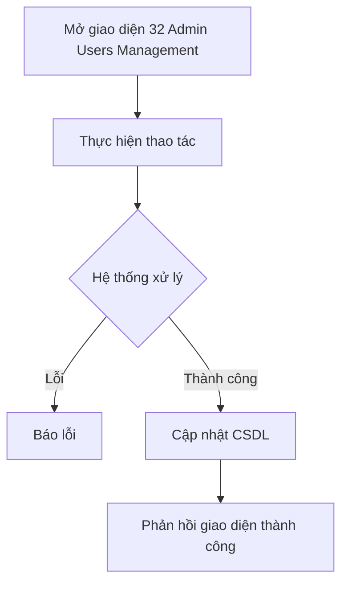

# 📋 User Story 32: Admin Quản Lý Users (Tài Khoản Người Dùng Hệ Thống)

## 1. MÔ TẢ USER STORY
- **Là** Quản trị viên Hệ thống (System Admin),
- **Tôi muốn** xem và quản lý toàn bộ tài khoản người dùng trên hệ thống (HR của tất cả các công ty),
- **Để** tôi có thể hỗ trợ xử lý sự cố tài khoản, vô hiệu hóa tài khoản vi phạm và giám sát tổng thể hoạt động người dùng.
- **Story Points:** 3

## SƠ ĐỒ LUỒNG NGHIỆP VỤ (Business Flow)

## 2. TIÊU CHÍ NGHIỆM THU (Acceptance Criteria)

- **Kịch bản 1: Admin xem danh sách tất cả người dùng**
  - **VỚI ĐIỀU KIỆN** System Admin đang đăng nhập vào Admin Dashboard.
  - **KHI** Admin truy cập `/admin/users`.
  - **THÌ** hệ thống hiển thị bảng danh sách tất cả tài khoản trong hệ thống (phân trang 20 bản ghi/trang), gồm: Tên, Email, Tên công ty, Role, Trạng thái, Ngày tạo, Lần đăng nhập cuối.

- **Kịch bản 2: Admin tìm kiếm và lọc người dùng**
  - **VỚI ĐIỀU KIỆN** Admin đang xem danh sách Users.
  - **KHI** Admin nhập từ khóa tìm kiếm (tên/email) hoặc chọn bộ lọc theo: Công ty, Role (HR / HR_ADMIN / ADMIN), Trạng thái (Active / Inactive).
  - **THÌ** danh sách lọc kết quả theo đúng điều kiện, hiển thị tổng số kết quả tìm được.

- **Kịch bản 3: Admin xem chi tiết tài khoản người dùng**
  - **VỚI ĐIỀU KIỆN** Admin muốn kiểm tra thông tin cụ thể của một tài khoản.
  - **KHI** Admin nhấn vào tên của người dùng đó.
  - **THÌ** hệ thống hiển thị trang chi tiết: thông tin cơ bản, công ty thuộc về, lịch sử đăng nhập 10 lần gần nhất, danh sách Job đã tạo (nếu là HR).

- **Kịch bản 4: Admin vô hiệu hóa tài khoản vi phạm**
  - **VỚI ĐIỀU KIỆN** Admin phát hiện một tài khoản có hành vi bất thường (qua Audit Logs).
  - **KHI** Admin nhấn "Vô hiệu hóa tài khoản" và nhập lý do.
  - **THÌ** hệ thống cập nhật `users.status = INACTIVE`, tài khoản bị logout ngay lập tức (vô hiệu hóa toàn bộ token đang hoạt động).
  - Ghi lại hành động này vào Audit Logs với lý do Admin nhập.

- **Kịch bản 5: Admin kích hoạt lại tài khoản đã bị vô hiệu hóa**
  - **VỚI ĐIỀU KIỆN** một tài khoản đang có trạng thái `INACTIVE`.
  - **KHI** Admin nhấn "Kích hoạt lại".
  - **THÌ** hệ thống cập nhật `users.status = ACTIVE`, người dùng có thể đăng nhập bình thường trở lại.

## 3. NGOÀI PHẠM VI
- System Admin **KHÔNG** thể thay đổi mật khẩu của người dùng – người dùng phải tự đặt lại qua "Quên mật khẩu".
- **KHÔNG** hỗ trợ tạo tài khoản HR trực tiếp từ Admin Dashboard – HR tự đăng ký qua flow Onboarding.
- **KHÔNG** cho phép Admin xem mật khẩu hoặc dữ liệu nhạy cảm của người dùng.
