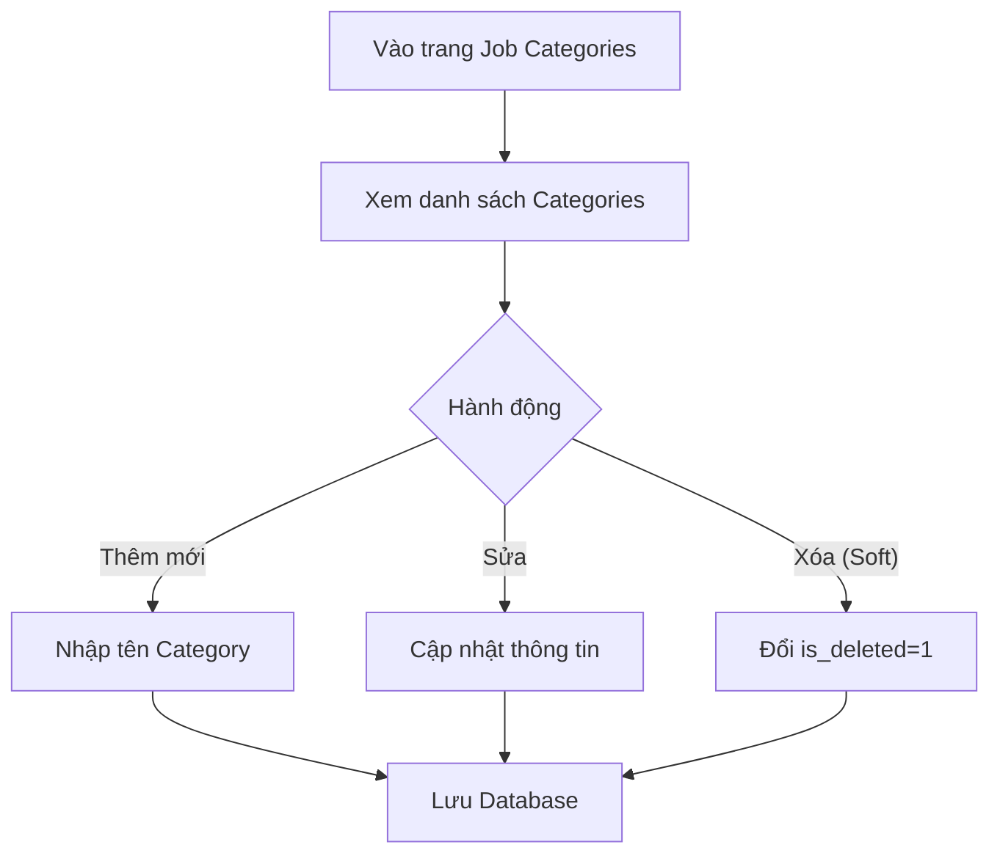

# 📋 User Story 33: Admin Quản Lý Job Categories (Danh Mục Ngành Nghề)

## 1. MÔ TẢ USER STORY
- **Là** Quản trị viên Hệ thống (System Admin),
- **Tôi muốn** quản lý (thêm, sửa, xóa, sắp xếp) danh mục ngành nghề (Job Categories) được dùng làm từ khóa phân loại cho các tin tuyển dụng,
- **Để** HR của các công ty có thể chọn đúng ngành nghề khi tạo Job, và ứng viên có thể lọc Job theo lĩnh vực quan tâm trên Career Site.
- **Story Points:** 3

## SƠ ĐỒ LUỒNG NGHIỆP VỤ (Business Flow)

## 2. TIÊU CHÍ NGHIỆM THU (Acceptance Criteria)

- **Kịch bản 1: Admin xem danh sách Job Categories**
  - **VỚI ĐIỀU KIỆN** Admin đang đăng nhập vào Admin Dashboard.
  - **KHI** Admin truy cập `/admin/job-categories`.
  - **THÌ** hệ thống hiển thị bảng danh sách tất cả danh mục ngành nghề, gồm: Tên danh mục, Slug (dùng cho URL), Số Job đang sử dụng, Trạng thái (Active / Inactive), Ngày tạo.

- **Kịch bản 2: Admin thêm danh mục mới**
  - **VỚI ĐIỀU KIỆN** Admin ở trang quản lý Job Categories.
  - **KHI** Admin nhấn "Thêm mới", điền Tên danh mục (ví dụ: "Công nghệ thông tin"), và nhấn "Lưu".
  - **THÌ** hệ thống tự động sinh `slug` (ví dụ: `cong-nghe-thong-tin`) và lưu vào database.
  - Nếu Tên danh mục đã tồn tại: hiển thị lỗi "Tên danh mục này đã tồn tại trong hệ thống."

- **Kịch bản 3: Admin chỉnh sửa danh mục**
  - **VỚI ĐIỀU KIỆN** một danh mục đang tồn tại trong danh sách.
  - **KHI** Admin nhấn "Sửa" và thay đổi tên, sau đó lưu.
  - **THÌ** hệ thống cập nhật tên và slug mới. Các Job đang sử dụng danh mục này tự động hiển thị tên mới (không cần cập nhật thủ công).

- **Kịch bản 4: Admin xóa danh mục không còn sử dụng**
  - **VỚI ĐIỀU KIỆN** một danh mục có 0 Job đang sử dụng.
  - **KHI** Admin nhấn "Xóa" và xác nhận.
  - **THÌ** hệ thống xóa (soft delete) danh mục đó, không hiển thị nữa trong dropdown tạo Job.
  - Nếu danh mục đang được sử dụng bởi ít nhất 1 Job: hiển thị lỗi "Không thể xóa danh mục đang có Job sử dụng."

- **Kịch bản 5: Admin bật/tắt hiển thị danh mục trên Career Site**
  - **VỚI ĐIỀU KIỆN** danh mục đang có trạng thái `ACTIVE`.
  - **KHI** Admin toggle trạng thái sang `INACTIVE`.
  - **THÌ** danh mục ẩn khỏi bộ lọc trên Career Site, nhưng vẫn hiển thị trong danh sách Admin và vẫn gắn với các Job cũ.

## 3. NGOÀI PHẠM VI
- **KHÔNG** hỗ trợ phân cấp danh mục (category > subcategory) trong phiên bản này.
- **KHÔNG** cho phép HR tự tạo danh mục – chỉ Admin hệ thống mới có quyền thêm/sửa/xóa.
