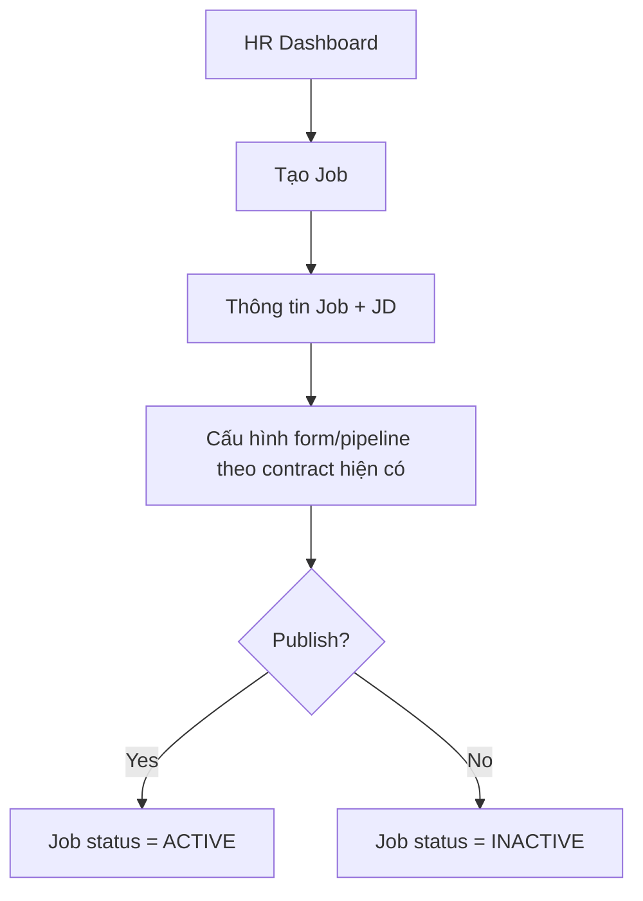

# EPIC 03 — HR Dashboard & Job Management

## 1. Tóm tắt
- **Nghiệp vụ:** HR quản lý dashboard, job list, tạo và publish tin tuyển dụng.
- **Điều kiện tiên quyết:** HR account đã `ACTIVE` và company profile đã được onboarding hoặc skip với reminder.
- **Luồng chính:** Tạo Job → thông tin Job → AI JD tùy chọn → (cấu hình form/pipeline nếu contract đã có) → publish → Job chuyển sang `ACTIVE`.

## 2. Giá trị nghiệp vụ và chỉ số
- **Giá trị nghiệp vụ:** Giảm thời gian tạo Job, giúp HR nhanh chóng đăng tin mà không cần hiểu toàn bộ cấu hình kỹ thuật.
- **Chỉ số:**
  - Thời gian tạo Job đầu tiên < 5 phút trong luồng mặc định
  - Tỷ lệ Job publish thành công > 95%

## 3. Quy trình nghiệp vụ

## 4. Phạm vi và Backlog
| ID | Tên Story | Ưu tiên | Trạng thái |
|---|---|---|---|
| US-10 | Dashboard tổng quan | Must Have | To-do |
| US-11 | Xem danh sách Job | Must Have | To-do |
| US-12 | Tạo Job với AI JD | Must Have | Manual create implemented locally; AI provider/E2E pending |
| US-13 | Xem & chỉnh sửa Job | Must Have | Contract regression verified 2026-09-18; E2E pending |
| US-14 | Publish Job | Must Have | Contract regression verified 2026-09-18; E2E pending |
| US-15 | Dynamic Form | Must Have | Contract regression verified 2026-09-18; E2E pending |

## 5. Business Rules
- Job mới bắt đầu ở `INACTIVE` với `round_count = 0`; API tạo Job không tự tạo form hoặc pipeline.
  Sau khi nhận Job ID, UI tạo Job gọi contract form-fields của US-15 để lưu các field tùy chỉnh.
  Pipeline vẫn là luồng phụ thuộc riêng và không được giả định là đã tạo tự động.
- Nếu chưa cấu hình advanced fields, system vẫn publish được với cấu hình tối giản.
- Trạng thái Job chuẩn theo database/code hiện tại là `INACTIVE`, `ACTIVE`, `CLOSED`.
- `INACTIVE` = chưa công khai/bản nháp hoặc tạm dừng; `ACTIVE` = đã publish; `CLOSED` = đã đóng tuyển dụng.
- Luồng publish là `INACTIVE → ACTIVE`; close là `ACTIVE → CLOSED`; reopen là `CLOSED → ACTIVE`.
- Không dùng tên trạng thái `DRAFT` trong API/database và không thêm trạng thái `EXPIRED` trong phạm vi hiện tại.
- `ACTIVE` = published job; không dùng Unpublish như một trạng thái riêng trong MVP.
- AI JD là recommendation, HR vẫn có quyền edit trước khi publish.

## 6. Cải tiến trong tương lai
- Form builder nâng cao với conditional logic và các loại field ngoài phạm vi US-15.
- Nhân bản Job kèm bản sao đầy đủ của template.
- Tự động hết hạn Job và tự động close Job.

