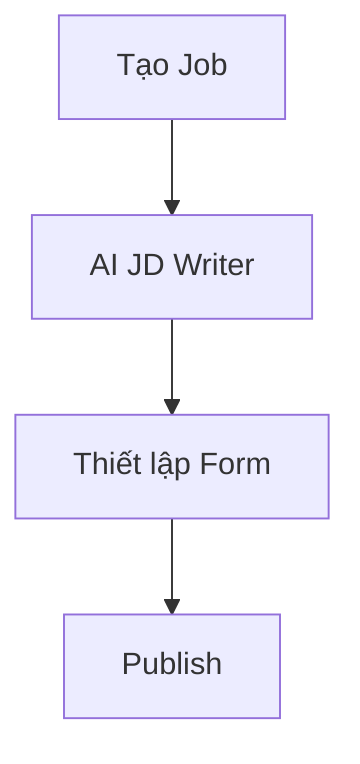

# HƯỚNG DẪN VIẾT TÀI LIỆU EPIC BRIEF (epic-03/brief.md)

## 1. TÓM TẮT YÊU CẦU (Executive Summary)
- **Nghiệp vụ:** Quản lý bảng điều khiển và tạo/chỉnh sửa tin tuyển dụng.
- **Prerequisites:** Doanh nghiệp đã được duyệt (ACTIVE).

## 2. GIÁ TRỊ DOANH NGHIỆP & CHỈ SỐ ĐO LƯỜNG (Business Value & Metrics)
- **Business Value:** Tăng tốc độ tạo JD nhờ AI và trực quan hóa dữ liệu.
- **Metrics:** Thời gian tạo Job < 2 phút.

## 3. QUY TRÌNH NGHIỆP VỤ (Business Process)

## 4. PHÂN CHIA USER STORY (Scope & Backlog)
| ID | Tên Story | Loại | Priority (MoSCoW) | Trạng thái |
|---|---|---|---|---|
| US-06 | Dashboard Tong Quan | Feature | Must Have | To-do |
| US-07 | Xem Danh Sach Job | Feature | Must Have | To-do |
| US-08 | Tao Job AI JD | Feature | Must Have | To-do |
| US-09 | Xem Chinh Sua Job | Feature | Must Have | To-do |
| US-10 | Publish Job | Feature | Must Have | To-do |
| US-25 | Dynamic Form | Feature | Must Have | To-do |

