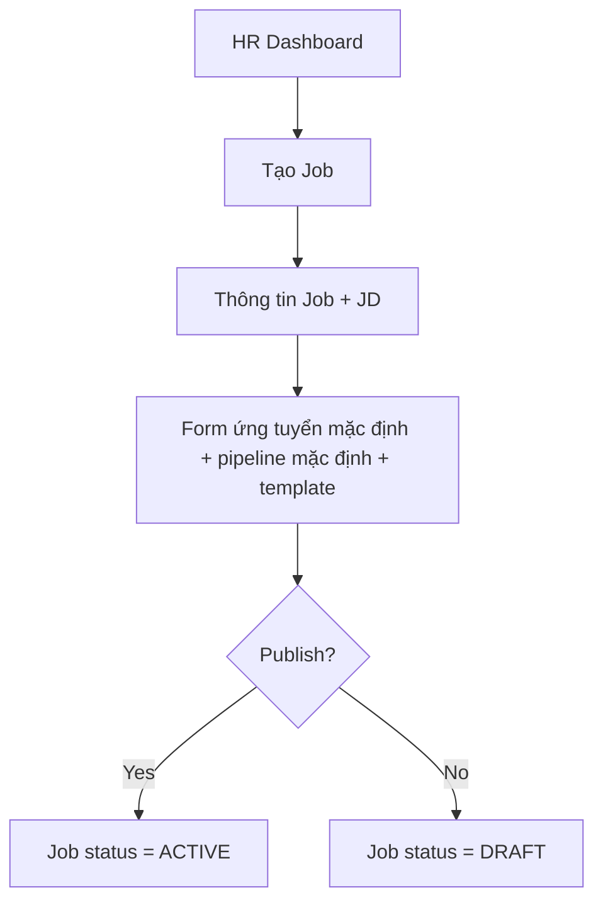

# EPIC 03 — HR Dashboard & Job Management

## 1. Tóm tắt
- **Nghiệp vụ:** HR quản lý dashboard, job list, tạo và publish tin tuyển dụng.
- **Điều kiện tiên quyết:** HR account đã `ACTIVE` và company profile đã được onboarding hoặc skip với reminder.
- **Luồng chính:** Tạo Job → thông tin Job → AI JD tùy chọn → form mặc định + pipeline mặc định → publish → Job chuyển sang `ACTIVE`.

## 2. Giá trị nghiệp vụ và chỉ số
- **Giá trị nghiệp vụ:** Giảm thời gian tạo Job, giúp HR nhanh chóng đăng tin mà không cần hiểu toàn bộ cấu hình kỹ thuật.
- **Chỉ số:**
  - Thời gian tạo Job đầu tiên < 5 phút trong luồng mặc định
  - Tỷ lệ Job publish thành công > 95%

## 3. Quy trình nghiệp vụ

## 4. Phạm vi và Backlog
| ID | Tên Story | Ưu tiên | Trạng thái |
|---|---|---|---|
| US-06 | Dashboard tổng quan | Must Have | To-do |
| US-07 | Xem danh sách Job | Must Have | To-do |
| US-08 | Tạo Job với AI JD | Must Have | To-do |
| US-09 | Xem & chỉnh sửa Job | Must Have | To-do |
| US-10 | Publish Job | Must Have | To-do |
| US-25 | Dynamic Form | Must Have | To-do |

## 5. Business Rules
- Job mới bắt đầu với default pipeline, default email template và default application form; HR không cần tạo từ đầu.
- Nếu chưa cấu hình advanced fields, system vẫn publish được với cấu hình tối giản.
- `ACTIVE` = published job; không dùng Unpublish trong MVP nếu không có trạng thái riêng.
- AI JD là recommendation, HR vẫn có quyền edit trước khi publish.

## 6. Cải tiến trong tương lai
- Form builder nâng cao với validation tùy chỉnh và trường động.
- Nhân bản Job kèm bản sao đầy đủ của template.
- Tự động hết hạn Job và tự động close Job.

