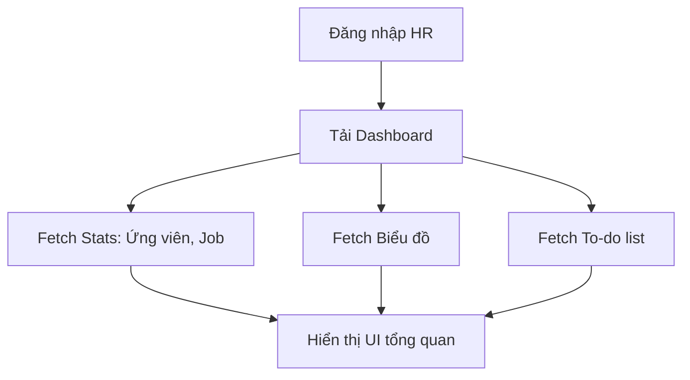

# 📋 User Story 10: Dashboard Tổng Quan (HR Dashboard Overview)

## 1. MÔ TẢ USER STORY
- **Là** Nhà tuyển dụng (HR),
- **Tôi muốn** xem trang tổng quan (Dashboard) ngay khi đăng nhập, hiển thị các số liệu thống kê chính và công việc cần làm,
- **Để** tôi có thể nắm bắt nhanh tình hình tuyển dụng của công ty và biết mình cần ưu tiên xử lý việc gì trong ngày.
- **Story Points:** 3

## SƠ ĐỒ LUỒNG NGHIỆP VỤ (Business Flow)

## 2. TIÊU CHÍ NGHIỆM THU (Acceptance Criteria)

- **Kịch bản 1: HR xem các thẻ số liệu thống kê (Metric Cards)**
  - **VỚI ĐIỀU KIỆN** HR đăng nhập vào hệ thống.
  - **KHI** HR truy cập `/dashboard`.
  - **THÌ** hệ thống hiển thị 4 thẻ số liệu của công ty (theo bộ lọc thời gian mặc định: 30 ngày qua):
    1. Tổng số Job đang mở (ACTIVE)
    2. Tổng số Ứng viên mới nộp (trạng thái NEW)
    3. Số lịch phỏng vấn sắp tới (trong 7 ngày tới)
    4. Tỷ lệ tuyển dụng thành công (Hired Candidates / Total Candidates)

- **Kịch bản 2: HR xem biểu đồ xu hướng ứng tuyển**
  - **VỚI ĐIỀU KIỆN** HR đang ở trang Dashboard.
  - **KHI** cuộn xuống phần biểu đồ.
  - **THÌ** hiển thị biểu đồ đường (Line Chart) thể hiện số lượng đơn ứng tuyển nhận được theo từng ngày trong 30 ngày qua.

- **Kịch bản 3: HR xem danh sách việc cần làm (To-Do / Recent Activities)**
  - **VỚI ĐIỀU KIỆN** HR đang ở trang Dashboard.
  - **KHI** xem panel bên phải (hoặc bên dưới).
  - **THÌ** hiển thị danh sách các mục cần chú ý:
    - Ứng viên chờ duyệt (mới nhất).
    - Lịch phỏng vấn trong hôm nay và ngày mai.
    - Phản hồi từ chối phỏng vấn của ứng viên (nếu có).

- **Kịch bản 4: Lọc dữ liệu Dashboard theo thời gian**
  - **VỚI ĐIỀU KIỆN** HR đang ở trang Dashboard.
  - **KHI** HR chọn khoảng thời gian từ dropdown (7 ngày qua, 30 ngày qua, Tháng này, Năm nay).
  - **THÌ** các số liệu và biểu đồ tự động cập nhật theo khoảng thời gian được chọn.

## 3. NGOÀI PHẠM VI
- **KHÔNG** hỗ trợ HR tự custom giao diện Dashboard (kéo thả các widget) trong phiên bản này.
- **KHÔNG** hiển thị dữ liệu của công ty khác (bảo đảm multi-tenant).
