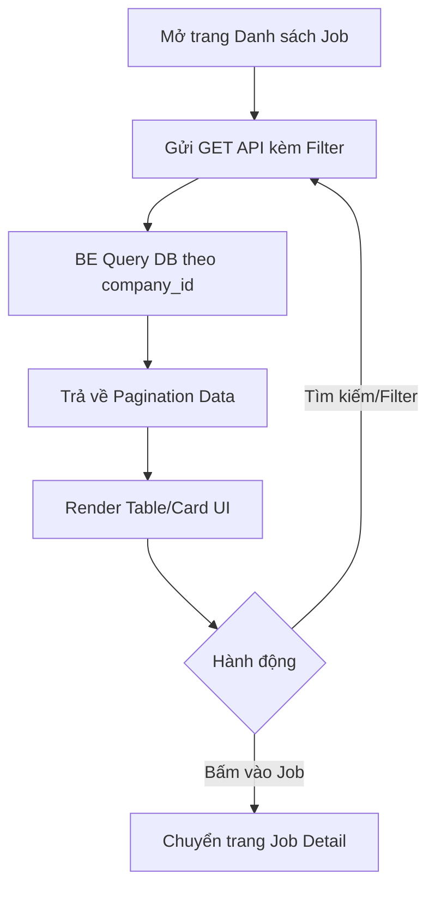

# 📋 User Story 11: Xem Danh Sách Job (Job List Management)

## 1. MÔ TẢ USER STORY
- **Là** Nhà tuyển dụng (HR),
- **Tôi muốn** xem và quản lý danh sách tất cả các tin tuyển dụng (Jobs) của công ty mình,
- **Để** tôi có thể dễ dàng tìm kiếm, lọc, và theo dõi trạng thái của từng chiến dịch tuyển dụng.
- **Story part:** 2

## SƠ ĐỒ LUỒNG NGHIỆP VỤ (Business Flow)

## 2. TIÊU CHÍ NGHIỆM THU (Acceptance Criteria)

- **Kịch bản 1: HR xem danh sách Job mặc định**
  - **VỚI ĐIỀU KIỆN** HR đã đăng nhập thành công.
  - **KHI** HR truy cập `/dashboard/jobs`.
  - **THÌ** hệ thống hiển thị dạng bảng (Table view) các Job của công ty, sắp xếp theo ngày tạo mới nhất. Các cột hiển thị: Tiêu đề Job, Trạng thái (Draft/Active/Closed), Ngày tạo, Ngày hết hạn, Số lượng ứng viên, và Cột Hành động.

- **Kịch bản 2: HR lọc và tìm kiếm Job**
  - **VỚI ĐIỀU KIỆN** HR đang ở trang danh sách Job.
  - **KHI** HR nhập từ khóa vào ô tìm kiếm (tiêu đề Job) hoặc chọn bộ lọc trạng thái (ví dụ: chỉ hiện Active Jobs).
  - **THÌ** bảng dữ liệu ngay lập tức (hoặc sau khi enter/click) cập nhật hiển thị các Job khớp với điều kiện lọc.

- **Kịch bản 3: HR thực hiện thao tác nhanh (Quick Actions)**
  - **VỚI ĐIỀU KIỆN** HR đang xem một dòng Job trong bảng.
  - **KHI** HR nhấn vào nút "..." (More options).
  - **THÌ** hiển thị dropdown với các tùy chọn: Xem chi tiết (Kanban ứng viên), Chỉnh sửa Job, Sao chép (Duplicate) Job, Đóng Job (Close), Xóa.
  - Khi chọn Xóa: Hệ thống sẽ thực hiện Xóa cứng (Hard Delete) Job đó, đồng thời tự động xóa cứng tất cả các ứng viên (Application) đang thuộc về Job này cùng file CV của họ.

- **Kịch bản 4: Phân trang (Pagination)**
  - **VỚI ĐIỀU KIỆN** công ty có hơn 10 Jobs.
  - **KHI** HR cuộn xuống cuối bảng.
  - **THÌ** hiển thị các nút phân trang (1, 2, 3...) hoặc nút "Tải thêm", cho phép xem các trang dữ liệu tiếp theo.

## 3. NGOÀI PHẠM VI
- **KHÔNG** hỗ trợ thao tác hàng loạt (Bulk actions - ví dụ chọn nhiều Job để xóa/đóng cùng lúc) trong phiên bản này.
- **KHÔNG** xuất (Export) danh sách Job ra file Excel/PDF.
