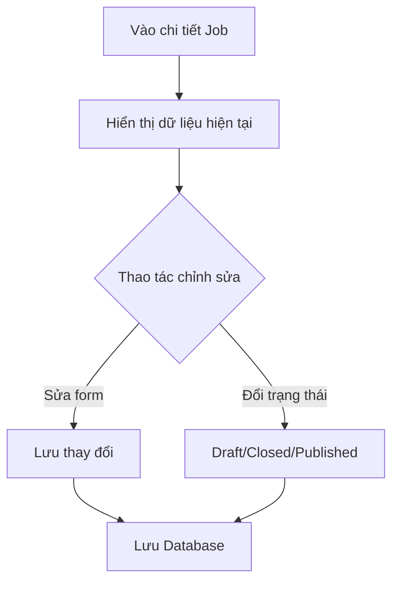

# 📋 User Story 13: Xem & Chỉnh Sửa Job (View & Edit Job)

## 1. MÔ TẢ USER STORY
- **Là** Nhà tuyển dụng (HR),
- **Tôi muốn** xem lại thông tin chi tiết của một tin tuyển dụng đã tạo và chỉnh sửa nó khi cần thiết,
- **Để** tôi có thể cập nhật nội dung JD, thay đổi mức lương hoặc ngày hết hạn nếu có sự thay đổi từ yêu cầu tuyển dụng.
- **Story Points:** 3

## SƠ ĐỒ LUỒNG NGHIỆP VỤ (Business Flow)

## 2. TIÊU CHÍ NGHIỆM THU (Acceptance Criteria)

- **Kịch bản 1: HR xem chi tiết Job**
  - **VỚI ĐIỀU KIỆN** HR đang ở danh sách Job.
  - **KHI** HR click vào tiêu đề của một Job hoặc chọn "Chỉnh sửa" từ menu.
  - **THÌ** hệ thống chuyển đến màn hình `/dashboard/jobs/{job_id}/edit` hiển thị đầy đủ thông tin hiện tại của Job đó trên form.

- **Kịch bản 2: HR chỉnh sửa và lưu thành công**
  - **VỚI ĐIỀU KIỆN** HR đang ở màn hình chỉnh sửa Job.
  - **KHI** HR thay đổi một số thông tin (ví dụ: mô tả, ngày hết hạn) và nhấn "Cập nhật".
  - **THÌ** hệ thống gọi API `PUT /api/v1/jobs/{job_id}`, validate dữ liệu và cập nhật database.
  - Hiển thị toast thông báo "Cập nhật thành công!".

- **Kịch bản 3: HR chỉnh sửa Job đang ACTIVE**
  - **VỚI ĐIỀU KIỆN** Job đang có trạng thái `ACTIVE` (đã hiển thị công khai).
  - **KHI** HR chỉnh sửa và lưu lại.
  - **THÌ** thông tin trên trang Career Site thay đổi ngay lập tức (không cần unpublish). Cảnh báo nhỏ xuất hiện báo cho HR biết thay đổi sẽ hiển thị public ngay.

- **Kịch bản 4: HR cố gắng chỉnh sửa Job đã CLOSED**
  - **VỚI ĐIỀU KIỆN** Job đang có trạng thái `CLOSED`.
  - **KHI** HR mở trang chỉnh sửa.
  - **THÌ** toàn bộ form ở trạng thái "Chỉ đọc" (không thể sửa). Nút "Cập nhật" bị ẩn. Hiển thị thông báo: _"Job này đã đóng, không thể chỉnh sửa."_

## 3. NGOÀI PHẠM VI
- **KHÔNG** theo dõi lịch sử chỉnh sửa (version history) của Job – chỉ lưu dữ liệu mới nhất.
- Chỉnh sửa Form ứng tuyển và Cấu hình Pipeline thuộc các User Story riêng biệt.
