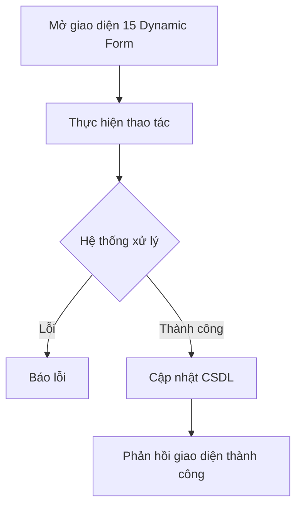

# 📋 User Story 15: Dynamic Application Form (Form Ứng Tuyển Tùy Chỉnh Theo Job)

## 1. MÔ TẢ USER STORY
- **Là** Nhà tuyển dụng (HR),
- **Tôi muốn** cấu hình bộ câu hỏi riêng (Dynamic Form) cho từng tin tuyển dụng khi tạo/chỉnh sửa Job,
- **Để** tôi có thể thu thập đúng thông tin cần thiết từ ứng viên phù hợp với từng vị trí công việc cụ thể.
- **Story Points:** 5

## SƠ ĐỒ LUỒNG NGHIỆP VỤ (Business Flow)

## 2. TIÊU CHÍ NGHIỆM THU (Acceptance Criteria)

- **Kịch bản 1: HR thêm câu hỏi tùy chỉnh khi tạo Job**
  - **VỚI ĐIỀU KIỆN** HR đang ở màn hình tạo Job mới (`/dashboard/jobs/create`).
  - **KHI** HR nhấn "Thêm câu hỏi" trong section "Form ứng tuyển" và điền thông tin câu hỏi (label, loại input: text/textarea/select/file, bắt buộc hay không).
  - **THÌ** hệ thống lưu cấu hình câu hỏi vào bảng `form_fields` liên kết với `job_id` tương ứng.
  - Thứ tự câu hỏi được lưu theo trường `order_index` và có thể kéo-thả để sắp xếp lại (Drag & Drop).

- **Kịch bản 2: Ứng viên thấy form động tương ứng với Job**
  - **VỚI ĐIỀU KIỆN** ứng viên truy cập trang chi tiết Job trên Career Site và nhấn "Ứng tuyển ngay".
  - **KHI** form ứng tuyển được hiển thị.
  - **THÌ** form hiển thị đúng các trường câu hỏi đã được HR cấu hình cho Job đó (không hiển thị câu hỏi của Job khác).
  - Các trường được đánh dấu `required` phải hiển thị dấu (*) và validate trước khi submit.

- **Kịch bản 3: HR chỉnh sửa form câu hỏi sau khi Job đã publish**
  - **VỚI ĐIỀU KIỆN** Job đang ở trạng thái `ACTIVE` và đã có ứng viên nộp đơn.
  - **KHI** HR vào chỉnh sửa và xóa một câu hỏi khỏi form.
  - **THÌ** hệ thống hiển thị cảnh báo: _"Xóa câu hỏi sẽ không ảnh hưởng đến các đơn đã nộp, nhưng câu hỏi sẽ không còn hiển thị cho ứng viên mới."_
  - Các đơn ứng tuyển cũ vẫn giữ nguyên dữ liệu câu trả lời đã lưu.

- **Kịch bản 4: Job không có form tùy chỉnh (dùng form mặc định)**
  - **VỚI ĐIỀU KIỆN** HR tạo Job mà không thêm câu hỏi tùy chỉnh nào.
  - **KHI** ứng viên ứng tuyển vào Job đó.
  - **THÌ** form ứng tuyển chỉ hiển thị các trường mặc định: Họ tên, Email, Số điện thoại, Upload CV (PDF, tối đa 5MB).

## 3. NGOÀI PHẠM VI
- **KHÔNG** hỗ trợ các loại câu hỏi dạng matrix, rating scale hoặc conditional logic (hiển thị câu hỏi B khi câu hỏi A có giá trị X) trong phiên bản này.
- **KHÔNG** cho phép ứng viên lưu nháp (save draft) form ứng tuyển giữa chừng.
- **KHÔNG** tích hợp với các dịch vụ form bên ngoài (Google Form, Typeform,...).

## 4. CONTRACT ĐÃ CHỐT KHI TRIỂN KHAI

- Cấu hình form dùng bảng `form_fields` và migration `V14__create_form_fields.sql`. ID, `job_id` và `company_id` dùng `BIGINT`/Java `Long`.
- API nội bộ của HR/HR_ADMIN:
  - `GET /api/v1/jobs/{jobId}/form-fields`
  - `POST /api/v1/jobs/{jobId}/form-fields`
  - `PUT /api/v1/jobs/{jobId}/form-fields/{fieldId}`
  - `PUT /api/v1/jobs/{jobId}/form-fields/reorder`
  - `DELETE /api/v1/jobs/{jobId}/form-fields/{fieldId}`
- Loại field trong phiên bản này là `TEXT`, `TEXTAREA`, `URL`, `FILE`, `SELECT`. `fieldName` có thể bỏ trống ở request tạo và sẽ được backend sinh từ `label`; tên đang hiệu lực phải duy nhất trong Job.
- `SELECT` bắt buộc có danh sách options không trống và không trùng. Các loại khác không được có options. `displayOrder` được backend kiểm tra lại, không tin thứ tự do frontend gửi riêng lẻ.
- HR chỉ được thao tác trên Job cùng `company_id`. Job `INACTIVE` và `ACTIVE` được sửa form; Job `CLOSED` trả lỗi `409`. Thay đổi ghi audit log.
- Xóa field là soft delete bằng `is_deleted = true`, vì vậy các câu trả lời cũ không bị xóa; field đã xóa không hiển thị cho ứng viên mới.
- Chi tiết Job public được mở rộng với `applicationForm.fields`. Các field mặc định Họ tên, Email, Số điện thoại và CV, cùng API submit `POST /api/v1/public/jobs/{jobId}/applications`, thuộc flow US-26.
