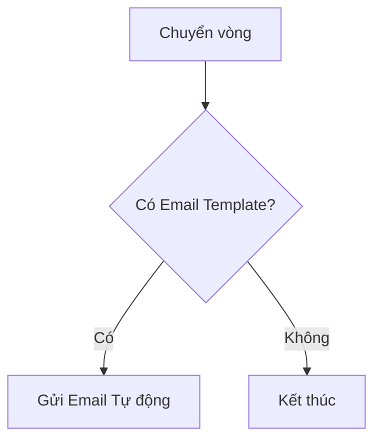

# HƯỚNG DẪN VIẾT TÀI LIỆU EPIC BRIEF (epic-04/brief.md)

## 1. TÓM TẮT YÊU CẦU (Executive Summary)
- **Nghiệp vụ:** Tự động hóa luồng chuyển vòng phỏng vấn và gửi email.
- **Prerequisites:** Job đã được tạo.

## 2. GIÁ TRỊ DOANH NGHIỆP & CHỈ SỐ ĐO LƯỜNG (Business Value & Metrics)
- **Business Value:** Tiết kiệm 80% thời gian gửi email thủ công.
- **Metrics:** 100% email gửi đúng trạng thái.

## 3. QUY TRÌNH NGHIỆP VỤ (Business Process)

## 4. PHÂN CHIA USER STORY (Scope & Backlog)
| ID | Tên Story | Loại | Priority (MoSCoW) | Trạng thái |
|---|---|---|---|---|
| US-11 | Cau Hinh Pipeline | Feature | Must Have | To-do |
| US-12 | Email Automation | Feature | Must Have | To-do |
| US-13 | Dat Lich Phong Van | Feature | Must Have | To-do |
| US-26 | Evaluation Form | Feature | Must Have | To-do |
| US-27 | Email Logs | Feature | Must Have | To-do |

