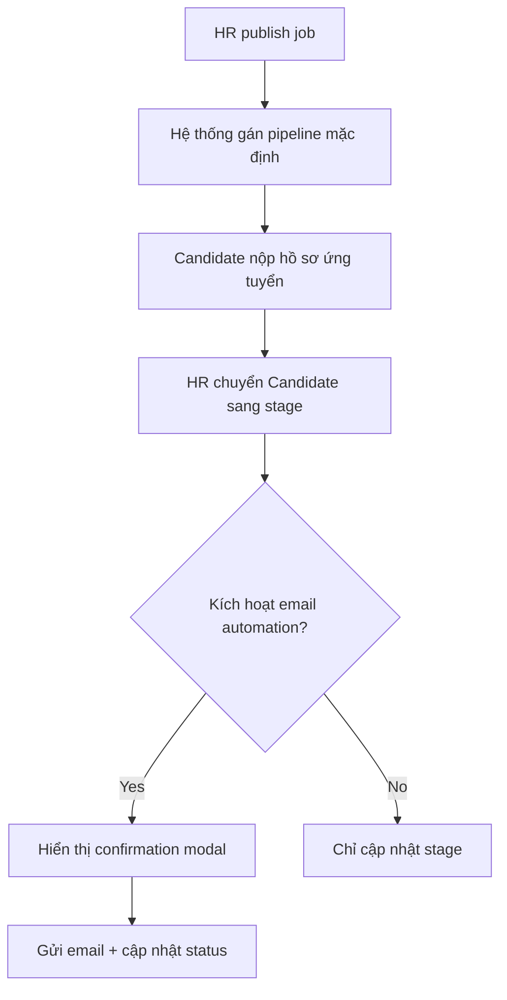

# EPIC 04 — Pipeline & Automation

## 1. Tóm tắt
- **Nghiệp vụ:** Thiết lập pipeline tuyển dụng, tự động hóa email và lịch phỏng vấn cho ứng viên.
- **Điều kiện tiên quyết:** Job đã `ACTIVE` hoặc `DRAFT` với default pipeline đã được gán.
- **Luồng chính:** HR publish Job → default pipeline sẵn sàng → ứng viên đi qua các stage → email automation chỉ gửi thư mời/cập nhật sau khi HR xác nhận side effect.

## 2. Giá trị nghiệp vụ và chỉ số
- **Giá trị nghiệp vụ:** Giảm thao tác thủ công, đảm bảo candidate nhận email đúng thời điểm và HR không phải gửi email tay từng vòng.
- **Chỉ số:**
  - 100% action trạng thái có confirmation before email side effect
  - Tỷ lệ email gửi thành công > 95%

## 3. Quy trình nghiệp vụ


## 4. Phạm vi và Backlog
| ID | Tên Story | Ưu tiên | Trạng thái |
|---|---|---|---|
| US-16 | Config pipeline | Must Have | To-do |
| US-17 | Email automation | Must Have | To-do |
| US-18 | Đặt lịch phỏng vấn | Must Have | To-do |
| US-19 | Evaluation form | Must Have | To-do |
| US-20 | Email logs | Must Have | To-do |
| US-21 | Notifications | Should Have | To-do |

## 5. Business Rules
- Pipeline default phải sẵn sàng khi Job mới tạo; không yêu cầu HR tự tạo từ đầu.
- Nếu HR xóa một round đang có ứng viên, phải hiện cảnh báo rõ ràng và có CTA xem ứng viên hoặc chuyển họ đi.
- Email automation luôn cần confirmation nếu có side effect gửi email.
- Không có hidden side effect: mọi action ảnh hưởng candidate phải được báo trước.

## 6. Cải tiến trong tương lai và quyết định sản phẩm
- Các vòng tuyển dụng song song và round template nâng cao là cải tiến trong tương lai.
- Tự động đặt lịch phỏng vấn khi chưa có xác nhận của HR là cải tiến trong tương lai, tùy quyết định sản phẩm.

## 7. API JSON Contracts (Tham khảo)

### 7.1. API Lên lịch phỏng vấn (Schedule Interview)
- **Endpoint:** `POST /api/v1/hr/interviews`
- **Request Body:** (Tham chiếu bảng `interviews`)
```json
{
  "application_id": "app-uuid-5678",
  "round_id": "round-uuid-9999",
  "interview_time": "2026-09-05T09:00:00Z",
  "duration": 60,
  "location": "https://meet.google.com/abc-xyz",
  "note": "Phỏng vấn kỹ thuật vòng 1",
  "candidate_note": "Vui lòng chuẩn bị laptop có cài sẵn IDE."
}
```
- **Response (201 Created):**
```json
{
  "id": "interview-uuid-1111",
  "status": "SCHEDULED",
  "secure_token": "token-for-magic-link-123",
  "token_expiry_at": "2026-09-04T09:00:00Z"
}
```


