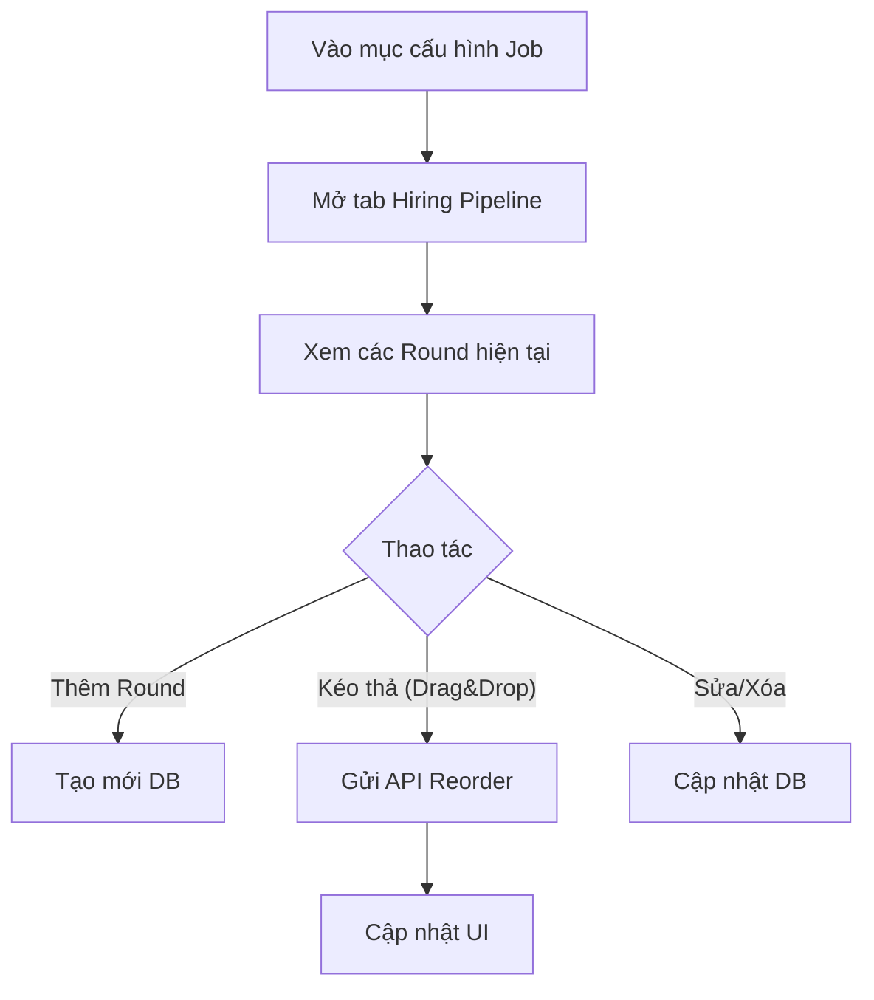

# 📋 User Story 11: Cấu Hình Pipeline Tuyển Dụng (Hiring Rounds Configuration)

## 1. MÔ TẢ USER STORY
- **Là** Nhà tuyển dụng (HR),
- **Tôi muốn** tùy chỉnh các vòng tuyển dụng (Hiring Rounds) riêng cho từng tin tuyển dụng,
- **Để** tôi có thể thiết kế quy trình phỏng vấn linh hoạt phù hợp với đặc thù từng vị trí (ví dụ: vị trí kỹ thuật cần thêm vòng Technical Test, vị trí senior cần thêm vòng Culture Fit).
- **Story Points:** 5

## SƠ ĐỒ LUỒNG NGHIỆP VỤ (Business Flow)

## 2. TIÊU CHÍ NGHIỆM THU (Acceptance Criteria)

- **Kịch bản 1: HR thêm vòng tuyển dụng cho Job**
  - **VỚI ĐIỀU KIỆN** HR đang ở màn hình chỉnh sửa Job (`/dashboard/jobs/{job_id}/edit`), section "Cấu hình Pipeline".
  - **KHI** HR nhấn nút "Thêm vòng" và điền thông tin: Tên vòng (ví dụ: _CV Screening_, _Technical Test_, _Phỏng vấn HR_), loại vòng (SCREENING / INTERVIEW / TEST), gắn Email Template tự động gửi khi pass vòng.
  - **THÌ** hệ thống lưu vòng mới vào bảng `hiring_rounds` với `job_id` tương ứng và `order_index` tự động gán cuối danh sách.
  - Danh sách vòng hiện tại cập nhật ngay, hiển thị đủ thông tin vòng vừa tạo.

- **Kịch bản 2: HR sắp xếp lại thứ tự vòng bằng Drag & Drop**
  - **VỚI ĐIỀU KIỆN** HR đã có ít nhất 2 vòng tuyển dụng trong danh sách.
  - **KHI** HR kéo-thả để thay đổi vị trí của một vòng.
  - **THÌ** hệ thống gọi API `PUT /api/v1/jobs/{job_id}/rounds/reorder` với payload `{ "ordered_ids": ["uuid1", "uuid2", ...] }`.
  - Kanban Board tự động cập nhật thứ tự cột tương ứng.

- **Kịch bản 3: HR chỉnh sửa thông tin một vòng tuyển dụng**
  - **VỚI ĐIỀU KIỆN** HR muốn thay đổi tên vòng hoặc email template gắn với vòng.
  - **KHI** HR nhấn icon "Sửa" trên vòng tương ứng và lưu.
  - **THÌ** hệ thống cập nhật bản ghi `hiring_rounds` và mọi đơn ứng tuyển đang ở vòng đó giữ nguyên trạng thái.

- **Kịch bản 4: HR xóa một vòng tuyển dụng**
  - **VỚI ĐIỀU KIỆN** một vòng tuyển dụng đang tồn tại trong Job.
  - **KHI** HR nhấn nút "Xóa" trên vòng đó.
  - **THÌ** nếu vòng **chưa có ứng viên nào**: hệ thống xóa ngay và cập nhật lại `order_index` của các vòng còn lại.
  - Nếu vòng **đã có ứng viên**: hệ thống hiển thị cảnh báo: _"Vòng này đang có {n} ứng viên. Bạn cần chuyển họ sang vòng khác trước khi xóa."_ và không thực hiện xóa.

- **Kịch bản 5: Job được publish mà không có vòng nào**
  - **VỚI ĐIỀU KIỆN** HR tạo Job nhưng chưa cấu hình vòng tuyển dụng.
  - **KHI** HR nhấn "Publish".
  - **THÌ** hệ thống hiển thị cảnh báo nhắc nhở: _"Job chưa có vòng tuyển dụng. Hệ thống sẽ dùng cấu hình tối giản (Mới → Đang xử lý → Kết thúc). Bạn có muốn tiếp tục không?"_

## 3. NGOÀI PHẠM VI
- **KHÔNG** hỗ trợ chia sẻ template pipeline giữa các Job trong phiên bản này (copy pipeline từ job khác).
- **KHÔNG** giới hạn số lượng vòng tối đa (HR có thể tạo bao nhiêu vòng tùy ý).
- **KHÔNG** hỗ trợ vòng song song (parallel rounds) – tất cả vòng là tuần tự.
