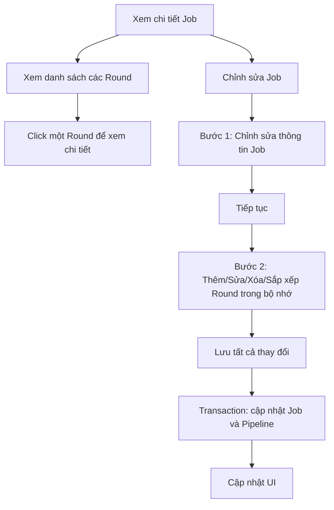

# 📋 User Story 16: Cấu Hình Pipeline Tuyển Dụng (Hiring Rounds Configuration)

## 1. MÔ TẢ USER STORY
- **Là** Nhà tuyển dụng (HR),
- **Tôi muốn** tùy chỉnh các vòng tuyển dụng (Hiring Rounds) riêng cho từng tin tuyển dụng,
- **Để** tôi có thể thiết kế quy trình phỏng vấn linh hoạt phù hợp với đặc thù từng vị trí (ví dụ: vị trí kỹ thuật cần thêm vòng Technical Test, vị trí senior cần thêm vòng Culture Fit).
- **Story Points:** 5

### Contract đang áp dụng
- Bảng triển khai là `hiring_rounds`; khóa `id`, `job_id` và `company_id` dùng `BIGINT` ở database, tương ứng `Long` trong backend và `number` ở frontend.
- Round đang hiệu lực được xác định bởi `is_deleted = false`; thao tác xóa là xóa mềm và không làm mất dữ liệu lịch sử ứng viên.
- Schema hiện tại không có field `type` hoặc `is_required` cho `hiring_rounds`. Contract sử dụng các field đã có trong code/database: `name`, `description`, `passEmailTemplateId`, `failEmailTemplateId`, `testLink` và `isFinalRound`.
- `jobs.round_count` luôn được đồng bộ với số round có `is_deleted = false`. Job không cần phỏng vấn được phép có pipeline rỗng và `roundCount = 0`.
- Job `CLOSED` chỉ được xem; không được tạo, sửa, xóa hoặc sắp xếp round.
- Mọi endpoint của US-16 đều re-check user thuộc đúng `company_id`, có role `HR`/`HR_ADMIN`, user và company đang `ACTIVE`; token hoặc frontend không được xem là nguồn xác thực cuối cùng.
- Các thao tác tạo, sửa, xóa mềm và sắp xếp round ghi audit log theo actor hiện tại. Đọc danh sách không tạo side effect.
- `passEmailTemplateId` và `failEmailTemplateId` là `Long` nullable; nếu truyền thì phải là số dương. US-16 chỉ lưu liên kết ID theo schema hiện tại; kiểm tra tồn tại và tenant của email template sẽ thuộc US-29. Không dùng ID hoặc tên template mock trên UI khi US-29 chưa có API/database triển khai.
- Luồng chỉnh sửa tổng hợp hiện có của US-13 (`PUT /api/v1/jobs/{jobId}/pipeline`) vẫn được giữ để lưu Job + toàn bộ pipeline trong một transaction; endpoint này phải áp dụng cùng rule của US-16 về `CLOSED`, tenant, workspace ACTIVE, `roundCount` và audit.
- Nếu request aggregate có truyền `job.roundCount`, giá trị đó phải bằng số phần tử `rounds`; backend vẫn tính lại và lưu `jobs.round_count` từ danh sách round thực tế. Danh sách rỗng và `roundCount = 0` là hợp lệ.

## SƠ ĐỒ LUỒNG NGHIỆP VỤ (Business Flow)

## 2. TIÊU CHÍ NGHIỆM THU (Acceptance Criteria)

- **Kịch bản 1: HR chỉnh sửa Job và Pipeline theo hai bước**
  - **VỚI ĐIỀU KIỆN** HR đang ở màn hình chi tiết Job (`/dashboard/jobs/{job_id}`). Màn này hiển thị danh sách các Round; HR có thể click từng Round để xem chi tiết.
  - **KHI** HR nhấn "Chỉnh sửa", cập nhật thông tin Job ở bước 1, sau đó nhấn "Tiếp tục" để sang bước 2.
  - **THÌ** HR có thể thêm, sửa, xóa, sắp xếp các Round và chọn `Email Pass`/`Email False` theo tên mẫu email; không hiển thị hay yêu cầu nhập ID template.
  - **VÀ KHI** HR nhấn "Lưu tất cả thay đổi" ở bước 2, hệ thống lưu Job và toàn bộ pipeline trong **một transaction**. Nếu bất kỳ dữ liệu nào không hợp lệ, toàn bộ thay đổi bị rollback và dữ liệu trước đó được giữ nguyên.

- **Kịch bản 2: HR sắp xếp lại thứ tự vòng**
  - **VỚI ĐIỀU KIỆN** HR đang ở bước 2 và có ít nhất 2 vòng tuyển dụng.
  - **KHI** HR thay đổi thứ tự vòng.
  - **THÌ** frontend chỉ cập nhật trạng thái tạm thời; thứ tự mới được gửi trong yêu cầu lưu tổng hợp ở bước cuối.
  - Sau khi lưu thành công, Kanban Board sử dụng thứ tự cột mới.

- **Kịch bản 3: HR chỉnh sửa thông tin một vòng tuyển dụng**
  - **VỚI ĐIỀU KIỆN** HR muốn thay đổi tên vòng hoặc email template gắn với vòng ở bước 2.
  - **KHI** HR chỉnh sửa vòng và lưu toàn bộ ở bước cuối.
  - **THÌ** hệ thống cập nhật bản ghi `hiring_rounds`; mọi đơn ứng tuyển đang ở vòng đó giữ nguyên trạng thái.

- **Kịch bản 4: HR xóa một vòng tuyển dụng**

  - **VỚI ĐIỀU KIỆN** một vòng tuyển dụng đang tồn tại trong Job và HR đang ở bước 2.
  - **KHI** HR nhấn nút "Xóa" trên vòng đó, vòng chỉ bị đánh dấu xóa trong trạng thái tạm thời.
  - **THÌ** khi HR nhấn "Lưu tất cả thay đổi", nếu vòng **chưa có ứng viên nào** hệ thống xóa mềm vòng và chuẩn hóa lại `order_index` trong cùng transaction.
  - Nếu vòng **đã có ứng viên**: hệ thống từ chối toàn bộ lần lưu và hiển thị cảnh báo: _"Vòng này đang có ứng viên. Bạn cần chuyển họ sang vòng khác trước khi xóa."_ Dữ liệu đang nhập trên frontend được giữ nguyên.

- **Kịch bản 5: Job được publish mà không có vòng nào**
  - **VỚI ĐIỀU KIỆN** HR tạo Job nhưng chưa cấu hình vòng tuyển dụng.
  - **KHI** HR nhấn "Publish".
- **THÌ** Job vẫn giữ `roundCount = 0`; luồng publish xử lý cảnh báo và cấu hình tối giản theo contract của US-14/US-22. US-16 không tự tạo round mặc định khi danh sách rỗng.

## 3. NGOÀI PHẠM VI
- **KHÔNG** hỗ trợ chia sẻ template pipeline giữa các Job trong phiên bản này (copy pipeline từ job khác).
- **KHÔNG** giới hạn số lượng vòng tối đa (HR có thể tạo bao nhiêu vòng tùy ý).
- **KHÔNG** hỗ trợ vòng song song (parallel rounds) – tất cả vòng là tuần tự.
