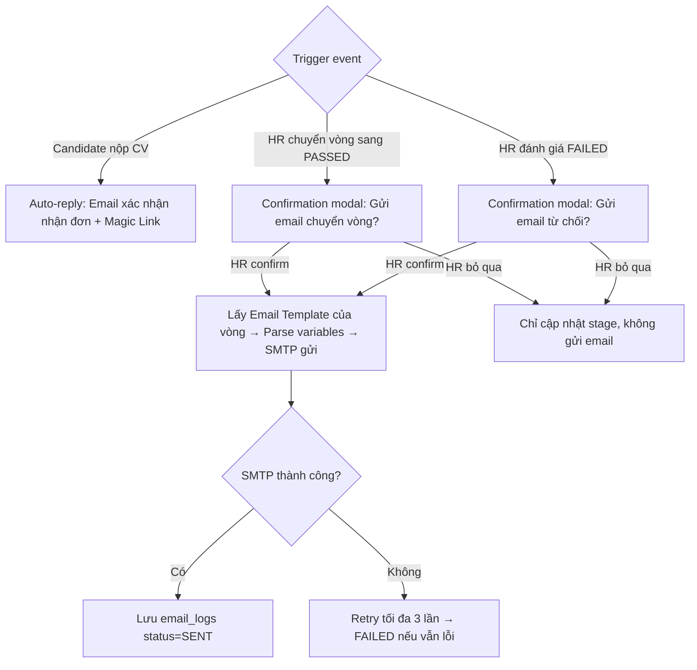

# 📋 User Story 17: Email Automation (Tự Động Hóa Gửi Email)

## 1. MÔ TẢ USER STORY
- **Là** Nhà tuyển dụng (HR),
- **Tôi muốn** hệ thống tự động gửi các email chuẩn hóa đến ứng viên khi có sự thay đổi trạng thái (chuyển vòng, PASSED/FAILED),
- **Để** tôi không phải viết email thủ công, đảm bảo ứng viên luôn được thông báo kịp thời, tăng trải nghiệm ứng viên (Candidate Experience).
- **Story Points:** 5

## SƠ ĐỒ LUỒNG NGHIỆP VỤ (Business Flow)

## 2. TIÊU CHÍ NGHIỆM THU (Acceptance Criteria)

- **Kịch bản 1: Kích hoạt email tự động khi chuyển vòng**
  - **VỚI ĐIỀU KIỆN** HR đã cấu hình `hiring_rounds` cho Job, và mỗi vòng có gắn một Email Template cụ thể.
  - **KHI** HR kéo-thả ứng viên sang vòng tiếp theo trên Kanban Board và vòng đó có gắn Email Template.
  - **THÌ** hệ thống hiển thị **Confirmation Modal**: _"Gửi email thông báo chuyển vòng đến [tên ứng viên]? Template: [tên template]"_ với 2 nút: **"Gửi Email & Cập nhật"** / **"Chỉ Cập nhật"**.
  - Nếu HR chọn "Gửi Email & Cập nhật": Background Job được kích hoạt:
    - Lấy thông tin Email Template tương ứng.
    - Parse các biến nội suy (variables) như `{{candidate_name}}`, `{{job_title}}`, `{{company_name}}` thành dữ liệu thực tế.
    - Gọi dịch vụ SMTP (qua Mailtrap/SendGrid) để gửi email đến địa chỉ của ứng viên.
    - Lưu một bản ghi vào bảng `email_logs`.
  - Nếu HR chọn "Chỉ Cập nhật": Chỉ cập nhật stage, không gửi email (lưu log với status = SKIPPED).

- **Kịch bản 2: Tự động gửi email khi nhận đơn ứng tuyển mới (Auto-reply)**
  - **VỚI ĐIỀU KIỆN** Job có cấu hình tự động trả lời khi nhận đơn (ví dụ: Template "Xác nhận nhận đơn").
  - **KHI** ứng viên nộp CV thành công qua Career Site.
  - **THÌ** hệ thống tự động gửi email "Xác nhận đã nhận hồ sơ" đến ứng viên, bao gồm Magic Link để họ tự tra cứu.

- **Kịch bản 3: Tự động gửi email thông báo trượt (Reject)**
  - **VỚI ĐIỀU KIỆN** HR đánh dấu ứng viên là `REJECTED` ở một vòng bất kỳ.
  - **KHI** thao tác được lưu thành công.
  - **THÌ** hệ thống tự động gửi email từ chối khéo léo (Template "Thư cảm ơn / Rejection") cho ứng viên.

- **Kịch bản 4: Xử lý lỗi khi gửi email**
  - **VỚI ĐIỀU KIỆN** SMTP server bị lỗi hoặc email ứng viên sai định dạng.
  - **KHI** hệ thống cố gắng gửi email tự động.
  - **THÌ** nếu lỗi mạng/server: Background Job sẽ thử lại (retry) tối đa 3 lần.
  - Nếu vẫn thất bại: bản ghi trong `email_logs` sẽ có `status = FAILED`, HR có thể thấy trên giao diện và thao tác gửi lại sau.

## 3. NGOÀI PHẠM VI
- **KHÔNG** cho phép ứng viên reply (trả lời) trực tiếp vào email hệ thống và nhận vào inbox của phần mềm (hỗ trợ 1-way email, reply-to sẽ trỏ về email công ty).
- **KHÔNG** cho phép HR custom email nội dung (viết tay hoàn toàn) trong lúc kéo thả – nó phải dùng Template định sẵn.
