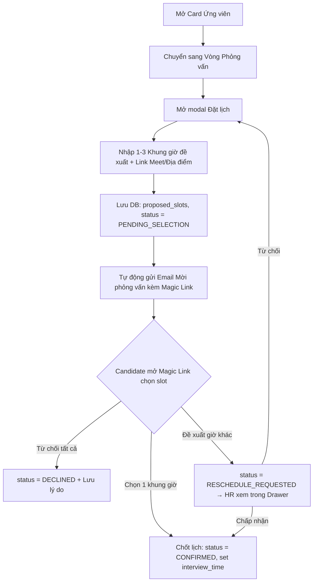

# 📋 User Story 18: Đặt Lịch Phỏng Vấn (Interview Scheduling — Chọn Khung Giờ Đề Xuất)

## 1. MÔ TẢ USER STORY
- **Là** Nhà tuyển dụng (HR),
- **Tôi muốn** đề xuất từ 1 đến 3 khung giờ phỏng vấn và gửi đến ứng viên trực tiếp từ giao diện quản trị,
- **Để** ứng viên tự chọn 1 khung giờ vừa vặn nhất qua Magic Link, giúp chốt lịch phỏng vấn nhanh chóng mà không cần qua lại nhiều email.
- **Story Points:** 5

## SƠ ĐỒ LUỒNG NGHIỆP VỤ (Business Flow)



## 2. TIÊU CHÍ NGHIỆM THU (Acceptance Criteria)

- **Kịch bản 1: HR đề xuất 1 đến 3 khung giờ phỏng vấn cho ứng viên**
  - **VỚI ĐIỀU KIỆN** HR đang xem Candidate Drawer của một ứng viên đang ở vòng phỏng vấn.
  - **KHI** HR nhấn nút "Đặt lịch phỏng vấn" và điền thông tin:
    - Danh sách Khung giờ đề xuất (Slot 1, Slot 2, Slot 3 - tối thiểu 1 slot, tối đa 3 slots).
    - Hình thức (Trực tiếp / Online qua Google Meet / Zoom).
    - Địa điểm hoặc link meet.
    - Ghi chú / Hướng dẫn thêm cho ứng viên.
  - **THÌ** hệ thống lưu bản ghi vào bảng `interviews` với `proposed_slots = [slot1, slot2, ...]`, `status = PENDING_SELECTION` và tự động kích hoạt Email Automation gửi thư mời chứa Magic Link đến ứng viên.

- **Kịch bản 2: HR chỉnh sửa danh sách khung giờ đã đề xuất**
  - **VỚI ĐIỀU KIỆN** ứng viên chưa phản hồi (lịch đang ở `PENDING_SELECTION`).
  - **KHI** HR nhấn "Chỉnh sửa lịch" và cập nhật lại danh sách khung giờ hoặc địa điểm.
  - **THÌ** hệ thống cập nhật `interviews.proposed_slots` và gửi email thông báo cập nhật khung giờ mới đến ứng viên.

- **Kịch bản 3: Xem lịch phỏng vấn trong Candidate Drawer**
  - **VỚI ĐIỀU KIỆN** ứng viên đã được đề xuất lịch phỏng vấn.
  - **KHI** HR mở Candidate Drawer → Tab "Lịch phỏng vấn".
  - **THÌ** section "Lịch phỏng vấn" hiển thị: danh sách các khung giờ đã đề xuất, hình thức, địa điểm/link, và trạng thái phản hồi của ứng viên (Chờ ứng viên chọn / Đã xác nhận [ngày/giờ chốt] / Đã từ chối / Đề xuất giờ khác).

- **Kịch bản 4: Ứng viên từ chối tất cả khung giờ và HR xếp lại**
  - **VỚI ĐIỀU KIỆN** ứng viên đã nhấn "Từ chối" tất cả khung giờ đề xuất (`status = DECLINED`).
  - **KHI** HR nhận thông báo và muốn xếp danh sách khung giờ mới.
  - **THÌ** HR có thể nhấn "Tạo lịch mới" từ Candidate Drawer, lịch cũ lưu trong lịch sử với trạng thái `DECLINED`, lịch mới được tạo với trạng thái `PENDING_SELECTION`.

- **Kịch bản 5: Validate các khung giờ phỏng vấn**
  - **VỚI ĐIỀU KIỆN** HR đang điền các khung giờ đề xuất.
  - **KHI** HR chọn bất kỳ khung giờ nào trong quá khứ hoặc trong vòng 2 giờ tới.
  - **THÌ** hệ thống hiển thị thông báo lỗi: _"Khung giờ phỏng vấn phải cách hiện tại ít nhất 2 giờ."_ và không cho phép lưu.

- **Kịch bản 6: HR xem và xử lý đề xuất khung giờ khác từ Candidate (RESCHEDULE_REQUESTED)**
  - **VỚI ĐIỀU KIỆN** Candidate không chọn các slot có sẵn mà gửi đề xuất giờ khác ngoài danh sách (`status = RESCHEDULE_REQUESTED`, tối đa 1 lần).
  - **KHI** HR mở Candidate Drawer → Tab "Lịch phỏng vấn".
  - **THÌ** hệ thống hiển thị:
    - Các khung giờ gốc HR đã đề xuất
    - Khung giờ cụ thể Candidate đề xuất + Lý do đề xuất
    - 2 nút hành động: **"Chấp nhận giờ đề xuất"** và **"Từ chối & Gửi danh sách giờ mới"**

- **Kịch bản 7: HR chấp nhận khung giờ đề xuất khác của Candidate**
  - **VỚI ĐIỀU KIỆN** HR đang xem màn hình xử lý đề xuất (Kịch bản 6).
  - **KHI** HR nhấn "Chấp nhận giờ đề xuất".
  - **THÌ** hệ thống cập nhật `interviews` với `interview_time = reschedule_time`, `status = CONFIRMED`.
  - Email xác nhận lịch chốt được gửi tự động đến Candidate.

- **Kịch bản 8: HR từ chối giờ đề xuất khác và gửi danh sách mới**
  - **VỚI ĐIỀU KIỆN** HR không đồng ý với khung giờ Candidate đề xuất.
  - **KHI** HR nhấn "Từ chối & Gửi danh sách giờ mới" và điền danh sách khung giờ đề xuất mới.
  - **THÌ** hệ thống cập nhật bản ghi lịch với `proposed_slots` mới, reset `status = PENDING_SELECTION`.
  - Email mời phỏng vấn mới được gửi đến Candidate. Candidate không được đề xuất thêm lần nữa.

- **Kịch bản 9: HR hủy lịch phỏng vấn**
  - **VỚI ĐIỀU KIỆN** Lịch phỏng vấn đang ở trạng thái `PENDING_SELECTION` hoặc `CONFIRMED`.
  - **KHI** HR nhấn "Hủy lịch" trong Candidate Drawer.
  - **THÌ** hệ thống cập nhật `interviews.status = CANCELLED` và gửi email thông báo hủy tới Candidate.

## 3. BUSINESS RULES
- HR có thể nhập từ 1 đến 3 khung giờ đề xuất cho mỗi lần mời phỏng vấn.
- Khi Candidate chọn 1 slot, `interview_time` được gán = slot đó và status đổi thành `CONFIRMED`.

## 4. NGOÀI PHẠM VI
- **KHÔNG** tích hợp Google Calendar hoặc Outlook tự động tạo sự kiện calendar trong phiên bản này.
- **KHÔNG** hỗ trợ phỏng vấn nhóm (nhiều ứng viên cùng lúc).

## 5. API JSON CONTRACTS (Tham khảo)

### 5.1. API Tạo lịch phỏng vấn với các khung giờ đề xuất
- **Endpoint:** `POST /api/v1/hr/interviews`
- **Request Body:**
```json
{
  "application_id": "app-uuid-5678",
  "round_id": "round-uuid-9999",
  "proposed_slots": [
    "2026-09-05T09:00:00Z",
    "2026-09-05T14:00:00Z",
    "2026-09-06T10:00:00Z"
  ],
  "duration": 60,
  "location": "https://meet.google.com/abc-xyz",
  "note": "Phỏng vấn kỹ thuật vòng 1",
  "candidate_note": "Vui lòng chọn 1 khung giờ phù hợp nhất."
}
```
- **Response (201 Created):**
```json
{
  "id": "interview-uuid-1111",
  "status": "PENDING_SELECTION",
  "secure_token": "token-for-magic-link-123",
  "token_expiry_at": "2026-09-04T09:00:00Z"
}
```

### 5.2. API HR Xử lý Đề xuất Đổi lịch từ Candidate
- **Endpoint:** `PUT /api/v1/hr/interviews/{interview_id}/reschedule-response`
- **Request Body (APPROVE):**
```json
{
  "action": "APPROVE",
  "note": "HR đồng ý với khung giờ đề xuất."
}
```
- **Request Body (REJECT & Send New Slots):**
```json
{
  "action": "REJECT",
  "new_proposed_slots": [
    "2026-09-07T09:00:00Z",
    "2026-09-07T14:00:00Z"
  ],
  "note": "Giờ bạn chọn HR bị kẹt họp. Vui lòng chọn lại khung giờ mới."
}
```
