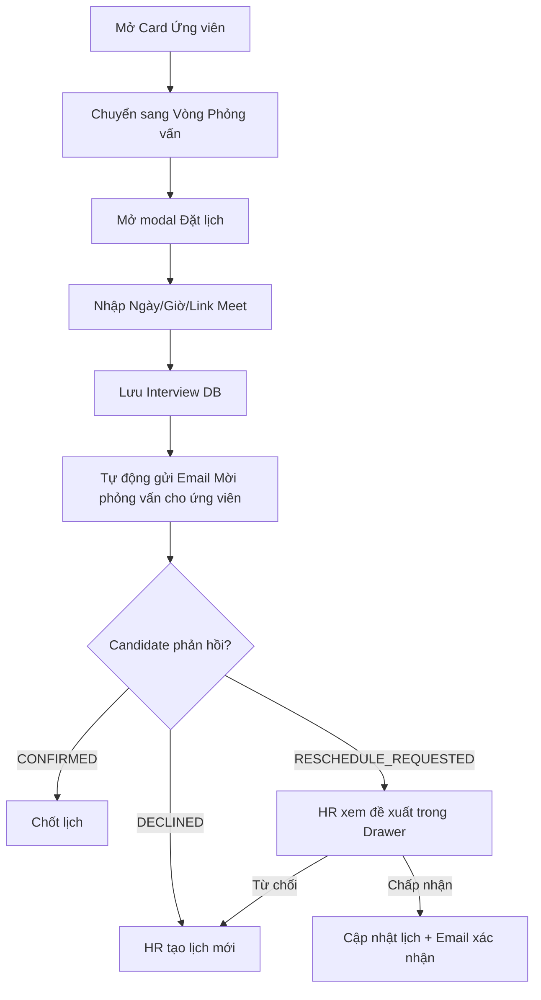

# 📋 User Story 18: Đặt Lịch Phỏng Vấn (Interview Scheduling)

## 1. MÔ TẢ USER STORY
- **Là** Nhà tuyển dụng (HR),
- **Tôi muốn** tạo và gửi lịch phỏng vấn đến ứng viên trực tiếp từ giao diện quản trị,
- **Để** ứng viên nhận được thông tin lịch hẹn đầy đủ qua email và có thể xác nhận/từ chối nhanh chóng mà không cần giao tiếp qua các kênh ngoài hệ thống.
- **Story Points:** 5

## SƠ ĐỒ LUỒNG NGHIỆP VỤ (Business Flow)

## 2. TIÊU CHÍ NGHIỆM THU (Acceptance Criteria)

- **Kịch bản 1: HR tạo lịch phỏng vấn cho ứng viên**
  - **VỚI ĐIỀU KIỆN** HR đang xem Candidate Drawer của một ứng viên đang ở vòng phỏng vấn, ứng viên chưa có lịch phỏng vấn nào được xếp.
  - **KHI** HR nhấn nút "Đặt lịch phỏng vấn" và điền thông tin: Ngày giờ, hình thức (Trực tiếp / Online qua Google Meet / Zoom), địa điểm hoặc link meet, ghi chú thêm.
  - **THÌ** hệ thống lưu lịch vào bảng `interview_schedules` với `status = SCHEDULED` và gửi email thông báo đến ứng viên chứa đầy đủ thông tin + 2 nút phản hồi (Xác nhận / Từ chối).

- **Kịch bản 2: HR chỉnh sửa lịch phỏng vấn đã tạo**
  - **VỚI ĐIỀU KIỆN** ứng viên đã có lịch phỏng vấn với trạng thái `SCHEDULED` hoặc `CONFIRMED`.
  - **KHI** HR nhấn "Chỉnh sửa lịch" và thay đổi ngày giờ hoặc địa điểm.
  - **THÌ** hệ thống cập nhật bản ghi `interview_schedules` và gửi email thông báo thay đổi lịch đến ứng viên.
  - Trạng thái phản hồi ứng viên reset về `PENDING` (vì lịch đã thay đổi).

- **Kịch bản 3: Xem lịch phỏng vấn trong Candidate Drawer**
  - **VỚI ĐIỀU KIỆN** ứng viên đã có lịch phỏng vấn được tạo.
  - **KHI** HR mở Candidate Drawer.
  - **THÌ** section "Lịch phỏng vấn" hiển thị: ngày giờ, hình thức, địa điểm/link, và trạng thái phản hồi của ứng viên (Chờ phản hồi / Đã xác nhận / Đã từ chối / Đề xuất đổi lịch).

- **Kịch bản 4: Ứng viên từ chối và HR cần xếp lịch mới**
  - **VỚI ĐIỀU KIỆN** ứng viên đã nhấn "Từ chối" trong email phỏng vấn, trạng thái `candidate_response = DECLINED`.
  - **KHI** HR nhận thông báo và muốn xếp lịch mới.
  - **THÌ** HR có thể nhấn "Tạo lịch mới" từ Candidate Drawer, lịch cũ lưu trong lịch sử với trạng thái `DECLINED`, lịch mới được tạo với trạng thái `SCHEDULED`.

- **Kịch bản 5: Validate ngày giờ phỏng vấn**
  - **VỚI ĐIỀU KIỆN** HR đang điền form tạo lịch phỏng vấn.
  - **KHI** HR chọn ngày giờ trong quá khứ hoặc trong vòng 2 giờ tới.
  - **THÌ** hệ thống hiển thị thông báo lỗi: _"Ngày giờ phỏng vấn phải cách hiện tại ít nhất 2 giờ."_ và không cho phép lưu.

- **Kịch bản 6: HR xem và xử lý đề xuất đổi lịch từ Candidate (RESCHEDULE_REQUESTED)**
  - **VỚI ĐIỀU KIỆN** Candidate đã gửi `RESCHEDULE_REQUESTED` thành công (tối đa 1 lần); HR nhận được notification.
  - **KHI** HR mở Candidate Drawer → Tab "Lịch phỏng vấn".
  - **THÌ** hệ thống hiển thị:
    - Lịch cũ (thời gian gốc HR đã gửi)
    - Thời gian Candidate đề xuất
    - Lý do đề xuất (nếu có)
    - 2 nút hành động: **"Chấp nhận đề xuất"** và **"Từ chối & Đặt lịch mới"**

- **Kịch bản 7: HR chấp nhận đề xuất đổi lịch**
  - **VỚI ĐIỀU KIỆN** HR đang xem màn hình xử lý đề xuất (Kịch bản 6).
  - **KHI** HR nhấn "Chấp nhận đề xuất".
  - **THÌ** hệ thống cập nhật `interview_schedules` với `interview_time = candidate_proposed_time`, `status = CONFIRMED`, `candidate_response = CONFIRMED`.
  - Email xác nhận lịch mới được gửi tự động đến Candidate.
  - HR thấy trạng thái cập nhật trong Drawer.

- **Kịch bản 8: HR từ chối đề xuất và đặt lịch mới**
  - **VỚI ĐIỀU KIỆN** HR không đồng ý với thời gian Candidate đề xuất.
  - **KHI** HR nhấn "Từ chối & Đặt lịch mới" và điền thời gian mới.
  - **THÌ** hệ thống tạo record lịch mới với `status = SCHEDULED`, `candidate_response = PENDING` (reset).
  - Email mời phỏng vấn mới được gửi đến Candidate.
  - Lịch cũ (bao gồm đề xuất của Candidate) được lưu trong lịch sử.
  - **Lưu ý:** Candidate đã dùng 1 lần đổi lịch, không còn quyền đề xuất thêm.

- **Kịch bản 9: HR hủy lịch phỏng vấn đã gửi**
  - **VỚI ĐIỀU KIỆN** Lịch phỏng vấn đang ở trạng thái `SCHEDULED` hoặc `CONFIRMED`.
  - **KHI** HR nhấn "Hủy lịch" trong Candidate Drawer → Tab Lịch phỏng vấn.
  - **THÌ** hệ thống cập nhật `interview_schedules.status = CANCELLED` và gửi email thông báo hủy tới Candidate.
  - Candidate nhận email: _"Lịch phỏng vấn của bạn vào [ngày giờ] đã được hủy. Nhà tuyển dụng sẽ liên hệ lại nếu có cập nhật."_
  - HR có thể tạo lịch mới sau đó khi cần.

## 3. NGOÀI PHẠM VI
- **KHÔNG** tích hợp Google Calendar hoặc Outlook để tự động tạo sự kiện calendar trong phiên bản này.
- **KHÔNG** hỗ trợ phỏng vấn nhóm (nhiều ứng viên cùng lúc).
- **KHÔNG** gửi reminder tự động trước giờ phỏng vấn trong phiên bản này.
