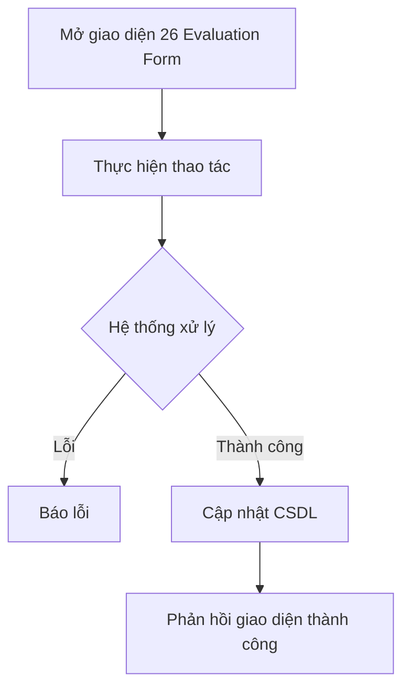

# 📋 User Story 26: Evaluation Form (Phiếu Đánh Giá Ứng Viên Theo Vòng)

## 1. MÔ TẢ USER STORY
- **Là** Nhà tuyển dụng (HR) / Người phỏng vấn (Interviewer),
- **Tôi muốn** điền phiếu đánh giá tiêu chí cho ứng viên sau mỗi vòng phỏng vấn,
- **Để** tôi có thể ghi lại nhận xét có cấu trúc, đưa ra quyết định PASSED/FAILED (Round Result) dựa trên dữ liệu và lưu lại lịch sử để tham chiếu sau này.
- **Story Points:** 5
- **Story Points:** 5

## SƠ ĐỒ LUỒNG NGHIỆP VỤ (Business Flow)

## 2. TIÊU CHÍ NGHIỆM THU (Acceptance Criteria)

- **Kịch bản 1: HR mở phiếu đánh giá từ Candidate Drawer**
  - **VỚI ĐIỀU KIỆN** HR đang xem thông tin chi tiết ứng viên trong Candidate Drawer, ứng viên đang ở một vòng phỏng vấn cụ thể.
  - **KHI** HR nhấn nút "Đánh giá vòng này" trong Drawer.
  - **THÌ** hệ thống hiển thị form đánh giá gồm các tiêu chí đã được định nghĩa cho vòng đó (lấy từ bảng `form_fields` liên kết với `hiring_round_id`).
  - Mỗi tiêu chí có thang điểm từ 1–5 (hoặc PASSED/FAILED tùy cấu hình vòng) và ô nhận xét tự do.

- **Kịch bản 2: HR hoàn thành đánh giá và đưa ra Round Result**
  - **VỚI ĐIỀU KIỆN** HR đã điền đầy đủ tất cả các tiêu chí đánh giá bắt buộc.
  - **KHI** HR nhấn nút "Lưu đánh giá" và chọn kết quả tổng thể: PASSED hoặc FAILED.
  - **THÌ** hệ thống lưu dữ liệu đánh giá vào bảng `round_statuses` với `result = PASSED / FAILED` và `evaluated_by = {user_id}`.
  - **Chuyển trạng thái nghiệp vụ:**
    - **Nếu Round Result = PASSED (và không phải vòng cuối):** Ứng viên được chuyển sang stage tiếp theo; `Application Status` vẫn là `ACTIVE`.
    - **Nếu Round Result = PASSED (và là vòng cuối):** Ứng viên đạt vòng cuối nhưng chưa được `HIRED` cho đến khi HR thực hiện hành động `Hire` rõ ràng; `Application Status` vẫn là `ACTIVE` trong giai đoạn final decision.
    - **Nếu Round Result = FAILED (bất kỳ vòng nào):** Ứng viên bị loại; `Application Status = REJECTED`.
  - Hệ thống tự động kích hoạt Email Automation gửi email thông báo kết quả tương ứng.
  - Kanban Board tự động cập nhật vị trí card ứng viên.
  - **Lưu ý:** PASSED/FAILED là Round Result (đánh giá một vòng cụ thể), không phải Application Status. Chỉ Application Status là ACTIVE/REJECTED/HIRED.

- **Kịch bản 3: Xem lại lịch sử đánh giá**
  - **VỚI ĐIỀU KIỆN** ứng viên đã được đánh giá qua nhiều vòng.
  - **KHI** HR mở Candidate Drawer của ứng viên đó.
  - **THÌ** tab "Lịch sử đánh giá" hiển thị danh sách tất cả các phiếu đánh giá theo từng vòng, bao gồm: tên người đánh giá, thời gian, điểm từng tiêu chí, nhận xét và kết quả (PASSED / FAILED).

- **Kịch bản 4: Ứng viên bị đánh giá trùng (guard check)**
  - **VỚI ĐIỀU KIỆN** vòng phỏng vấn đã có đánh giá từ trước (status != null).
  - **KHI** HR cố gắng tạo đánh giá mới cho cùng vòng đó.
  - **THÌ** hệ thống hiển thị cảnh báo: _"Vòng này đã có kết quả đánh giá. Bạn có muốn ghi đè không?"_ và yêu cầu xác nhận trước khi cho phép chỉnh sửa.

## 3. NGOÀI PHẠM VI
- **KHÔNG** hỗ trợ nhiều người đánh giá cùng lúc (collaborative scoring) trong phiên bản này.
- **KHÔNG** tự động tính điểm tổng hợp hoặc xếp hạng ứng viên dựa trên điểm đánh giá.
- **KHÔNG** cho phép ứng viên xem nội dung phiếu đánh giá của mình.
