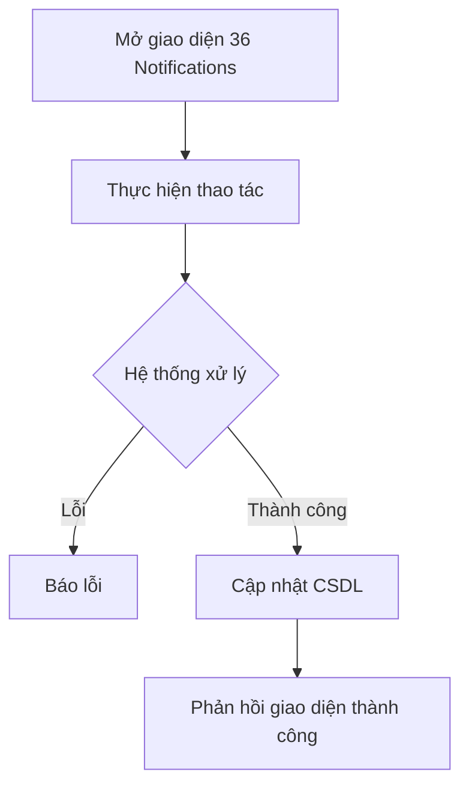

# 📋 User Story 36: Hệ Thống Thông Báo (In-App Notifications)

## 1. MÔ TẢ USER STORY
- **Là** Nhà tuyển dụng (HR),
- **Tôi muốn** nhận thông báo trong ứng dụng (in-app notifications) ngay khi có sự kiện quan trọng xảy ra trong hệ thống,
- **Để** tôi có thể phản hồi kịp thời với ứng viên mới, không bỏ lỡ phản hồi lịch phỏng vấn, và luôn nắm bắt được tiến độ tuyển dụng mà không cần liên tục reload trang.
- **Story Points:** 5

## SƠ ĐỒ LUỒNG NGHIỆP VỤ (Business Flow)

## 2. TIÊU CHÍ NGHIỆM THU (Acceptance Criteria)

- **Kịch bản 1: HR nhận thông báo khi có ứng viên mới nộp đơn**
  - **VỚI ĐIỀU KIỆN** Career Site của công ty đang hoạt động và có ứng viên nộp đơn vào một Job đang `ACTIVE`.
  - **KHI** ứng viên hoàn thành nộp đơn thành công.
  - **THÌ** hệ thống tạo một bản ghi notification trong bảng `notifications` với:
    - `type = NEW_APPLICATION`
    - `title = "Ứng viên mới: {tên ứng viên} vừa nộp đơn vào {tên Job}"`
    - `recipient_id = {hr_user_id}` (tất cả HR thuộc company)
    - `entity_type = APPLICATION`, `entity_id = {application_id}`
  - Biểu tượng chuông 🔔 trên Sidebar hiển thị badge số thông báo chưa đọc (unread count) tăng lên 1.
  - Khi HR nhấn vào notification, hệ thống điều hướng đến Candidate Drawer của ứng viên vừa nộp.

- **Kịch bản 2: HR nhận thông báo khi ứng viên xác nhận hoặc từ chối lịch phỏng vấn**
  - **VỚI ĐIỀU KIỆN** HR đã gửi lịch phỏng vấn cho ứng viên.
  - **KHI** ứng viên nhấn "Xác nhận" hoặc "Từ chối" qua link trong email.
  - **THÌ** hệ thống tạo notification:
    - **Xác nhận**: `"Ứng viên {tên} đã XÁC NHẬN tham dự phỏng vấn vào {ngày giờ}."`
    - **Từ chối**: `"Ứng viên {tên} đã TỪ CHỐI lịch phỏng vấn vào {ngày giờ}. Lý do: {lý do nếu có}."`
  - Notification hiển thị trong Inbox của HR với màu phân biệt (xanh lá = xác nhận, đỏ = từ chối).

- **Kịch bản 3: HR xem danh sách tất cả thông báo**
  - **VỚI ĐIỀU KIỆN** HR nhấn vào biểu tượng chuông 🔔 trên Sidebar.
  - **KHI** panel thông báo mở ra (hoặc điều hướng đến `/dashboard/notifications`).
  - **THÌ** hệ thống hiển thị danh sách tất cả thông báo sắp xếp theo thời gian giảm dần, phân nhóm: "Hôm nay", "Hôm qua", "Tuần trước".
  - Thông báo chưa đọc có nền màu nhạt khác biệt với thông báo đã đọc.
  - Mỗi thông báo hiển thị: loại sự kiện, nội dung tóm tắt, thời gian tương đối (ví dụ: "5 phút trước").

- **Kịch bản 4: HR đánh dấu tất cả thông báo là đã đọc**
  - **VỚI ĐIỀU KIỆN** HR có nhiều thông báo chưa đọc.
  - **KHI** HR nhấn nút "Đánh dấu tất cả là đã đọc".
  - **THÌ** hệ thống cập nhật `notifications.is_read = true` cho tất cả thông báo của HR đó.
  - Badge số chưa đọc trên biểu tượng chuông về 0.

- **Kịch bản 5: HR nhận thông báo khi Job sắp hết hạn**
  - **VỚI ĐIỀU KIỆN** một Job đang `ACTIVE` có trường `deadline` và còn 3 ngày đến ngày hết hạn.
  - **KHI** Cron job chạy vào 8:00 sáng mỗi ngày.
  - **THÌ** hệ thống tạo notification: `"Job '{tên Job}' sẽ hết hạn sau 3 ngày (vào {ngày}). Nhấn để gia hạn hoặc đóng Job."` và gửi kèm email nhắc nhở đến HR.

- **Kịch bản 6: Phân quyền - HR chỉ nhận thông báo của công ty mình**
  - **VỚI ĐIỀU KIỆN** hệ thống có nhiều công ty (multi-tenant).
  - **KHI** ứng viên nộp đơn vào Job của Công ty A.
  - **THÌ** chỉ HR thuộc `company_id = A` nhận được thông báo. HR của công ty B **không** nhận thông báo này.

## 3. NGOÀI PHẠM VI
- **KHÔNG** hỗ trợ thông báo real-time qua WebSocket/SSE trong phiên bản này – sử dụng polling 30 giây.
- **KHÔNG** hỗ trợ thông báo push (push notification trên mobile/desktop browser).
- **KHÔNG** lưu trữ notifications quá 90 ngày (cron job tự xóa dữ liệu cũ).
- Ứng viên **KHÔNG** nhận in-app notification – chỉ nhận qua email.
