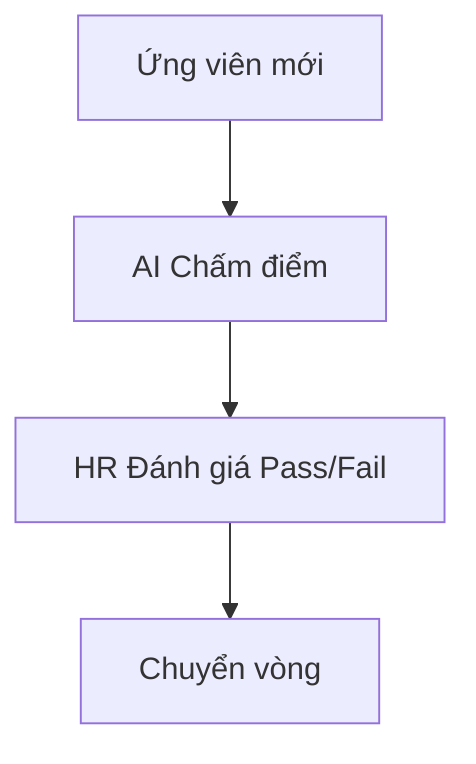

# HƯỚNG DẪN VIẾT TÀI LIỆU EPIC BRIEF (epic-05/brief.md)

## 1. TÓM TẮT YÊU CẦU (Executive Summary)
- **Nghiệp vụ:** Quản lý hồ sơ ứng viên bằng Kanban và chi tiết hồ sơ.
- **Prerequisites:** Có ứng viên nộp CV.

## 2. GIÁ TRỊ DOANH NGHIỆP & CHỈ SỐ ĐO LƯỜNG (Business Value & Metrics)
- **Business Value:** Trực quan hóa luồng tuyển dụng (ATS).
- **Metrics:** Giảm 50% thời gian tìm kiếm CV.

## 3. QUY TRÌNH NGHIỆP VỤ (Business Process)

## 4. PHÂN CHIA USER STORY (Scope & Backlog)
| ID | Tên Story | Loại | Priority (MoSCoW) | Trạng thái |
|---|---|---|---|---|
| US-14 | Kanban Board | Feature | Must Have | To-do |
| US-15 | List View | Feature | Must Have | To-do |
| US-16 | Candidate Drawer | Feature | Must Have | To-do |

