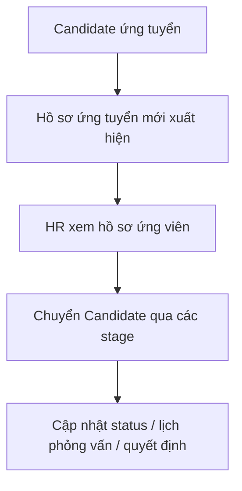

# EPIC 05 — Candidate & Application Management

## 1. Tóm tắt
- **Nghiệp vụ:** HR quản lý hồ sơ ứng viên qua Kanban, list view và candidate drawer.
- **Điều kiện tiên quyết:** Job đã `ACTIVE`, có ứng viên nộp CV và có default pipeline.
- **Luồng chính:** Candidate ứng tuyển → HR thấy card mới → xem hồ sơ → chuyển qua các stage → gửi email / thư mời phỏng vấn khi cần.

## 2. Giá trị nghiệp vụ và chỉ số
- **Giá trị nghiệp vụ:** Tăng tốc độ xem xét hồ sơ và làm cho quy trình review rõ ràng cho HR / interviewer.
- **Chỉ số:**
  - Thời gian review hồ sơ trung bình giảm 40%
  - 100% ứng viên có trạng thái rõ ràng trong pipeline

## 3. Quy trình nghiệp vụ

## 4. Phạm vi và Backlog
| ID | Tên Story | Ưu tiên | Trạng thái |
|---|---|---|---|
| US-14 | Kanban Board | Must Have | To-do |
| US-15 | List View | Must Have | To-do |
| US-16 | Candidate Drawer | Must Have | To-do |

## 5. Business Rules
- Candidate list phải thể hiện trạng thái rõ ràng và hiển thị time-to-stage logic nếu phù hợp.
- HR không cần mặc định AI score để review; AI chỉ hỗ trợ recommendation.
- Khi move candidate tới một vòng mới, UI phải hiển thị rõ action và email side effect nếu có.
- Candidate status không được mơ hồ: phải có `APPLIED`, `SCREENING`, `INTERVIEW`, `REJECTED`, `HIRED` và các trạng thái tương ứng tại round level.

## 6. Cải tiến trong tương lai
- Thao tác hàng loạt với Candidate
- Cột / tag Candidate tùy chỉnh
- Bộ lọc nâng cao và view đã lưu

