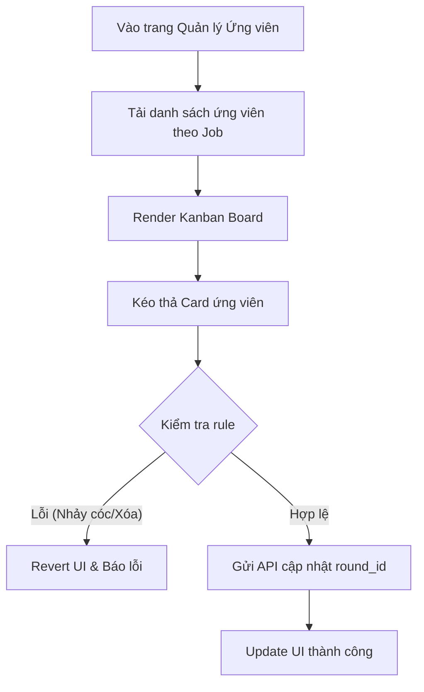

# 📋 User Story 14: Kanban Board Ứng Viên (Bảng Quản Lý Tuyển Dụng Động)

## 1. MÔ TẢ USER STORY
- **Là** Nhà tuyển dụng (HR),
- **Tôi muốn** xem danh sách ứng viên của một tin tuyển dụng dưới dạng Kanban Board với các **cột tương ứng với Pipeline Stages** (hiring_rounds) được tạo tự động theo cấu hình Job,
- **Để** tôi có thể quản lý và theo dõi tiến trình từng ứng viên qua từng vòng phỏng vấn một cách trực quan, với terminal states (Rejected, Hired) là end states không phải columns.
- **Story Points:** 5
- **Story Points:** 5

## SƠ ĐỒ LUỒNG NGHIỆP VỤ (Business Flow)

## 2. TIÊU CHÍ NGHIỆM THU (Acceptance Criteria)

- **Kịch bản 1: Hiển thị Kanban Board động theo cấu hình vòng của Job**
  - **VỚI ĐIỀU KIỆN** HR đã chọn một Tin tuyển dụng cụ thể để quản lý.
  - **KHI** HR truy cập màn hình Kanban tại `/dashboard/applications/kanban?job_id={job_id}`.
  - **THÌ** hệ thống gọi API `GET /api/v1/jobs/{job_id}/rounds` để lấy danh sách `hiring_rounds` đã cấu hình.
  - **Kanban Board tự động render các cột như sau:**
    - **Columns (Pipeline Stages)**: Render lần lượt từng vòng trong `hiring_rounds` theo `order_index` tăng dần (ví dụ: *Application Received → CV Screening → Online Test → Technical Interview → Final Interview*).
    - Ngoài cùng có hai **terminal columns** (không phải Pipeline Stages):
      - **"Recruited" / "Hired"** (Application Status = HIRED): Ứng viên được tuyển sau vòng cuối.
      - **"Rejected"** (Application Status = REJECTED): Ứng viên bị loại ở bất kỳ vòng nào.
  - **Lưu ý:** Columns là Pipeline Stages; terminal states (Hired, Rejected) là end states của Application, không phải stages.

- **Kịch bản 2: HR kéo-thả (Drag & Drop) ứng viên sang vòng tiếp theo**
  - **VỚI ĐIỀU KIỆN** HR thấy card ứng viên ở cột "Mới" hoặc một vòng trung gian.
  - **KHI** HR kéo card ứng viên đó và thả vào cột kế tiếp (vòng tiếp theo).
  - **THÌ** hệ thống gọi API `PUT /api/v1/applications/{app_id}/stage` với payload `{ "round_id": "uuid", "status": "IN_PROGRESS" }`.
  - Giao diện cập nhật ngay lập tức (optimistic update) không cần reload trang.
  - Nếu API trả về lỗi, card tự động trở về vị trí ban đầu và hiển thị thông báo lỗi.

- **Kịch bản 3: HR đánh giá ứng viên (Round Result) tự động trigger chuyển stage hoặc terminal state**
  - **VỚI ĐIỀU KIỆN** ứng viên đang ở một stage trung gian trên Kanban (e.g., "CV Screening").
  - **KHI** HR nhấn nút "..." trên card và chọn "Evaluate" hoặc trực tiếp nộp phiếu đánh giá (User Story 26).
  - **THÌ** HR đánh giá Round Result: PASSED hoặc FAILED.
    - **Nếu Round Result = PASSED (và không phải vòng cuối)**: Card tự động di chuyển sang stage tiếp theo; `Application Status` vẫn là `ACTIVE`.
    - **Nếu Round Result = PASSED (và là vòng cuối)**: Kết quả vòng cuối chỉ cho biết ứng viên đạt kỳ đánh giá; `Application Status` vẫn là `ACTIVE` cho đến khi HR thực hiện explicit `Hire`; card không được tự động tạo `HIRED`.
    - **Nếu Round Result = FAILED (bất kỳ vòng nào)**: Card di chuyển sang "Rejected" column; `Application Status = REJECTED`.
  - Hệ thống tự động kích hoạt Email Automation gửi email thông báo kết quả đến ứng viên.
  - **Lưu ý:** PASSED/FAILED là Round Result (đánh giá một vòng cụ thể), không phải Application Status. Application Status chỉ là ACTIVE/REJECTED/HIRED.

- **Kịch bản 4: Job không có hiring_rounds (dùng cấu hình tối giản)**
  - **VỚI ĐIỀU KIỆN** HR tạo Job nhưng chưa cấu hình bất kỳ vòng tuyển dụng nào.
  - **KHI** HR truy cập Kanban của Job đó.
  - **THÌ** hệ thống hiển thị Kanban với default pipeline stages: **Application Received → Under Review → Hired** và **Rejected** (terminal). Banner nhắc nhở HR cấu hình vòng tuyển dụng nếu muốn chi tiết hơn.

- **Kịch bản 5: Lọc và tìm kiếm ứng viên trên Kanban**
  - **VỚI ĐIỀU KIỆN** HR đang xem Kanban của một Job có nhiều ứng viên.
  - **KHI** HR nhập từ khóa vào ô tìm kiếm hoặc chọn bộ lọc (theo nguồn nộp, theo điểm AI Score, theo ngày nộp).
  - **THÌ** các card trên Kanban lọc lại theo điều kiện, các card không phù hợp ẩn đi mà không thay đổi cấu trúc cột.

## 3. NGOÀI PHẠM VI
- **KHÔNG** cho phép HR kéo ứng viên ngược lại vòng trước (chỉ tiến về phía trước hoặc sang "Không đạt").
- **KHÔNG** hỗ trợ xem đồng thời Kanban của nhiều Job cùng lúc.
- **KHÔNG** tích hợp tính năng comment hoặc ghi chú trực tiếp trên card Kanban (tính năng này thuộc Candidate Drawer – User Story 16).
