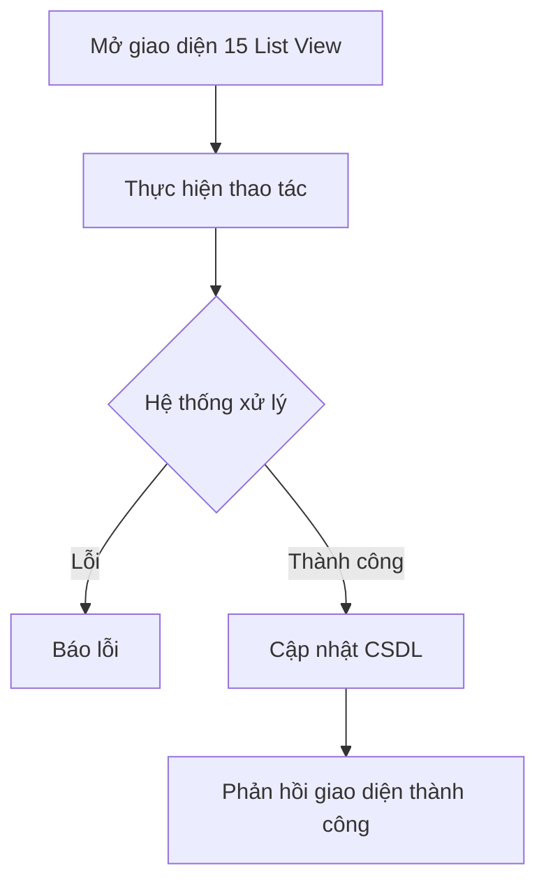

# 📋 User Story 15: List View Ứng Viên (Xem Danh Sách Dạng Bảng)

## 1. MÔ TẢ USER STORY
- **Là** Nhà tuyển dụng (HR),
- **Tôi muốn** xem danh sách toàn bộ ứng viên của một Job dưới dạng Bảng (Data Table) song song với Kanban Board,
- **Để** tôi có thể dễ dàng sắp xếp, tìm kiếm, lọc dữ liệu hàng loạt và xem các thông tin chi tiết (Email, Số ĐT, Ngày nộp) mà Kanban Board không hiển thị hết.
- **Story Points:** 3

## SƠ ĐỒ LUỒNG NGHIỆP VỤ (Business Flow)

## 2. TIÊU CHÍ NGHIỆM THU (Acceptance Criteria)

- **Kịch bản 1: HR chuyển đổi giữa Kanban và List View**
  - **VỚI ĐIỀU KIỆN** HR đang xem quản lý ứng viên của một Job (mặc định là Kanban).
  - **KHI** HR nhấn vào nút Toggle "Dạng bảng" (List View).
  - **THÌ** giao diện chuyển từ Kanban sang Bảng dữ liệu mà không cần tải lại trang toàn bộ.
  - Bảng hiển thị các cột: Họ tên, Email, SĐT, Current Stage (Pipeline Stage), Application Status (Active / Rejected / Hired), AI Score, Ngày nộp đơn.

- **Kịch bản 2: Sắp xếp (Sorting) ứng viên trong bảng**
  - **VỚI ĐIỀU KIỆN** HR đang ở chế độ List View.
  - **KHI** HR nhấn vào tiêu đề cột "Ngày nộp đơn" hoặc "AI Score".
  - **THÌ** danh sách ứng viên được sắp xếp lại tương ứng (Tăng dần / Giảm dần).

- **Kịch bản 3: Lọc dữ liệu trên List View**
  - **VỚI ĐIỀU KIỆN** HR đang xem bảng ứng viên.
  - **KHI** HR sử dụng bộ lọc:
    - **Application Status:** Active / Rejected / Hired
    - **Current Stage:** Ứng viên đang ở stage nào trong pipeline (e.g., "CV Screening", "Technical Interview", etc.)
  - **THÌ** bảng chỉ hiển thị những ứng viên thỏa mãn tất cả điều kiện lọc.
  - **Lưu ý:** Application Status (ACTIVE/REJECTED/HIRED) khác với Current Stage (Pipeline Stage). Filter phải tách rõ.

- **Kịch bản 4: Truy cập chi tiết ứng viên từ bảng**
  - **VỚI ĐIỀU KIỆN** HR đang xem List View.
  - **KHI** HR click vào hàng của một ứng viên.
  - **THÌ** hệ thống mở Candidate Drawer từ cạnh phải màn hình hiển thị toàn bộ thông tin chi tiết của người đó.

## 3. NGOÀI PHẠM VI
- **KHÔNG** hỗ trợ chỉnh sửa thông tin ứng viên trực tiếp (inline-edit) trên các ô của bảng dữ liệu.
- **KHÔNG** hỗ trợ "Bulk Actions" (chọn nhiều row bằng checkbox để xóa, gửi email hàng loạt) trong phiên bản này.
