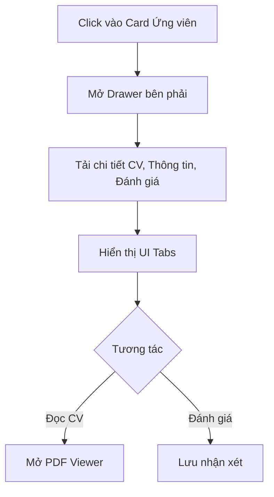

# 📋 User Story 24: Candidate Drawer (Xem Chi Tiết Hồ Sơ Ứng Viên)

## 1. MÔ TẢ USER STORY
- **Là** Nhà tuyển dụng (HR),
- **Tôi muốn** xem chi tiết toàn bộ hồ sơ của ứng viên (CV, Form trả lời, Email History, AI Score) trong một giao diện Drawer mở từ bên phải màn hình,
- **Để** tôi không bị chuyển trang liên tục, có thể thao tác nhanh với ứng viên và giữ nguyên ngữ cảnh của danh sách (Kanban/List).
- **Story Points:** 5

## SƠ ĐỒ LUỒNG NGHIỆP VỤ (Business Flow)

## 2. TIÊU CHÍ NGHIỆM THU (Acceptance Criteria)

- **Kịch bản 1: HR mở xem Drawer của một ứng viên**
  - **VỚI ĐIỀU KIỆN** HR đang ở màn hình Kanban hoặc List View.
  - **KHI** HR click vào một card ứng viên (trên Kanban) hoặc một hàng (trên List).
  - **THÌ** hệ thống trượt Drawer từ bên phải màn hình ra (không reload trang).
  - Drawer hiển thị thông tin tổng quan ở phần Header: Họ tên, Email, Số ĐT, **Application Status** (Active / Rejected / Hired), **Current Stage** (pipeline stage hiện tại), **Latest Round Result** (IN_PROGRESS / PASSED / FAILED nếu có), và Điểm AI (nếu có).
  - **Lưu ý:** Application Status ≠ Current Stage ≠ Round Result. Phải hiển thị rõ 3 thông tin này.

- **Kịch bản 2: HR xem các Tab thông tin trong Drawer**
  - **VỚI ĐIỀU KIỆN** Drawer đang mở.
  - **KHI** HR chuyển đổi qua lại giữa các Tab (Hồ sơ, Đánh giá, Lịch phỏng vấn, Lịch sử Email).
  - **THÌ** hệ thống tải và hiển thị dữ liệu tương ứng của ứng viên đó trong từng tab:
    - Tab **Hồ sơ**: Nút xem PDF CV (in-app preview hoặc tab mới) và câu trả lời các câu hỏi phụ.
    - Tab **Đánh giá**: Form đánh giá và lịch sử.
    - Tab **Lịch phỏng vấn**: Thông tin lịch hẹn.
    - Tab **Email**: Các email đã gửi.

- **Kịch bản 3: HR thực hiện Action từ Drawer**
  - **VỚI ĐIỀU KIỆN** Drawer đang mở.
  - **KHI** HR nhấn vào các nút chức năng:
    - **"Đánh dấu Đạt" (PASSED):** Cập nhật Round Result = PASSED. Nếu không phải vòng cuối → tự động chuyển sang vòng tiếp theo + Confirmation email. Nếu là vòng cuối → Application vẫn ACTIVE, chờ HR nhấn "Tuyển dụng".
    - **"Đánh dấu Trượt" (FAILED):** Hiển thị Confirmation Modal → Sau khi xác nhận: Round Result = FAILED + Application Status = REJECTED + Email từ chối tự động.
    - **"Tuyển dụng" (HIRE):** Chỉ xuất hiện khi ứng viên ở vòng cuối và Round Result = PASSED → Application Status = HIRED + Email chúc mừng.
    - **"Xóa hồ sơ" (Hard Delete):** Hiển thị cảnh báo xác nhận → Xóa vĩnh viễn toàn bộ thông tin ứng viên và file CV.
  - **THÌ** hệ thống xử lý logic tương ứng, hiển thị thông báo thành công và cập nhật lại thông tin hiển thị trên Header của Drawer cũng như trên bảng/kanban bên dưới.

- **Kịch bản 4: HR đóng Drawer**
  - **VỚI ĐIỀU KIỆN** Drawer đang mở.
  - **KHI** HR nhấn nút "X", hoặc click ra ngoài vùng xám (backdrop).
  - **THÌ** Drawer trượt đóng lại, màn hình Kanban/List phía dưới không thay đổi vị trí cuộn ban đầu.

## 3. BUSINESS RULES

### Reject Trigger Rule
- Application Status = REJECTED được set theo 2 con đường:
  1. **Explicit action:** HR nhấn "Đánh dấu Trượt" trong Candidate Drawer → Confirmation Modal → FAILED + REJECTED.
  2. **Auto rule:** Round Result = FAILED (từ Kanban drag hoặc Drawer) → tự động set Application Status = REJECTED.
- Cả 2 con đường đều trigger Email Automation gửi email từ chối nếu HR confirm trong modal.
- KHÔNG cho phép drag card trực tiếp sang cột "Rejected" mà bỏ qua Round Result (phải đi qua FAILED evaluation).

## 4. NGOÀI PHẠM VI
- **KHÔNG** có tính năng "Preview PDF" trực tiếp nhúng vào Drawer nếu trình duyệt không hỗ trợ iframe PDF chuẩn (chấp nhận mở tab mới).
- **KHÔNG** hỗ trợ tính năng Chat trực tuyến với ứng viên trong Drawer.
