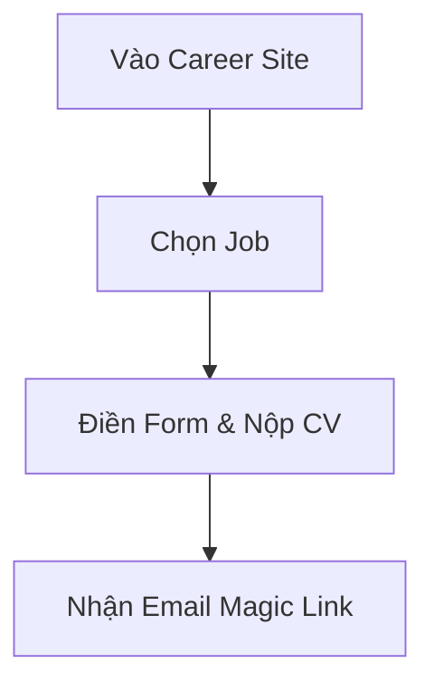

# HƯỚNG DẪN VIẾT TÀI LIỆU EPIC BRIEF (epic-06/brief.md)

## 1. TÓM TẮT YÊU CẦU (Executive Summary)
- **Nghiệp vụ:** Trang web công khai để ứng viên xem tin và nộp CV.
- **Prerequisites:** Job đã được publish.

## 2. GIÁ TRỊ DOANH NGHIỆP & CHỈ SỐ ĐO LƯỜNG (Business Value & Metrics)
- **Business Value:** Tạo kênh tuyển dụng chuyên nghiệp cho từng doanh nghiệp.
- **Metrics:** Tỷ lệ rớt đơn (Drop rate) khi nộp CV < 10%.

## 3. QUY TRÌNH NGHIỆP VỤ (Business Process)

## 4. PHÂN CHIA USER STORY (Scope & Backlog)
| ID | Tên Story | Loại | Priority (MoSCoW) | Trạng thái |
|---|---|---|---|---|
| US-17 | Xem Career Site | Feature | Must Have | To-do |
| US-18 | Nop CV | Feature | Must Have | To-do |
| US-19 | Phan Hoi Lich Phong Van | Feature | Must Have | To-do |
| US-28 | Magic Link Tracking | Feature | Must Have | To-do |
| US-30 | Interview Response | Feature | Must Have | To-do |

