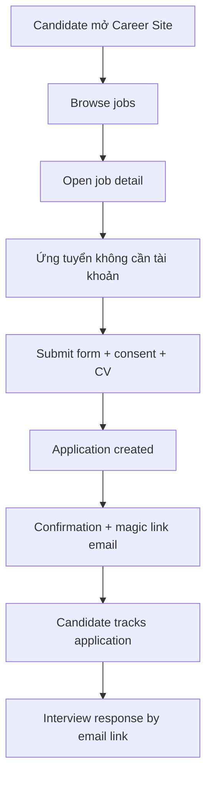

# EPIC 06 — Career Site

## 1. Tóm tắt
- **Nghiệp vụ:** Trang công khai cho Candidate xem các Job đang tuyển và nộp hồ sơ trực tiếp mà không cần tài khoản.
- **Điều kiện tiên quyết:** Job phải `ACTIVE` và được publish.
- **MVP principle:** Candidate không cần tạo tài khoản để apply.

## 2. Giá trị nghiệp vụ và chỉ số
- **Giá trị nghiệp vụ:** Tạo kênh ứng tuyển đơn giản, chuyên nghiệp và dễ tiếp cận.
- **Chỉ số:**
  - Drop-off trong form apply < 10%
  - Tỷ lệ nộp đơn thành công > 95%

## 3. Quy trình nghiệp vụ

## 4. Phạm vi và Backlog
| ID | Tên Story | Ưu tiên | Trạng thái |
|---|---|---|---|
| US-17 | Xem Career Site | Must Have | To-do |
| US-18 | Nộp CV | Must Have | To-do |
| US-28 | Magic Link tracking | Must Have | To-do |
| US-29 | Interview Response | Must Have | To-do |

> Ghi chú: US-19 đã bị deprecated và hợp nhất vào US-29.
> US-30 là Admin Job Categories trong EP-02.
> US-33 là HR Permission Management trong EP-07.

## 5. Business Rules
- Candidate ứng tuyển không cần register/login.
- Form mặc định gồm: họ tên, email, số điện thoại, CV; custom fields là tùy chọn.
- Duplicate application phải được chặn rõ ràng và cung cấp tùy chọn xem trạng thái hoặc gửi lại Magic Link.
- Candidate phản hồi qua secure email link và không cần đăng nhập.

## 6. Product Decisions / Needs Confirmation
- Chính sách hết hạn Magic Link: NEEDS PRODUCT DECISION.
- Việc Candidate có được đề xuất lịch mới sau khi decline là `Future Enhancement`.
- Việc chỉnh sửa phản hồi sau lần đầu là Product Decision; mặc định MVP coi phản hồi đầu tiên là kết quả cuối.

