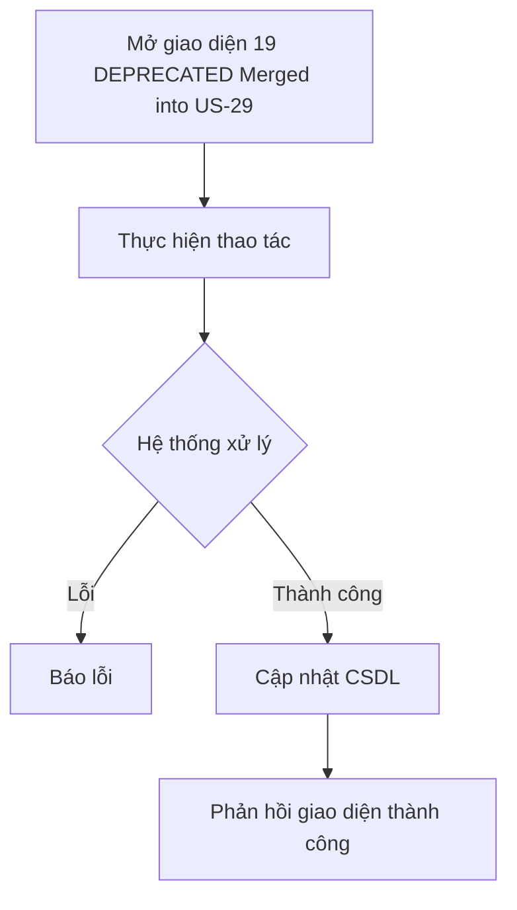

# 📋 User Story 19: Phản Hồi Lịch Phỏng Vấn Công Khai (Deprecated — merged into US-29)

## 1. MÔ TẢ USER STORY
- **Là** Ứng viên (Candidate),
- **Tôi muốn** phản hồi từ email lịch phỏng vấn một cách nhanh chóng mà không cần tài khoản,
- **Để** HR biết tôi đã xác nhận hoặc từ chối và quy trình tuyển dụng tiếp tục đúng hướng.
- **Story Points:** 2

## SƠ ĐỒ LUỒNG NGHIỆP VỤ (Business Flow)

## 2. LƯU Ý QUAN TRỌNG
User Story 19 và User Story 29 mô tả cùng một nghiệp vụ: phản hồi lịch phỏng vấn qua email link. Trong MVP, chúng phải được hợp nhất thành một story duy nhất: US-29.

## 3. TIÊU CHÍ NGHIỆM THU
- Candidate nhận link email và click;
- Link xác minh token hợp lệ;
- Candidate chọn Confirm hoặc Decline;
- Khi đã phản hồi, trạng thái được cập nhật; không cho thay đổi lại trong MVP;
- HR nhận notification.

## 4. Ngoài phạm vi
- Reschedule / propose another slot là cải tiến trong tương lai.
- Không triển khai hai flow khác nhau trong cùng một release.
