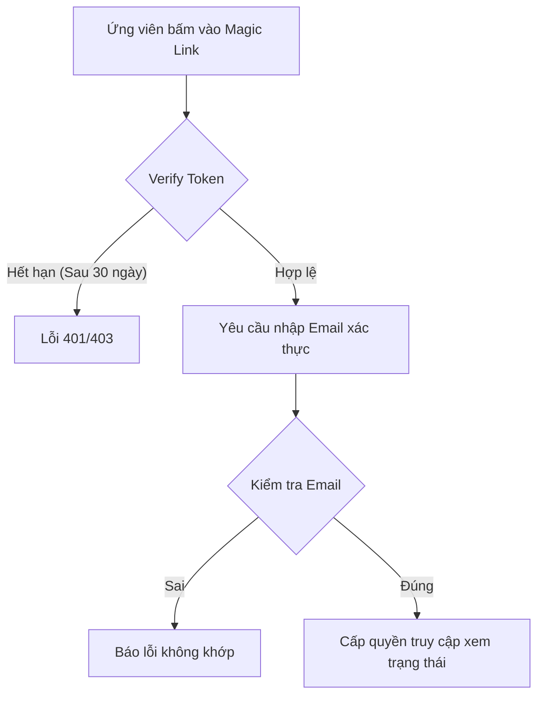

# 📋 User Story 27: Magic Link Tracking (Tra cứu hồ sơ không dùng mật khẩu)

## 1. MÔ TẢ USER STORY
- **Là** Ứng viên (Candidate),
- **Tôi muốn** nhận được một đường link bảo mật (Magic Link) qua email sau khi nộp CV thành công,
- **Để** tôi có thể tự tra cứu trạng thái hồ sơ của mình mà không cần phải đăng ký tài khoản hoặc mật khẩu trên hệ thống.
- **Story Points:** 3

## SƠ ĐỒ LUỒNG NGHIỆP VỤ (Business Flow)

## 2. TIÊU CHÍ NGHIỆM THU (Acceptance Criteria)

- **Kịch bản 1: Ứng viên truy cập bằng Magic Link hợp lệ**
  - **VỚI ĐIỀU KIỆN** ứng viên đã nộp đơn ứng tuyển thành công và hệ thống đã tạo một `secure_token` hợp lệ với thời gian hiệu lực được cấu hình.
  - **KHI** ứng viên nhấp vào đường dẫn trong email xác nhận: `/careers/applications/track?token={secure_token}`.
  - **THÌ** Backend xác minh `secure_token` trong database:
    - Nếu token hợp lệ và còn hiệu lực: hệ thống trả về trang tra cứu `/careers/applications/status` với thông tin trạng thái đơn ứng tuyển.
    - Trang hiển thị: tên ứng viên, tên Job, tên công ty, trạng thái hiện tại, và lịch phỏng vấn nếu có.

- **Kịch bản 2: Magic Link đã hết hạn**
  - **VỚI ĐIỀU KIỆN** ứng viên có `secure_token` đã vượt quá 30 ngày kể từ ngày nộp đơn.
  - **KHI** ứng viên truy cập link với token đó.
  - **THÌ** hệ thống hiển thị trang "Liên kết đã hết hạn." và cho phép ứng viên yêu cầu gửi lại Magic Link mới.

- **Kịch bản 3: Magic Link không hợp lệ (token bị sửa đổi / giả mạo)**
  - **KHI** ứng viên truy cập link với token không tồn tại trong database.
  - **THÌ** hệ thống hiển thị trang lỗi: _"Liên kết tra cứu không hợp lệ."_ và không tiết lộ bất kỳ thông tin nào.

- **Kịch bản 4: Ứng viên tra cứu sau khi xác nhận / từ chối lịch phỏng vấn**
  - **VỚI ĐIỀU KIỆN** ứng viên đã phản hồi lịch phỏng vấn (CONFIRM hoặc DECLINE).
  - **KHI** ứng viên mở lại trang tra cứu bằng cùng Magic Link (vẫn còn hạn).
  - **THÌ** trang tra cứu hiển thị trạng thái phản hồi hiện tại (đã xác nhận / đã từ chối) thay vì hiển thị nút hành động.

## 3. BUSINESS RULES
- **Magic Link TTL: 30 ngày (Đã chốt — xem `_overview.md §8`).** Hết hạn → Candidate phải tự yêu cầu gửi lại link mới (không tự động gia hạn).
- Magic Link không cấp quyền đăng nhập vào hệ thống HR Dashboard.

## 4. NGOÀI PHẠM VI
- Ứng viên **KHÔNG** được chỉnh sửa thông tin cá nhân, thay đổi file CV hoặc rút đơn ứng tuyển từ trang tra cứu (Chỉ đọc).
- **KHÔNG** triển khai cơ chế làm mới token tự động (tự động gia hạn) – ứng viên phải tự yêu cầu gửi lại.
