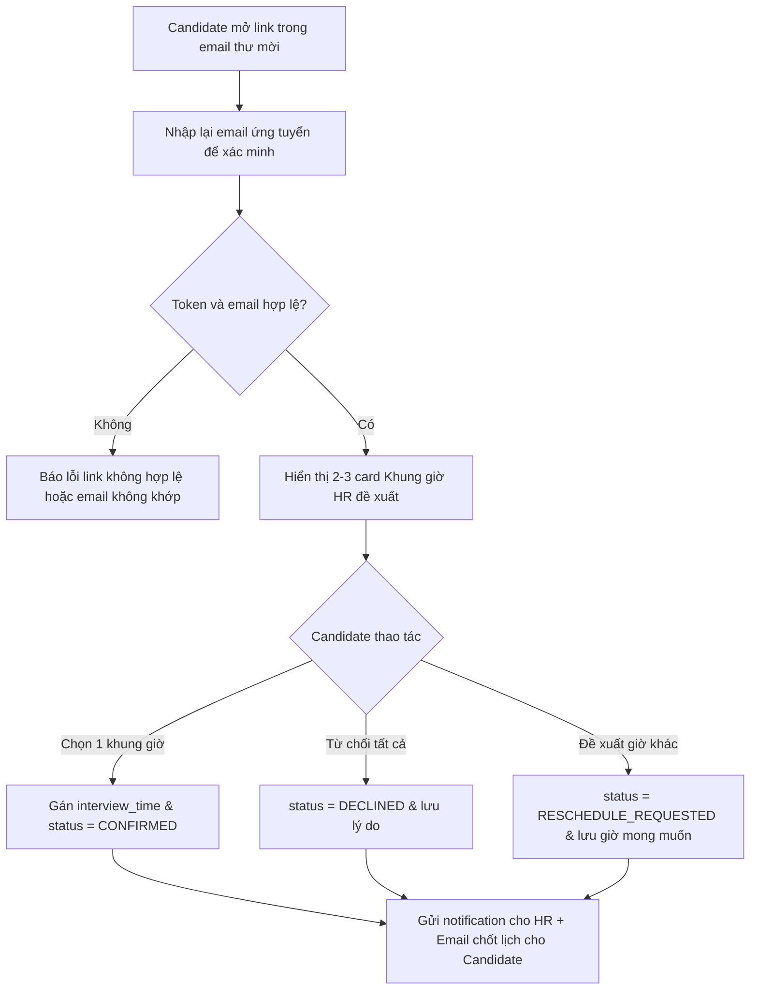

# 📋 User Story 28: Interview Response (Chọn Khung Giờ & Phản Hồi Lịch Phỏng Vấn)

## 1. MÔ TẢ USER STORY
- **Là** Ứng viên (Candidate),
- **Tôi muốn** mở Magic Link trong email mời phỏng vấn, xem các khung giờ HR đề xuất và chọn 1 khung giờ phù hợp nhất,
- **Để** tôi chốt lịch phỏng vấn ngay lập tức mà không cần tạo tài khoản hay trao đổi nhiều email.
- **Story Points:** 3

## SƠ ĐỒ LUỒNG NGHIỆP VỤ (Business Flow)



## 2. TIÊU CHÍ NGHIỆM THU (Acceptance Criteria)

- **Kịch bản 1: Ứng viên chọn 1 khung giờ đề xuất và xác nhận**
  - **VỚI ĐIỀU KIỆN** HR đã gửi danh sách các khung giờ đề xuất (`proposed_slots`) qua email.
  - **KHI** ứng viên mở link, nhập đúng email ứng tuyển để xác minh.
  - **THÌ** giao diện hiển thị danh sách các khung giờ dưới dạng card/radio tùy chọn.
  - Ứng viên chọn 1 khung giờ và nhấn "Xác nhận tham dự khung giờ này".
  - Hệ thống cập nhật `interview_time = selected_slot`, `status = CONFIRMED`.
  - HR nhận được notification và ứng viên nhận email xác nhận lịch chốt.

- **Kịch bản 2: Ứng viên từ chối tất cả khung giờ**
  - **VỚI ĐIỀU KIỆN** ứng viên bận tất cả khung giờ đề xuất và không muốn phỏng vấn.
  - **KHI** họ nhập đúng email ứng tuyển, bấm "Từ chối phỏng vấn" và điền lý do (optional).
  - **THÌ** hệ thống cập nhật `status = DECLINED` và lưu lý do từ chối.
  - HR nhận được notification để xem xét.

- **Kịch bản 3: Ứng viên đề xuất khung giờ khác ngoài danh sách**
  - **VỚI ĐIỀU KIỆN** ứng viên bận các khung giờ đề xuất nhưng vẫn muốn phỏng vấn và chưa từng đề xuất trước đó (tối đa 1 lần).
  - **KHI** ứng viên chọn "Đề xuất khung giờ khác", nhập ngày giờ mong muốn và lý do.
  - **THÌ** hệ thống cập nhật `status = RESCHEDULE_REQUESTED`, lưu `reschedule_time` và gửi notification cho HR xử lý.

- **Kịch bản 4: Link hết hạn**
  - **VỚI ĐIỀU KIỆN** token đã quá thời hạn 30 ngày.
  - **KHI** ứng viên nhấn vào email link.
  - **THÌ** hệ thống hiển thị thông báo "Liên kết đã hết hạn. Vui lòng liên hệ với nhà tuyển dụng." kèm thông tin liên hệ HR.

- **Kịch bản 5: Email xác minh không khớp**
  - **VỚI ĐIỀU KIỆN** link hợp lệ nhưng người mở link nhập email khác email đã ứng tuyển.
  - **KHI** họ gửi form xác minh.
  - **THÌ** hệ thống từ chối thao tác và hiển thị thông báo "Email xác minh không khớp với hồ sơ ứng tuyển".

- **Kịch bản 6: Khung giờ đã được chốt từ trước**
  - **VỚI ĐIỀU KIỆN** ứng viên đã chọn 1 khung giờ thành công trước đó (`status = CONFIRMED`).
  - **KHI** họ truy cập lại Magic Link.
  - **THÌ** hệ thống hiển thị thông tin lịch phỏng vấn đã chốt (Ngày giờ, địa điểm/meet link) ở chế độ Chỉ đọc, không hiển thị các nút chọn lại.

## 3. BUSINESS RULES
- Candidate phản hồi không cần login account.
- Candidate bắt buộc nhập lại email ứng tuyển để verify trước khi cho phép thao tác (chống forward email).
- Candidate được phép đề xuất khung giờ khác tối đa 1 lần.
- Sau khi đã chọn slot thành công (`CONFIRMED`), ứng viên không thể tự đổi slot từ Magic Link trong MVP.

## 4. NGOÀI PHẠM VI
- **KHÔNG** tích hợp Google Calendar / Outlook Calendar.
- **KHÔNG** cho phép ứng viên đề xuất đổi lịch nhiều lần trong MVP.

## 5. API JSON CONTRACTS (Tham khảo)

### 5.1. API Phản hồi chọn khung giờ / đổi lịch qua Magic Link
- **Endpoint:** `PUT /api/v1/public/interviews/{secure_token}/respond`
- **Request Body (CONFIRMED - Chọn 1 khung giờ đề xuất):**
```json
{
  "verify_email": "tranvanb@gmail.com",
  "response": "CONFIRMED",
  "selected_slot": "2026-09-05T09:00:00Z"
}
```
- **Request Body (RESCHEDULE_REQUESTED - Đề xuất khung giờ khác):**
```json
{
  "verify_email": "tranvanb@gmail.com",
  "response": "RESCHEDULE_REQUESTED",
  "reschedule_time": "2026-09-06T14:00:00Z",
  "reschedule_reason": "Tôi bận lịch cá nhân vào các khung giờ đề xuất."
}
```
- **Response (200 OK):**
```json
{
  "interview_id": "interview-uuid-1111",
  "status": "CONFIRMED",
  "interview_time": "2026-09-05T09:00:00Z",
  "message": "Bạn đã xác nhận lịch phỏng vấn thành công."
}
```
