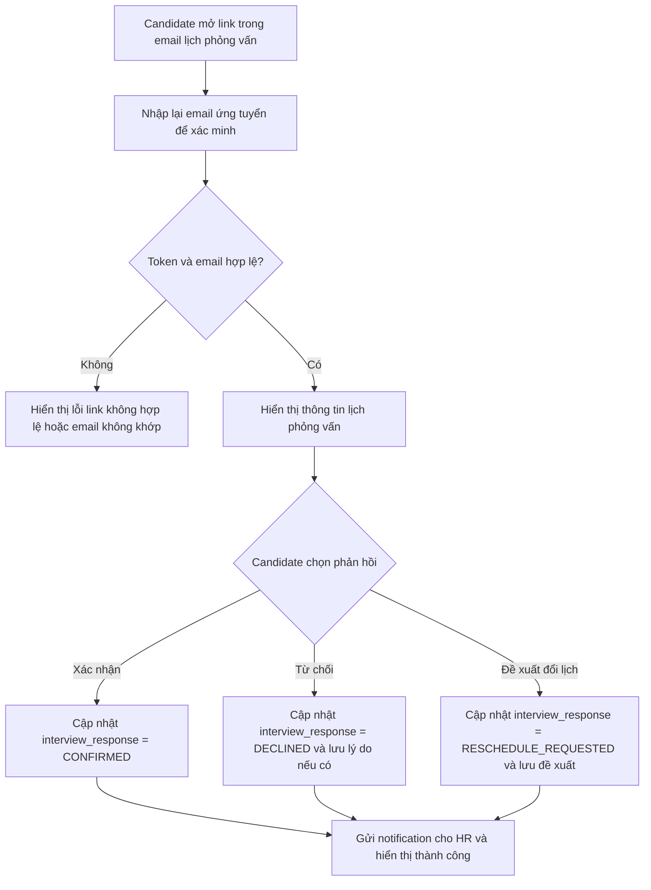

# 📋 User Story 28: Interview Response (Phản Hồi Lịch Phỏng Vấn Qua Email)

## 1. MÔ TẢ USER STORY
- **Là** Ứng viên (Candidate),
- **Tôi muốn** mở email lịch phỏng vấn và xác nhận hoặc từ chối trực tiếp từ link trong email,
- **Để** tôi không cần đăng nhập vào hệ thống và HR nhận phản hồi ngay lập tức.
- **Story Points:** 3

## SƠ ĐỒ LUỒNG NGHIỆP VỤ (Business Flow)

## 2. TIÊU CHÍ NGHIỆM THU (Acceptance Criteria)

- **Kịch bản 1: Ứng viên xác nhận tham dự**
  - **VỚI ĐIỀU KIỆN** HR đã gửi lịch phỏng vấn và email chứa link xác nhận hoặc từ chối.
  - **KHI** ứng viên mở link, nhập đúng email ứng tuyển để xác minh và bấm "Xác nhận tham dự".
  - **THÌ** hệ thống xác minh token, cập nhật `interview_response = CONFIRMED`, và hiển thị trang xác nhận thành công.
  - HR được thông báo và ứng viên nhận email xác nhận lại.

- **Kịch bản 2: Ứng viên từ chối**
  - **VỚI ĐIỀU KIỆN** ứng viên mở link decline.
  - **KHI** họ nhập đúng email ứng tuyển, bấm "Từ chối" và có thể nhập lý do (optional).
  - **THÌ** hệ thống cập nhật `interview_response = DECLINED` và lưu lý do nếu có.
  - HR nhận thông báo và nhìn thấy trạng thái mới trong drawer/list.

- **Kịch bản 3: Ứng viên đề xuất đổi lịch**
  - **VỚI ĐIỀU KIỆN** HR đã bật tùy chọn cho phép ứng viên đề xuất đổi lịch và ứng viên chưa từng đề xuất trước đó.
  - **KHI** ứng viên nhập đúng email ứng tuyển, chọn "Đề xuất đổi lịch", nhập thời gian mong muốn và lý do.
  - **THÌ** hệ thống cập nhật `interview_response = RESCHEDULE_REQUESTED`, lưu thời gian/lý do đề xuất và gửi notification cho HR.

- **Kịch bản 4: Link hết hạn**
  - **VỚI ĐIỀU KIỆN** token đã quá thời hạn được thiết lập.
  - **KHI** ứng viên nhấn vào email link.
  - **THÌ** hệ thống hiển thị thông báo "Liên kết đã hết hạn. Vui lòng liên hệ với nhà tuyển dụng." kèm thông tin liên hệ HR.

- **Kịch bản 5: Email xác minh không khớp**
  - **VỚI ĐIỀU KIỆN** link hợp lệ nhưng người mở link nhập email khác email đã ứng tuyển.
  - **KHI** họ gửi form xác minh.
  - **THÌ** hệ thống từ chối thao tác và hiển thị thông báo "Email xác minh không khớp với hồ sơ ứng tuyển".

- **Kịch bản 6: Phản hồi đầu tiên là phản hồi cuối**
  - **VỚI ĐIỀU KIỆN** ứng viên đã phản hồi trước đó.
  - **KHI** họ truy cập lại link lần nữa.
  - **THÌ** hệ thống hiển thị trạng thái hiện tại và không cho thay đổi response trong MVP.

## 3. BUSINESS RULES
- Candidate response không cần login.
- Candidate phải nhập lại email ứng tuyển để verify trước khi được phản hồi, nhằm giảm rủi ro forward link.
- Candidate được phép đề xuất đổi lịch tối đa 1 lần nếu Product bật tùy chọn này trong MVP.
- Sau khi đã phản hồi `CONFIRMED` hoặc `DECLINED`, ứng viên không được tự chỉnh sửa lại trong MVP.
- Luồng phản hồi lịch phỏng vấn công khai cũ đã được hợp nhất vào US-28; không triển khai hai behavior khác nhau.

## 4. NGOÀI PHẠM VI
- **KHÔNG** tích hợp Google Calendar / Outlook Calendar.
- **KHÔNG** có flow tự động tạo lịch thay thế khi candidate decline.
- **KHÔNG** cho phép ứng viên đề xuất đổi lịch nhiều lần trong MVP.
