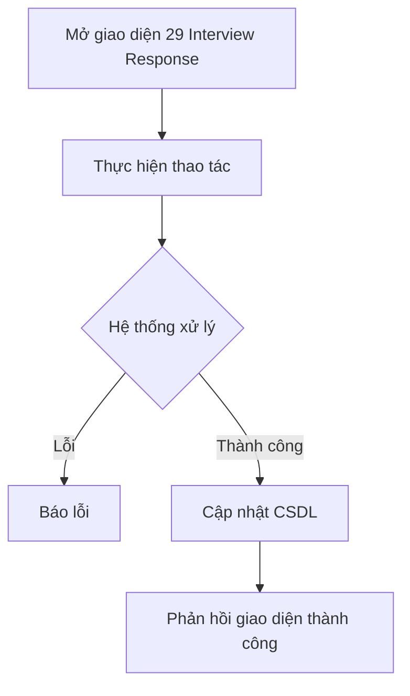

# 📋 User Story 29: Interview Response (Phản Hồi Lịch Phỏng Vấn Qua Email)

## 1. MÔ TẢ USER STORY
- **Là** Ứng viên (Candidate),
- **Tôi muốn** mở email lịch phỏng vấn và xác nhận hoặc từ chối trực tiếp từ link trong email,
- **Để** tôi không cần đăng nhập vào hệ thống và HR nhận phản hồi ngay lập tức.
- **Story Points:** 3

## SƠ ĐỒ LUỒNG NGHIỆP VỤ (Business Flow)

## 2. TIÊU CHÍ NGHIỆM THU (Acceptance Criteria)

- **Kịch bản 1: Ứng viên xác nhận tham dự**
  - **VỚI ĐIỀU KIỆN** HR đã gửi lịch phỏng vấn và email chứa link xác nhận hoặc từ chối.
  - **KHI** ứng viên bấm "Xác nhận tham dự".
  - **THÌ** hệ thống xác minh token, cập nhật `interview_response = CONFIRMED`, và hiển thị trang xác nhận thành công.
  - HR được thông báo và ứng viên nhận email xác nhận lại.

- **Kịch bản 2: Ứng viên từ chối**
  - **VỚI ĐIỀU KIỆN** ứng viên mở link decline.
  - **KHI** họ bấm "Từ chối" và có thể nhập lý do (optional).
  - **THÌ** hệ thống cập nhật `interview_response = DECLINED` và lưu lý do nếu có.
  - HR nhận thông báo và nhìn thấy trạng thái mới trong drawer/list.

- **Kịch bản 3: Link hết hạn**
  - **VỚI ĐIỀU KIỆN** token đã quá thời hạn được thiết lập.
  - **KHI** ứng viên nhấn vào email link.
  - **THÌ** hệ thống hiển thị thông báo "Liên kết đã hết hạn. Vui lòng liên hệ với nhà tuyển dụng." kèm thông tin liên hệ HR.

- **Kịch bản 4: Phản hồi đầu tiên là phản hồi cuối**
  - **VỚI ĐIỀU KIỆN** ứng viên đã phản hồi trước đó.
  - **KHI** họ truy cập lại link lần nữa.
  - **THÌ** hệ thống hiển thị trạng thái hiện tại và không cho thay đổi response trong MVP.

## 3. BUSINESS RULES
- Candidate response không cần login.
- Trong MVP, phản hồi đầu tiên là cuối cùng; không triển khai reschedule ngay trong giai đoạn này.
- Story 19 đã được hợp nhất vào story này; không triển khai hai luồng behavior khác nhau.

## 4. NGOÀI PHẠM VI
- **KHÔNG** hỗ trợ ứng viên tự đề xuất lại giờ phỏng vấn trong MVP.
- **KHÔNG** tích hợp Google Calendar / Outlook Calendar.
- **KHÔNG** có flow tự động tạo lịch thay thế khi candidate decline.
