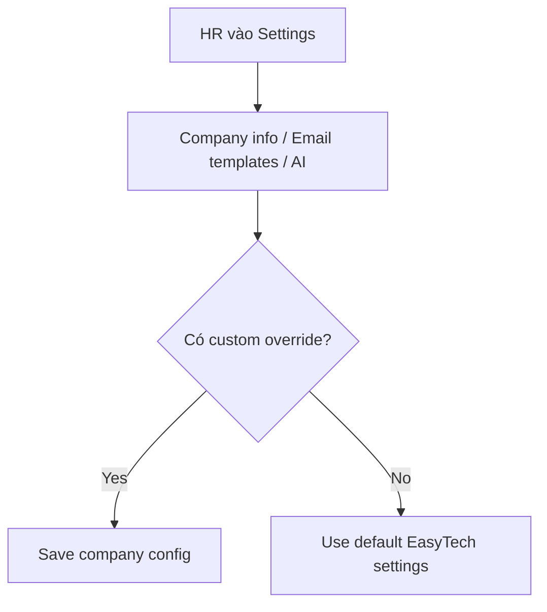

# EPIC 07 — Settings & Configuration

## 1. Tóm tắt
- **Nghiệp vụ:** HR quản lý thông tin doanh nghiệp, email templates và các tùy chọn AI trong phạm vi công ty.
- **Điều kiện tiên quyết:** HR đã login và company đã `ACTIVE`.
- **Default behavior:** system default email templates và EasyTech AI service phải hoạt động mà không cần HR setup phức tạp.

## 2. Giá trị nghiệp vụ và chỉ số
- **Giá trị nghiệp vụ:** Tăng khả năng tùy biến bằng cách cho phép HR chỉnh sửa thông tin công ty và email template khi cần, mà vẫn giữ được luồng mặc định rất ngắn.
- **Chỉ số:**
  - 100% Job flow hoạt động với default templates nếu HR không cấu hình gì
  - 90% HR hoàn thành settings trong vòng 1 lần truy cập

## 3. Quy trình nghiệp vụ

## 4. Phạm vi và Backlog
| ID | Tên Story | Ưu tiên | Trạng thái |
|---|---|---|---|
| US-29 | Email Templates | Must Have | To-do |
| US-30 | Thông tin doanh nghiệp | Must Have | To-do |
| US-31 | AI Provider | Should Have | To-do |
| US-32 | HR quản lý phân quyền | Should Have | To-do |
| US-33 | Career Site Settings | Should Have | To-do |

## 5. Business Rules
- Default email templates phải có sẵn để job flow hoạt động ngay mà không yêu cầu HR tạo template từ đầu.
- AI Provider / BYOK là cấu hình nâng cao tùy chọn; AI mặc định của EasyTech vẫn hoạt động khi HR chưa nhập key.
- Company settings và Career Site settings phải tách biệt rõ ràng: dữ liệu pháp lý/nội bộ và dữ liệu thương hiệu public.
- Nếu cùng một field xuất hiện ở hai nơi, source of truth phải rõ ràng trong spec.

## 6. Cải tiến trong tương lai và quyết định sản phẩm
- Cấu hình AI provider BYOK đầy đủ là cấu hình nâng cao.
- Quản lý phân quyền chi tiết theo role có thể mở rộng sau MVP.
- Bộ tùy biến public branding có thể mở rộng sau phần cài đặt cơ bản.

