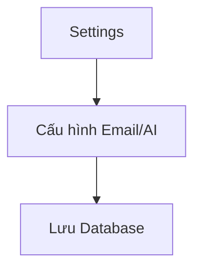

# HƯỚNG DẪN VIẾT TÀI LIỆU EPIC BRIEF (epic-07/brief.md)

## 1. TÓM TẮT YÊU CẦU (Executive Summary)
- **Nghiệp vụ:** Cài đặt thông tin chung, Email Template, AI Provider.
- **Prerequisites:** HR login.

## 2. GIÁ TRỊ DOANH NGHIỆP & CHỈ SỐ ĐO LƯỜNG (Business Value & Metrics)
- **Business Value:** Tùy biến hóa trải nghiệm tuyển dụng.
- **Metrics:** 100% DN tự cấu hình được email.

## 3. QUY TRÌNH NGHIỆP VỤ (Business Process)

## 4. PHÂN CHIA USER STORY (Scope & Backlog)
| ID | Tên Story | Loại | Priority (MoSCoW) | Trạng thái |
|---|---|---|---|---|
| US-20 | Email Templates | Feature | Must Have | To-do |
| US-21 | Thong Tin DN | Feature | Must Have | To-do |
| US-22 | AI Provider | Feature | Must Have | To-do |

