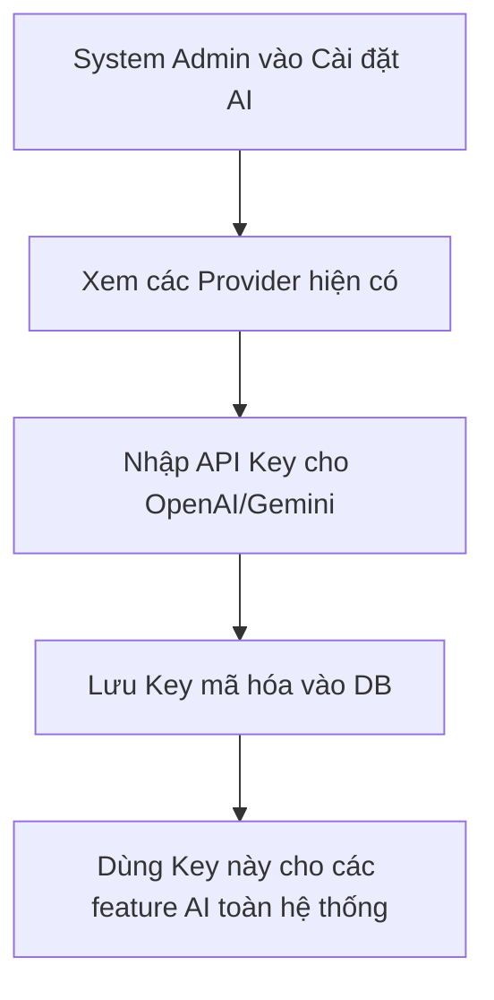

# 📋 User Story 22: AI Provider Configuration (Cấu Hình Dịch Vụ AI)

## 1. MÔ TẢ USER STORY
- **Là** Quản trị viên Công ty (Company Admin),
- **Tôi muốn** tùy chọn cấu hình và kết nối hệ thống với các nhà cung cấp dịch vụ AI (như OpenAI, Gemini),
- **Để** tôi có thể sử dụng custom BYOK khi cần, còn nếu không cấu hình thì hệ thống vẫn dùng EasyTech default AI service mà không bắt buộc người dùng phải hiểu API key.
- **Story Points:** 3

## SƠ ĐỒ LUỒNG NGHIỆP VỤ (Business Flow)

## 2. TIÊU CHÍ NGHIỆM THU (Acceptance Criteria)

- **Kịch bản 1: HR Admin thiết lập API Key mới**
  - **VỚI ĐIỀU KIỆN** HR có quyền Admin truy cập `/dashboard/settings/ai-provider`.
  - **KHI** HR chọn nhà cung cấp "OpenAI", nhập `api_key` vào trường văn bản bảo mật (dạng `***`) và nhấn "Kết nối".
  - **THÌ** Backend mã hóa (encrypt) key này trước khi lưu vào bảng `ai_providers` liên kết với `company_id`.
  - Hiển thị trạng thái "Đã kết nối". Hệ thống sẽ ưu tiên sử dụng Key này cho mọi tính năng AI của công ty.

- **Kịch bản 2: Chuyển đổi giữa Key mặc định và Custom Key**
  - **VỚI ĐIỀU KIỆN** HR Admin ở trang cài đặt AI.
  - **KHI** bật/tắt (toggle) tùy chọn "Sử dụng API Key riêng".
  - **THÌ** hệ thống lập tức thay đổi chính sách. Nếu chọn mặc định, hệ thống dùng Key chung của server (bị giới hạn quota). Nếu dùng Custom Key, giới hạn được dỡ bỏ.

- **Kịch bản 3: Xử lý lỗi API Key không hợp lệ**
  - **VỚI ĐIỀU KIỆN** HR nhập một API Key sai.
  - **KHI** nhấn "Kết nối".
  - **THÌ** Backend gọi một lệnh test (ping) nhẹ sang provider (vd: liệt kê models của OpenAI). Nếu nhận lỗi 401 Unauthorized, trả về lỗi "API Key không hợp lệ, vui lòng kiểm tra lại" và không lưu vào DB.

- **Kịch bản 4: Ẩn/hiện API Key đã lưu**
  - **VỚI ĐIỀU KIỆN** API Key đã được lưu thành công.
  - **KHI** trang được load lại.
  - **THÌ** form hiển thị API key dưới dạng che khuất một phần (ví dụ: `sk-proj-****abc`). Không hiển thị full key để bảo mật. HR chỉ có thể ghi đè (overwrite) bằng key mới.

## 3. NGOÀI PHẠM VI
- **KHÔNG** theo dõi hoặc hiển thị chi phí/lượng token đã tiêu thụ (Billing tracking) tại Dashboard này. Quản lý quota do phía hệ thống Provider (OpenAI platform) đảm nhận.
- **KHÔNG** hỗ trợ cấu hình các model nội bộ tự host (chỉ hỗ trợ cloud providers lớn).
