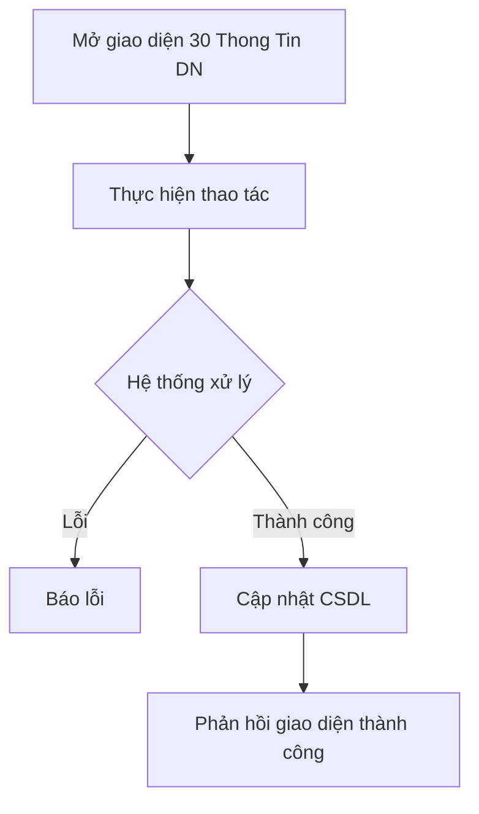

# 📋 User Story 30: Thông Tin Doanh Nghiệp (Company General Settings)

## 1. MÔ TẢ USER STORY
- **Là** Nhà tuyển dụng (HR Admin),
- **Tôi muốn** cập nhật các thông tin cơ bản về doanh nghiệp mình trong hệ thống (Tên, Mã số thuế, Logo nội bộ, Email liên hệ, Múi giờ),
- **Để** dữ liệu công ty luôn chính xác, các báo cáo hoặc hóa đơn hiển thị đúng thông tin, và cài đặt hệ thống phù hợp với khu vực hoạt động.
- **Story Points:** 2

## SƠ ĐỒ LUỒNG NGHIỆP VỤ (Business Flow)

## 2. TIÊU CHÍ NGHIỆM THU (Acceptance Criteria)

- **Kịch bản 1: HR Admin xem và cập nhật thông tin công ty**
  - **VỚI ĐIỀU KIỆN** HR có quyền Admin truy cập `/dashboard/settings/general`.
  - **KHI** form hiển thị thông tin hiện tại. HR sửa một số trường như Tên công ty, Website, Số điện thoại và nhấn "Lưu thay đổi".
  - **THÌ** hệ thống xác thực (validate) dữ liệu, gọi API `PUT /api/v1/companies/me`, cập nhật database và hiển thị thông báo "Cập nhật thành công".
  - Các thông tin mới hiển thị ngay lập tức trên giao diện chung của Dashboard.

- **Kịch bản 2: Quản lý Logo nội bộ**
  - **VỚI ĐIỀU KIỆN** HR đang ở trang Cài đặt thông tin.
  - **KHI** HR upload một logo (<= 2MB, JPG/PNG).
  - **THÌ** ảnh được tải lên thành công, thay thế logo cũ trên thanh điều hướng góc trái Dashboard.
  - _Lưu ý: Logo này độc lập với Logo trên Career Site (User Story 35), dùng cho giao diện nội bộ HR._

- **Kịch bản 3: HR không có quyền Admin cố gắng chỉnh sửa**
  - **VỚI ĐIỀU KIỆN** HR (không có quyền Admin) truy cập trang này.
  - **KHI** trang hiển thị.
  - **THÌ** form hiển thị ở chế độ Chỉ đọc (chỉ xem), nút "Lưu thay đổi" và tính năng upload logo bị ẩn.

- **Kịch bản 4: Cập nhật Mã số thuế (Tax Code)**
  - **VỚI ĐIỀU KIỆN** HR Admin sửa Mã số thuế.
  - **KHI** lưu lại.
  - **THÌ** nếu Mã số thuế mới đã bị công ty khác đăng ký, hệ thống báo lỗi trùng lặp và không cho lưu.

## 3. NGOÀI PHẠM VI
- **KHÔNG** quản lý thông tin xuất hóa đơn đỏ (VAT Invoicing) chi tiết trong phiên bản MVP này.
- **KHÔNG** liên kết thay đổi tên công ty với các thông tin đã public trên Career Site (nếu thay đổi, phải chỉnh sửa ở trang Career Site Settings riêng).
