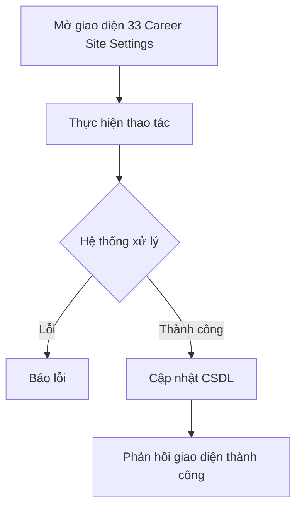

# 📋 User Story 33: Cấu Hình Career Site (Career Site Branding & Settings)

## 1. MÔ TẢ USER STORY
- **Là** Nhà tuyển dụng (HR),
- **Tôi muốn** tùy chỉnh giao diện trang Career Site công khai của công ty mình (logo, banner, màu chủ đạo, mô tả công ty),
- **Để** trang tuyển dụng của công ty phản ánh đúng nhận diện thương hiệu (Brand Identity) và tạo ấn tượng tốt với ứng viên tiềm năng.
- **Story Points:** 5

## SƠ ĐỒ LUỒNG NGHIỆP VỤ (Business Flow)

## 2. TIÊU CHÍ NGHIỆM THU (Acceptance Criteria)

- **Kịch bản 1: HR cấu hình thông tin cơ bản Career Site**
  - **VỚI ĐIỀU KIỆN** HR đang đăng nhập và truy cập `/dashboard/career-site`.
  - **KHI** HR điền/cập nhật các thông tin: Tên công ty hiển thị, Slogan/Tagline, Mô tả công ty (rich text), Địa chỉ, Website, Quy mô nhân sự.
  - **THÌ** hệ thống lưu dữ liệu vào bảng `career_site_settings` với `company_id` tương ứng thông qua API `PUT /api/v1/career-site/settings`.
  - Có nút "Xem trước" để HR preview Career Site trước khi lưu chính thức.

- **Kịch bản 2: HR upload Logo công ty**
  - **VỚI ĐIỀU KIỆN** HR đang ở trang cấu hình Career Site, section "Hình ảnh thương hiệu".
  - **KHI** HR nhấn "Tải lên Logo", chọn file ảnh (PNG/JPG/SVG, tối đa 2MB, khuyến nghị 200x200px) và nhấn "Lưu".
  - **THÌ** hệ thống upload file lên Cloud Storage (S3/Cloudinary), lưu URL vào `career_site_settings.logo_url` và hiển thị logo mới ngay lập tức trên preview.
  - Nếu file vượt 2MB: hiển thị lỗi "File logo không được vượt quá 2MB."

- **Kịch bản 3: HR tùy chỉnh Banner ảnh bìa**
  - **VỚI ĐIỀU KIỆN** HR đang ở section "Hình ảnh thương hiệu".
  - **KHI** HR upload ảnh banner (JPEG/PNG, tối đa 5MB, khuyến nghị 1200x400px).
  - **THÌ** hệ thống upload và lưu URL vào `career_site_settings.banner_url`.
  - Trang Career Site công khai cập nhật banner mới ngay sau khi HR lưu (không cần deploy lại).

- **Kịch bản 4: HR tùy chỉnh màu chủ đạo thương hiệu**
  - **VỚI ĐIỀU KIỆN** HR đang ở section "Màu sắc thương hiệu".
  - **KHI** HR chọn màu primary (màu nút CTA, thanh navigation) thông qua color picker hoặc nhập mã HEX.
  - **THÌ** hệ thống lưu `primary_color` vào `career_site_settings`.
  - Trang Career Site tự động áp dụng màu mới cho tất cả các element (nút "Ứng tuyển", header, link).
  - Nếu mã màu không hợp lệ: hiển thị lỗi và revert về màu trước.

- **Kịch bản 5: Career Site chưa được cấu hình hiển thị trạng thái mặc định**
  - **VỚI ĐIỀU KIỆN** công ty mới đăng ký, chưa cấu hình bất kỳ thông tin Career Site nào.
  - **KHI** ứng viên truy cập URL Career Site của công ty đó: `/careers/{company_slug}`.
  - **THÌ** trang vẫn hiển thị được với dữ liệu mặc định: tên công ty (từ bảng `companies`), không có banner, màu mặc định của hệ thống (primary: #4F46E5), không có mô tả.

- **Kịch bản 6: HR bật/tắt Career Site công khai**
  - **VỚI ĐIỀU KIỆN** HR đang ở trang cấu hình Career Site.
  - **KHI** HR toggle switch "Hiển thị Career Site công khai" sang OFF.
  - **THÌ** hệ thống cập nhật `career_site_settings.is_published = false`. Khi ứng viên truy cập URL Career Site, hệ thống trả về trang "404 – Career Site hiện không khả dụng."

## 3. NGOÀI PHẠM VI
- **KHÔNG** hỗ trợ chỉnh sửa layout/template Career Site (thêm/xóa section, drag-drop blocks) trong phiên bản này.
- **KHÔNG** hỗ trợ custom domain (sử dụng tên miền riêng của công ty) – chỉ subdomain dạng `/{company_slug}`.
- **KHÔNG** hỗ trợ đa ngôn ngữ (i18n) cho Career Site trong phiên bản này.
