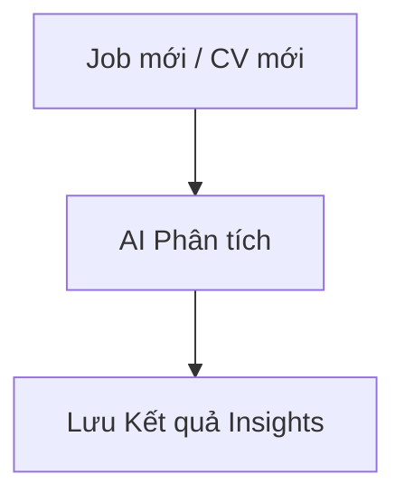

# HƯỚNG DẪN VIẾT TÀI LIỆU EPIC BRIEF (epic-08/brief.md)

## 1. TÓM TẮT YÊU CẦU (Executive Summary)
- **Nghiệp vụ:** Các tính năng AI cốt lõi: Scoring, Suggestions.
- **Prerequisites:** Đã cấu hình AI Provider.

## 2. GIÁ TRỊ DOANH NGHIỆP & CHỈ SỐ ĐO LƯỜNG (Business Value & Metrics)
- **Business Value:** Giảm tải 90% công sức đọc CV thủ công.
- **Metrics:** Độ chính xác của Scoring > 85%.

## 3. QUY TRÌNH NGHIỆP VỤ (Business Process)

## 4. PHÂN CHIA USER STORY (Scope & Backlog)
| ID | Tên Story | Loại | Priority (MoSCoW) | Trạng thái |
|---|---|---|---|---|
| US-23 | CV Scoring | Feature | Must Have | To-do |
| US-24 | AI Goi Y Cau Hoi | Feature | Must Have | To-do |

