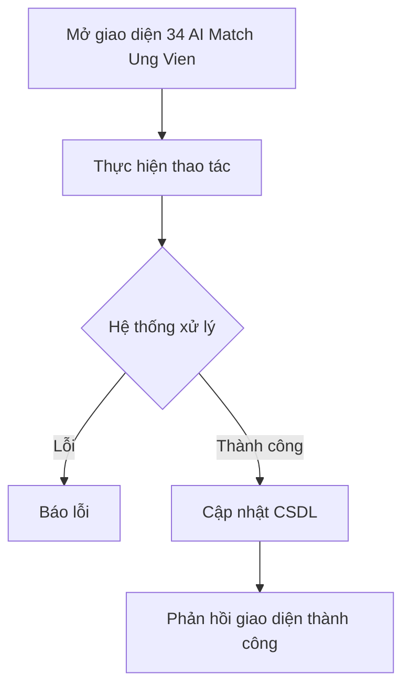

# 📋 User Story 34: AI Shadow Matching & Suggestions (Gợi Ý Ứng Viên Từ Kho Dữ Liệu Cũ)

## 1. MÔ TẢ USER STORY
- **Là** Nhà tuyển dụng (HR),
- **Tôi muốn** hệ thống AI tự động quét và gợi ý các ứng viên tiềm năng từ kho dữ liệu cũ (Candidate Pool) của công ty phù hợp với Tin tuyển dụng mới,
- **Để** tôi có thể tái sử dụng nguồn lực ứng viên cũ, tối ưu chi phí và thời gian tuyển dụng thay vì luôn phải chờ ứng viên mới nộp đơn.
- **Story Points:** 5

## SƠ ĐỒ LUỒNG NGHIỆP VỤ (Business Flow)

## 2. TIÊU CHÍ NGHIỆM THU (Acceptance Criteria)

- **Kịch bản 1: AI đề xuất ứng viên khi Job được Publish**
  - **VỚI ĐIỀU KIỆN** hệ thống có kho lưu trữ hồ sơ ứng viên cũ trong bảng `candidates` và `applications`, và mỗi hồ sơ đã có `cv_insights` từ AI (matching_score, strengths, skills).
  - **KHI** HR publish một tin tuyển dụng mới (Jobs có trạng thái chuyển từ `DRAFT` → `ACTIVE`).
  - **THÌ** hệ thống kích hoạt Background Worker chạy ngầm (không block UI):
    - Worker gọi Python AI Service để thực hiện Vector Similarity Search giữa JD mới và các CV trong kho.
    - Lưu tối đa 10 ứng viên phù hợp nhất (score ≥ 70%) vào bảng `ai_suggestions` với `job_id` và `candidate_id` tương ứng.
    - Hiển thị danh sách gợi ý tại tab **"AI Match"** trên giao diện quản trị của Job đó sau khi Worker hoàn thành.

- **Kịch bản 2: HR xem danh sách ứng viên được AI gợi ý**
  - **VỚI ĐIỀU KIỆN** Job đã được publish và Worker đã hoàn thành xử lý.
  - **KHI** HR vào trang quản lý Job và chọn tab "AI Match".
  - **THÌ** hệ thống hiển thị danh sách tối đa 10 ứng viên, mỗi ứng viên gồm: Tên, Email, Điểm phù hợp (%), Điểm nổi bật (strengths), Thời gian nộp đơn gần nhất, Nút "Liên hệ".

- **Kịch bản 3: HR liên hệ với ứng viên được gợi ý**
  - **VỚI ĐIỀU KIỆN** HR đang xem danh sách AI Match và muốn tiếp cận một ứng viên.
  - **KHI** HR nhấn nút "Liên hệ" đối với một ứng viên trong danh sách.
  - **THÌ** hệ thống mở popup gửi email với template mặc định "Mời ứng tuyển" (có thể chỉnh sửa nội dung trước khi gửi).
  - Sau khi gửi: cập nhật `ai_suggestions.contact_status = CONTACTED` và ghi nhận thời gian liên hệ.
  - Danh sách AI Match cập nhật badge "Đã liên hệ" bên cạnh tên ứng viên đó.

- **Kịch bản 4: Chưa có dữ liệu ứng viên cũ phù hợp**
  - **VỚI ĐIỀU KIỆN** kho ứng viên cũ trống hoặc không có ứng viên nào đạt score ≥ 70%.
  - **KHI** Worker hoàn thành xử lý mà không tìm được kết quả phù hợp.
  - **THÌ** tab "AI Match" hiển thị thông báo: _"Chưa tìm thấy ứng viên phù hợp từ kho dữ liệu. Hệ thống sẽ cập nhật khi có thêm hồ sơ mới."_

- **Kịch bản 5: HR kích hoạt lại AI Matching thủ công**
  - **VỚI ĐIỀU KIỆN** Job đã publish và kho ứng viên đã được bổ sung thêm hồ sơ mới.
  - **KHI** HR nhấn nút "Chạy lại AI Match" trong tab "AI Match".
  - **THÌ** hệ thống xóa kết quả cũ trong `ai_suggestions` của Job đó và chạy lại Background Worker với toàn bộ kho ứng viên hiện tại.

## 3. NGOÀI PHẠM VI
- **KHÔNG** gợi ý ứng viên từ kho dữ liệu của công ty khác (multi-tenant isolation).
- **KHÔNG** tự động tạo đơn ứng tuyển cho ứng viên được gợi ý – HR phải liên hệ và ứng viên tự nộp.
- **KHÔNG** hiển thị danh sách AI Suggestions cho ứng viên công khai (tính năng nội bộ HR Dashboard).
